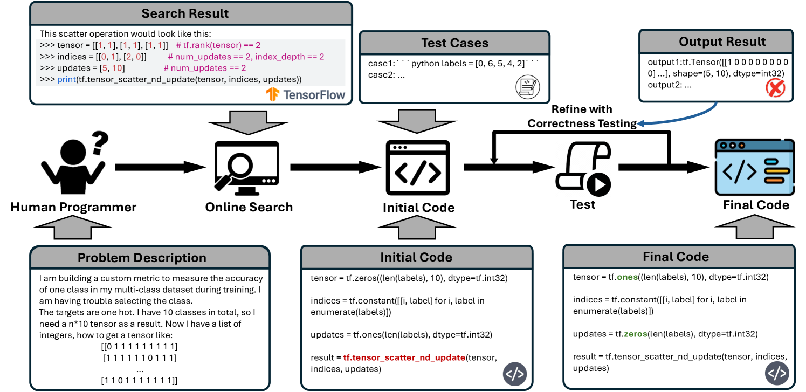
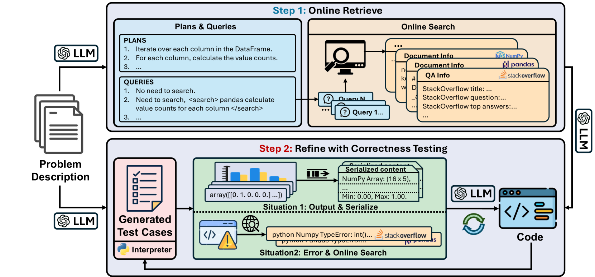
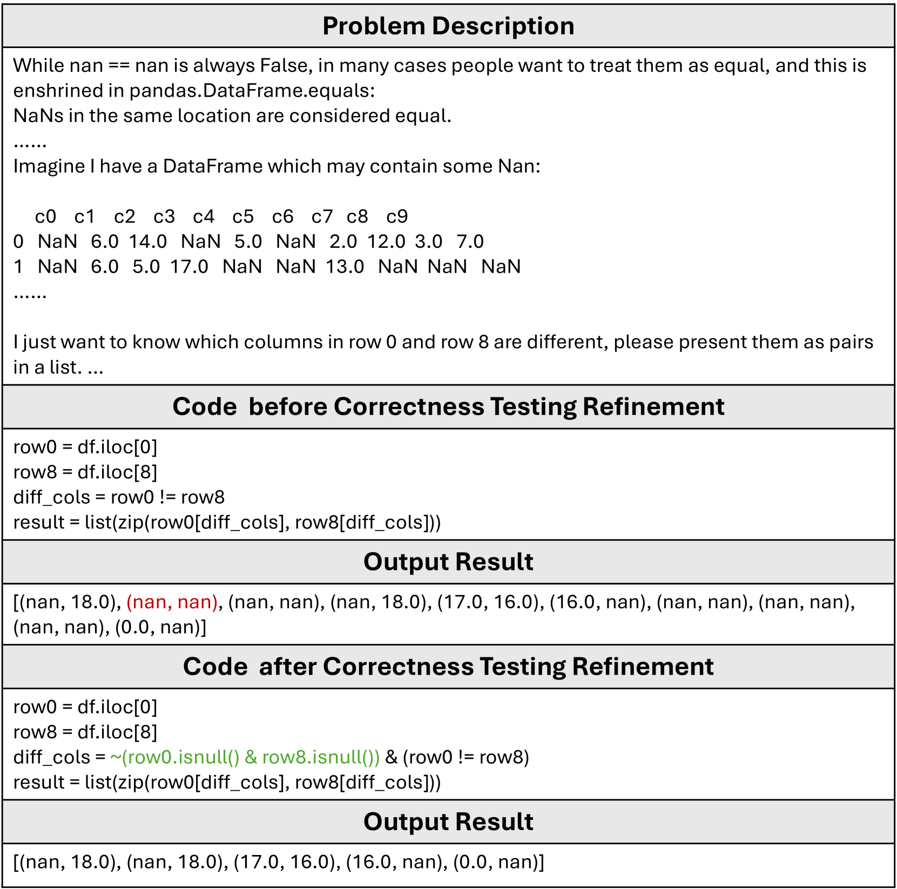
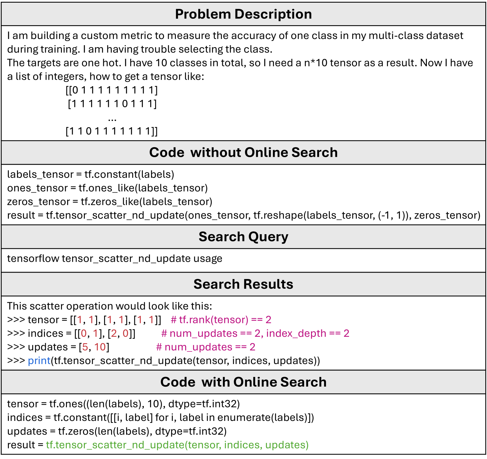
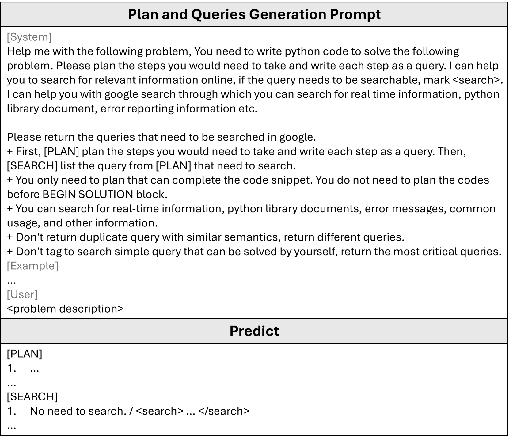
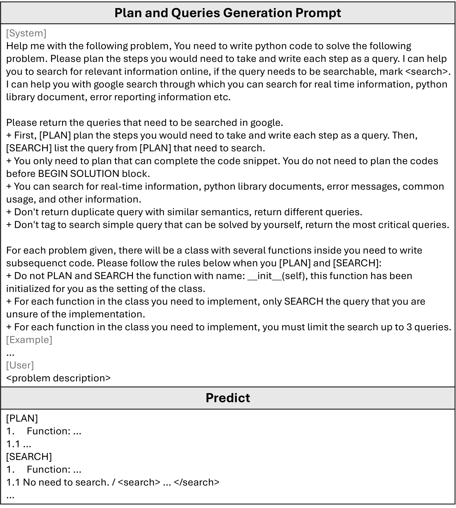
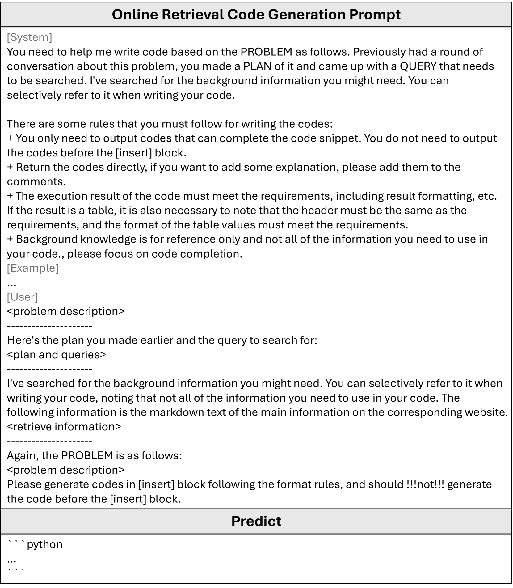
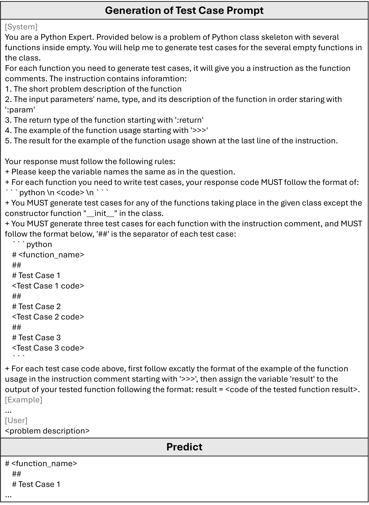
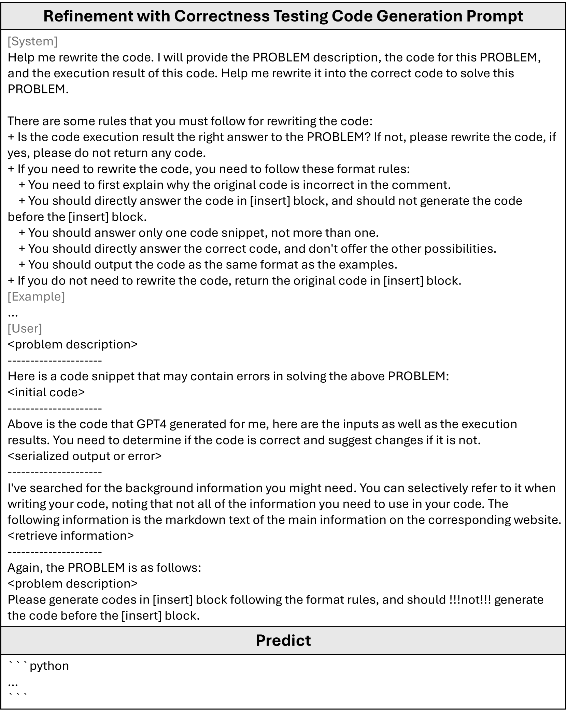

# CONLINE 是一种结合了在线搜索和正确性测试技术的方法，用于复杂代码的生成与精细化处理。步骤细化：

发布时间：2024年03月20日

`LLM应用` `软件开发`

> CONLINE: Complex Code Generation and Refinement with Online Searching and Correctness Testing

> LLMs通过将自然语言转变为可执行代码，革新了代码生成领域，但面对实际世界中复杂的代码结构、不易察觉的错误、高级数据类型理解和缺失的辅助信息等问题，生成复杂代码仍有难度。为此，我们创新推出了CONLINE框架，它借助预设的在线信息检索和自动化的正确性测试实现迭代优化，增强了代码生成能力。同时，CONLINE通过序列化复杂的输入输出，增进理解并生成测试案例，确保框架能够灵活应对真实应用场景。经过在DS-1000和ClassEval数据集上的一系列严苛实验验证，CONLINE成功大幅提升复杂代码生成质量，充分展示了其提升LLMs在构建复杂代码时的实用性与可靠性的巨大潜力。

> Large Language Models (LLMs) have revolutionized code generation ability by converting natural language descriptions into executable code. However, generating complex code within real-world scenarios remains challenging due to intricate structures, subtle bugs, understanding of advanced data types, and lack of supplementary contents. To address these challenges, we introduce the CONLINE framework, which enhances code generation by incorporating planned online searches for information retrieval and automated correctness testing for iterative refinement. CONLINE also serializes the complex inputs and outputs to improve comprehension and generate test case to ensure the framework's adaptability for real-world applications. CONLINE is validated through rigorous experiments on the DS-1000 and ClassEval datasets. It shows that CONLINE substantially improves the quality of complex code generation, highlighting its potential to enhance the practicality and reliability of LLMs in generating intricate code.

[Arxiv](https://arxiv.org/abs/2403.13583)