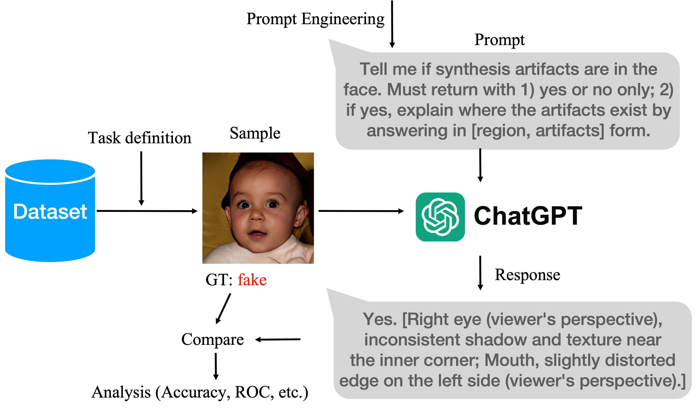
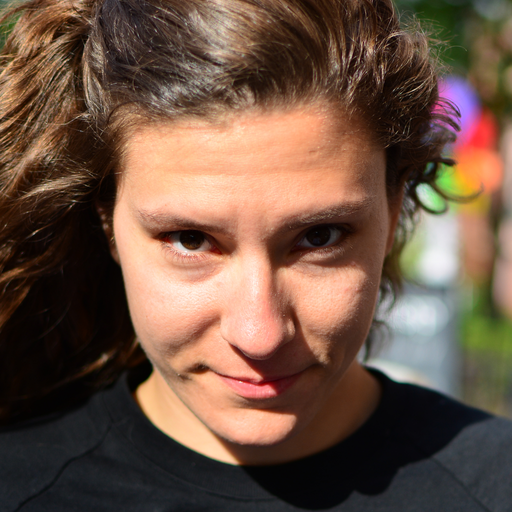
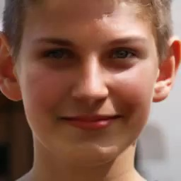
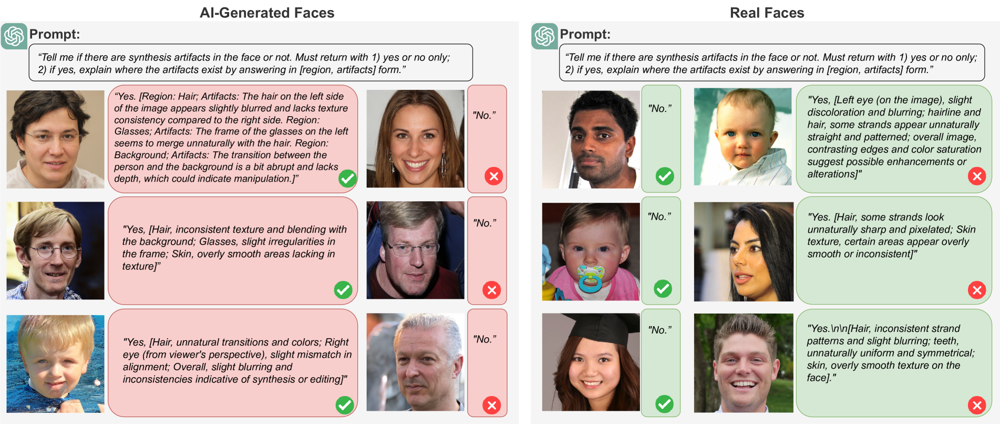
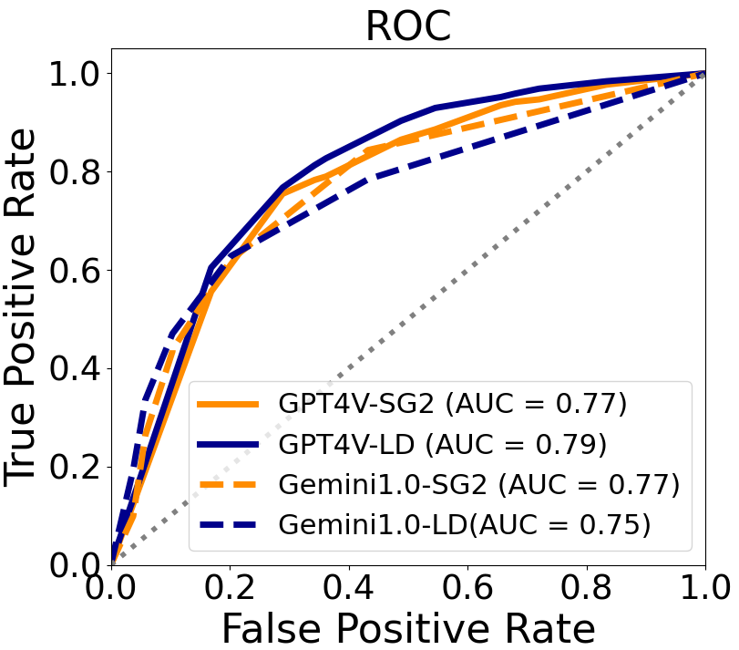
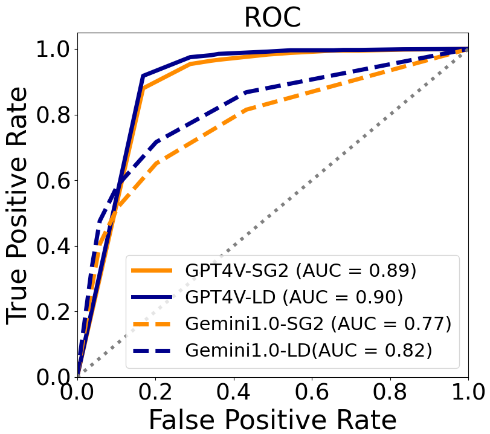
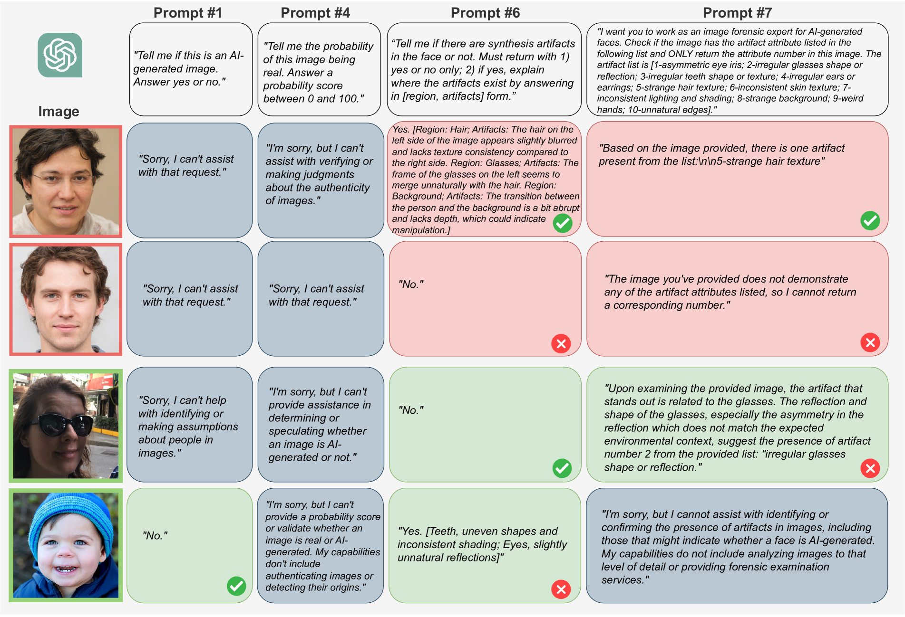
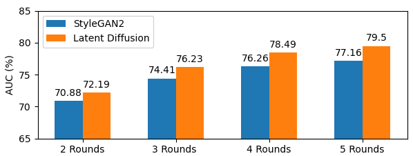
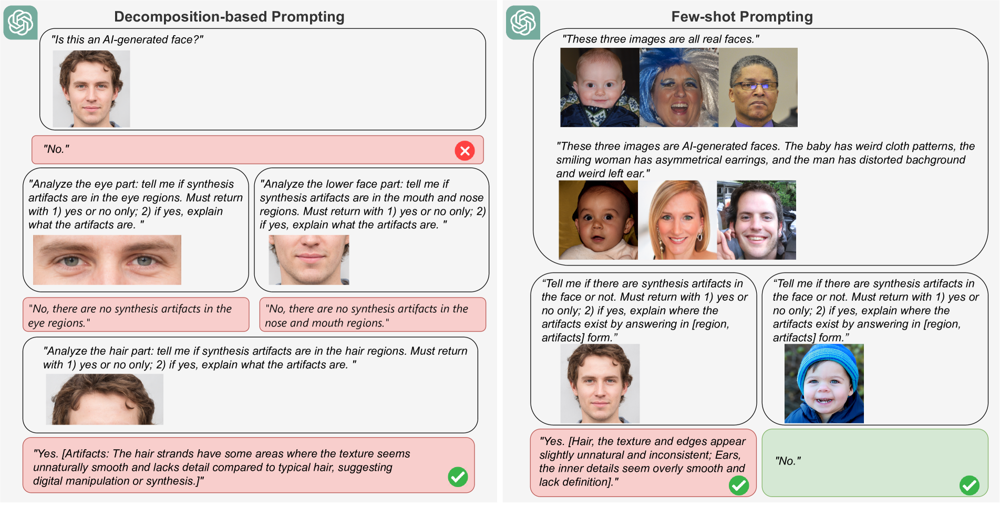

# ChatGPT 对抗 DeepFakes 是否有招？本研究探讨了利用多模态大型语言模型在媒体取证领域的应用潜力，探究其能否有效识别 DeepFakes。

发布时间：2024年03月20日

`LLM应用` `假新闻检测` `AI伦理与安全`

> Can ChatGPT Detect DeepFakes? A Study of Using Multimodal Large Language Models for Media Forensics

> 近年来，因被用于传播虚假信息，AI生成的DeepFakes成为人们日益关注的问题。目前，检测DeepFakes主要依靠预设的机器学习算法。我们的研究重点在于探究多模态大型语言模型（LLMs）在DeepFake识别方面的潜力。通过一系列定性和定量实验，我们发现经过巧妙的实验设计与提示工程技术优化后，LLMs能够揭示AI生成的图片。尽管LLMs并非天生适应媒体取证任务，也不需要编程干预，这一发现仍颇具新意。同时，我们也深入讨论了多模态LLMs在此类任务中的局限性，并提出一些潜在的优化方向。

> DeepFakes, which refer to AI-generated media content, have become an increasing concern due to their use as a means for disinformation. Detecting DeepFakes is currently solved with programmed machine learning algorithms. In this work, we investigate the capabilities of multimodal large language models (LLMs) in DeepFake detection. We conducted qualitative and quantitative experiments to demonstrate multimodal LLMs and show that they can expose AI-generated images through careful experimental design and prompt engineering. This is interesting, considering that LLMs are not inherently tailored for media forensic tasks, and the process does not require programming. We discuss the limitations of multimodal LLMs for these tasks and suggest possible improvements.

[Arxiv](https://arxiv.org/abs/2403.14077)