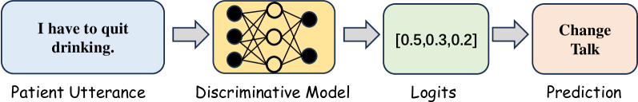
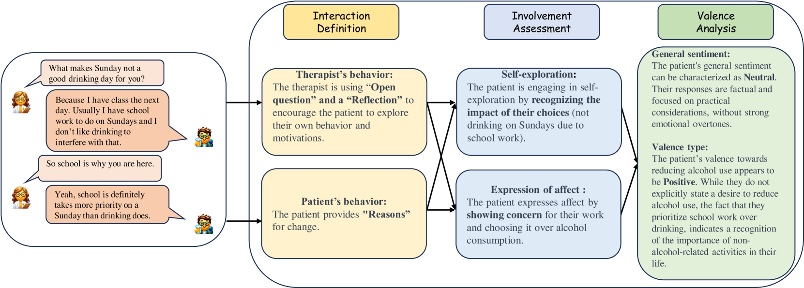
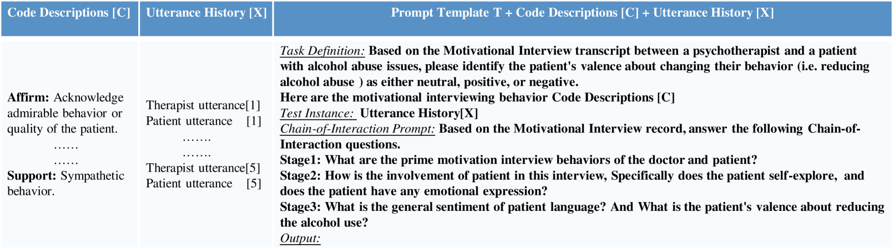

# Chain-of-Interaction 方法旨在通过引入双人交互情境，提升大型语言模型在理解和解析精神行为方面的表现。这一技术致力于深入探究和利用对话互动中的上下文信息，从而助力模型更好地捕捉和模拟复杂的心理行为特征。

发布时间：2024年03月20日

`Agent` `心理健康` `行为分析`

> Chain-of-Interaction: Enhancing Large Language Models for Psychiatric Behavior Understanding by Dyadic Contexts

> 在面对诸如酒精和药物成瘾的精神咨询场景中，自动识别动机访谈（MI）过程中的患者行为对于支持心理咨询师决策至关重要。然而，目前虽然行为编码任务已借助机器学习技术实现在MI会话中预测患者状态，但在实践中构建和应用此类模型时，仍受限于领域专业知识不足及患者与治疗师互动关系的忽视两大难题。因此，我们提出了一种创新的“交互链”（CoI）提示法，旨在通过双人互动情境引导大型语言模型（LLMs），从而更好地辅助精神健康决策。该方法巧妙地将行为编码任务拆解为三大逻辑环节：抽取患者的参与程度、解析治疗师的提问策略以及整合患者与治疗师间的互动信息。这使得LLMs能够充分利用编码规范、患者实时状态以及相关领域知识进行精准的行为编码。基于真实数据集的实验验证了我们提出的CoI提示法相较于现有提示基准方法在配合多种顶尖LLMs时所展现出的有效性与灵活性。同时，我们通过深入的消融分析进一步证实了双人互动在运用LLMs理解心理治疗行为中的核心作用。

> Automatic coding patient behaviors is essential to support decision making for psychotherapists during the motivational interviewing (MI), a collaborative communication intervention approach to address psychiatric issues, such as alcohol and drug addiction. While the behavior coding task has rapidly adapted machine learning to predict patient states during the MI sessions, lacking of domain-specific knowledge and overlooking patient-therapist interactions are major challenges in developing and deploying those models in real practice. To encounter those challenges, we introduce the Chain-of-Interaction (CoI) prompting method aiming to contextualize large language models (LLMs) for psychiatric decision support by the dyadic interactions. The CoI prompting approach systematically breaks down the coding task into three key reasoning steps, extract patient engagement, learn therapist question strategies, and integrates dyadic interactions between patients and therapists. This approach enables large language models to leverage the coding scheme, patient state, and domain knowledge for patient behavioral coding. Experiments on real-world datasets can prove the effectiveness and flexibility of our prompting method with multiple state-of-the-art LLMs over existing prompting baselines. We have conducted extensive ablation analysis and demonstrate the critical role of dyadic interactions in applying LLMs for psychotherapy behavior understanding.

[Arxiv](https://arxiv.org/abs/2403.13786)