# CoMo 是一种新颖的方法，它借助于语言指导的姿势码编辑技术，实现了对运动生成过程的可控性。简言之，CoMo 通过语言指令精细编辑姿势码，从而在运动生成中达到预期和可控的效果。

发布时间：2024年03月20日

`Agent` `人工智能` `虚拟现实/动画`

> CoMo: Controllable Motion Generation through Language Guided Pose Code Editing

> 文本驱动的动作生成模型虽然擅长快速生成人体动作，但对于生成过程的精细操控尚显不足，例如难以在动作中微调姿态或适时插入新动作，这使得它们在多元场景中的应用受到限制。为此，我们创新推出了CoMo——一款具备精准生成与编辑动作能力的可控动作生成模型，它巧妙借助大型语言模型（LLMs）的预存知识。CoMo的独特之处在于，它将动作拆解为一系列表征清晰、具有语义意义的姿势码，每个姿势码都蕴含着某个身体部位的信息，比如“左膝微微弯曲”。当接收到文本指令时，CoMo会自回归地生成一连串姿势码，并进一步将其转化为三维动作。得益于姿势码这一易于理解的表达方式，LLM可根据编辑指令直接调整姿势码以实现对动作编辑的有效介入。实验证明，CoMo在动作生成性能上与当前最先进模型不相上下，而在人体动作编辑能力评估中，CoMo则显著超越了先前的研究成果。

> Text-to-motion models excel at efficient human motion generation, but existing approaches lack fine-grained controllability over the generation process. Consequently, modifying subtle postures within a motion or inserting new actions at specific moments remains a challenge, limiting the applicability of these methods in diverse scenarios. In light of these challenges, we introduce CoMo, a Controllable Motion generation model, adept at accurately generating and editing motions by leveraging the knowledge priors of large language models (LLMs). Specifically, CoMo decomposes motions into discrete and semantically meaningful pose codes, with each code encapsulating the semantics of a body part, representing elementary information such as "left knee slightly bent". Given textual inputs, CoMo autoregressively generates sequences of pose codes, which are then decoded into 3D motions. Leveraging pose codes as interpretable representations, an LLM can directly intervene in motion editing by adjusting the pose codes according to editing instructions. Experiments demonstrate that CoMo achieves competitive performance in motion generation compared to state-of-the-art models while, in human studies, CoMo substantially surpasses previous work in motion editing abilities.

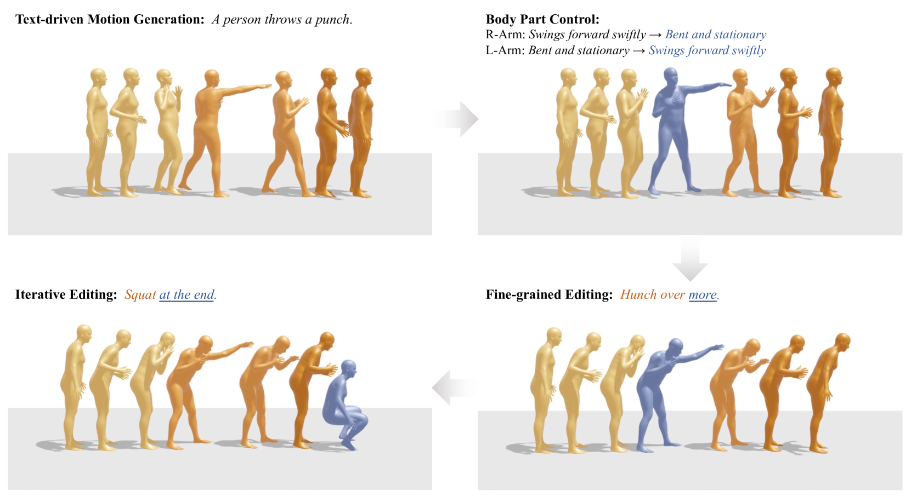

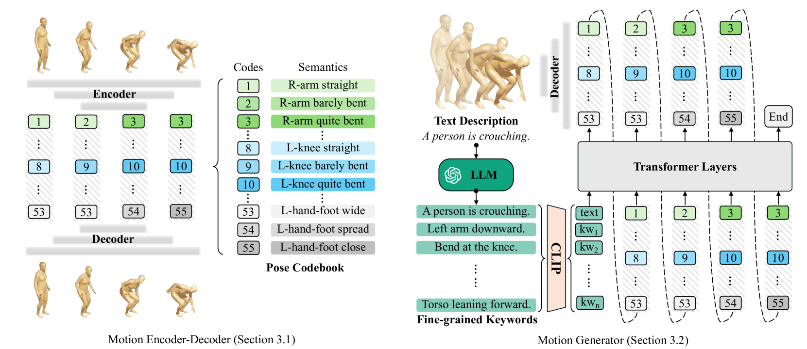

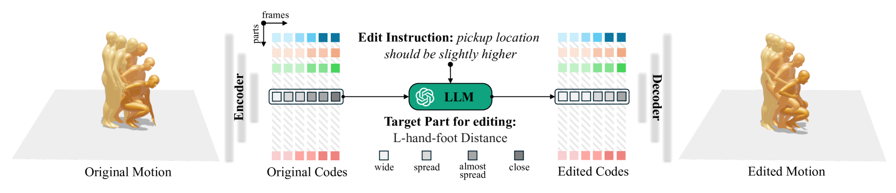

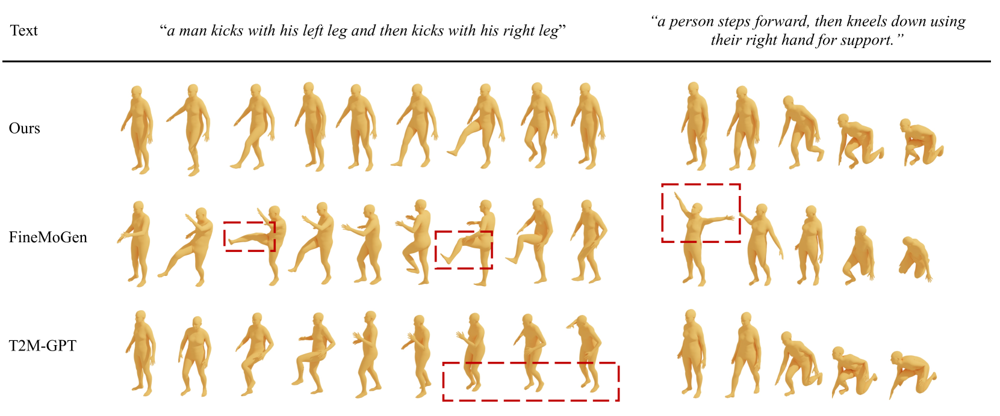

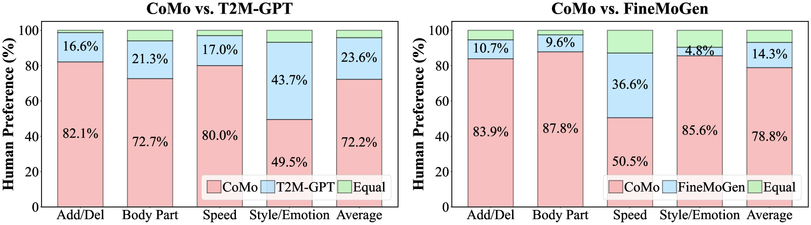

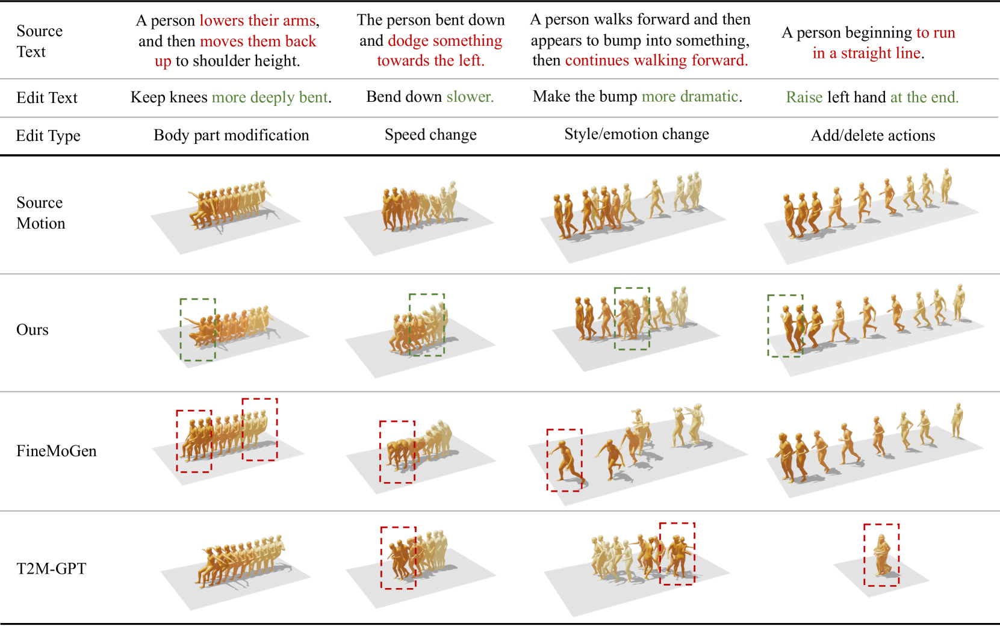

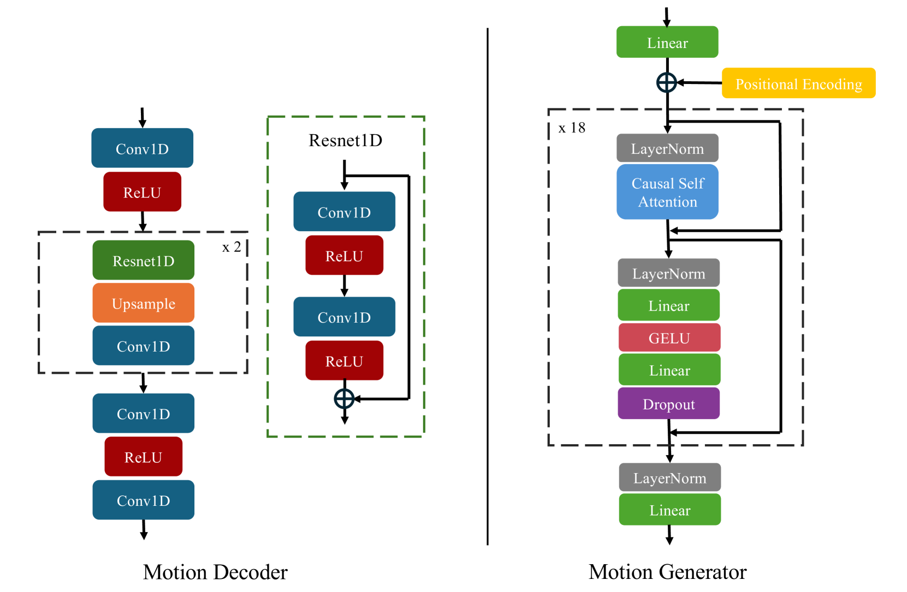

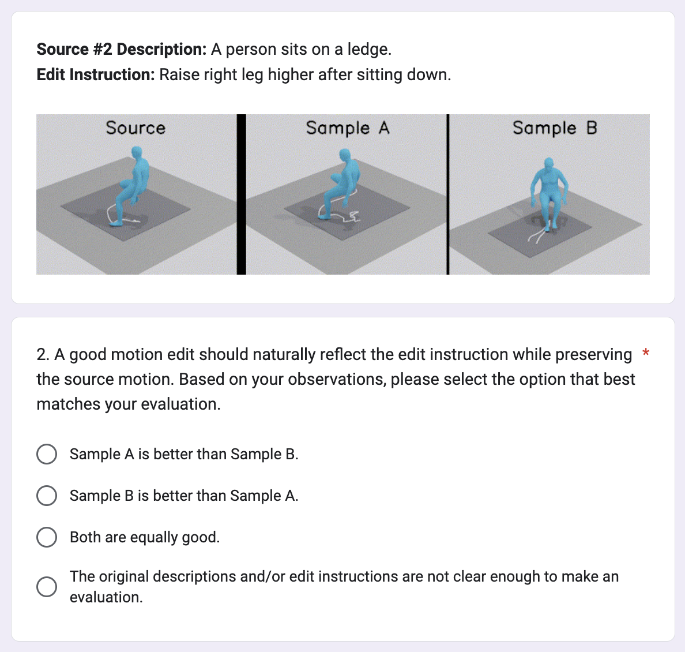

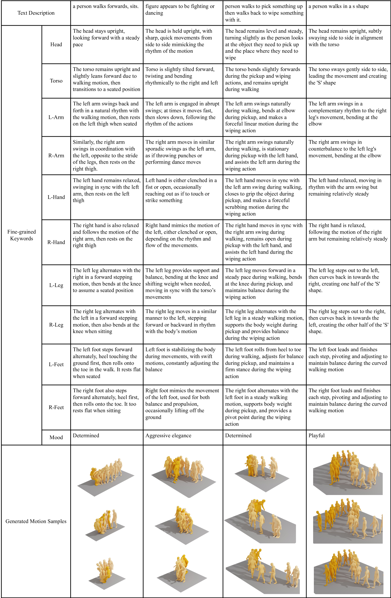

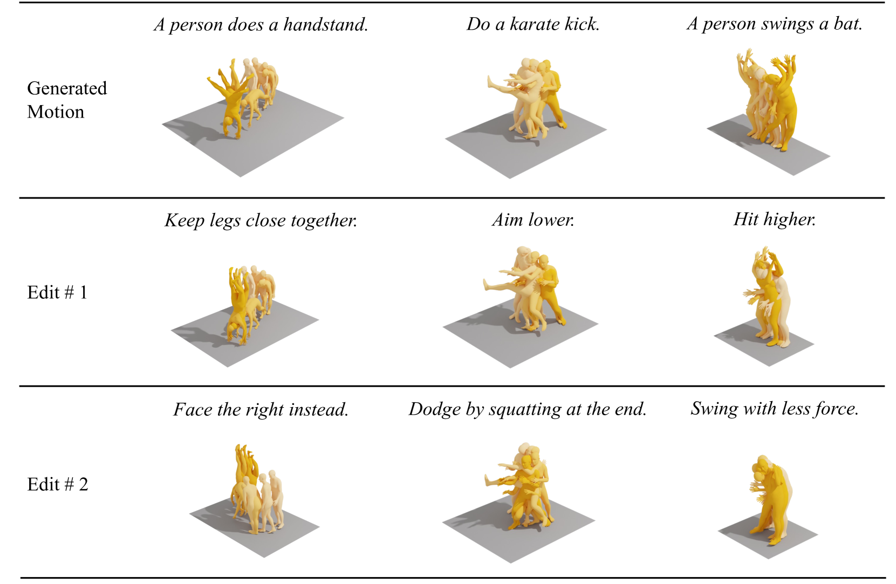

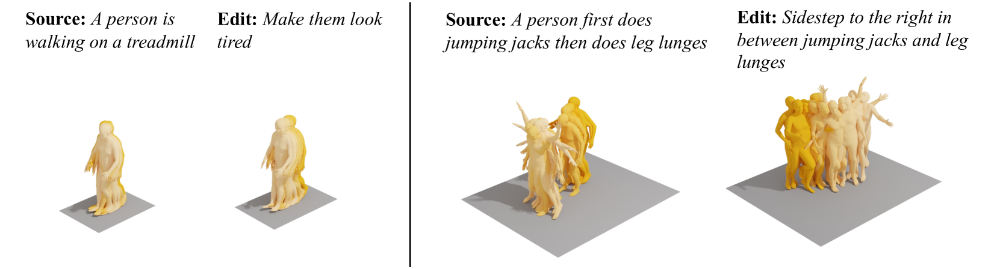

[Arxiv](https://arxiv.org/abs/2403.13900)