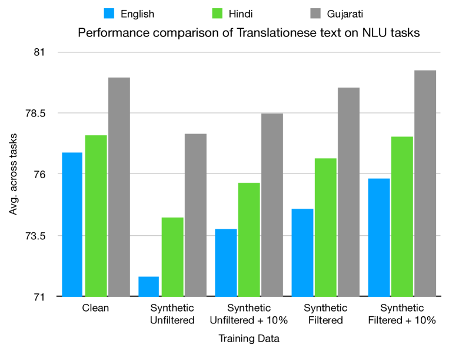
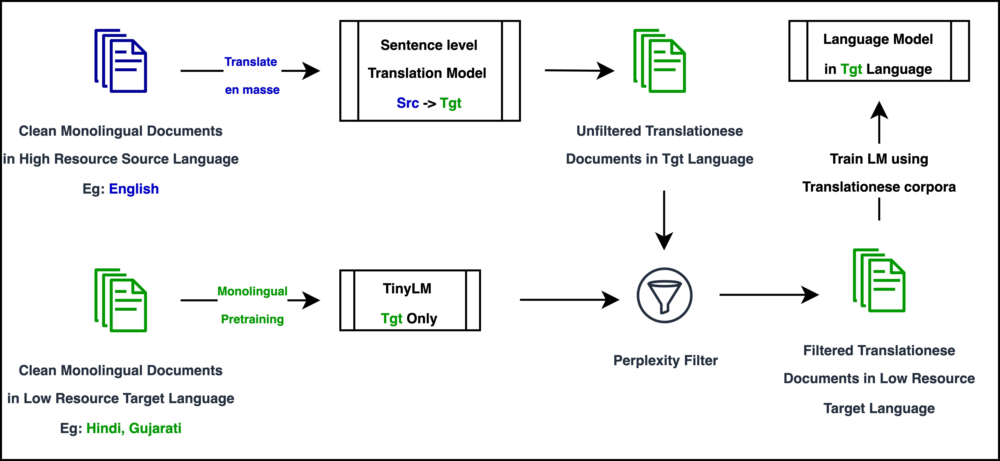
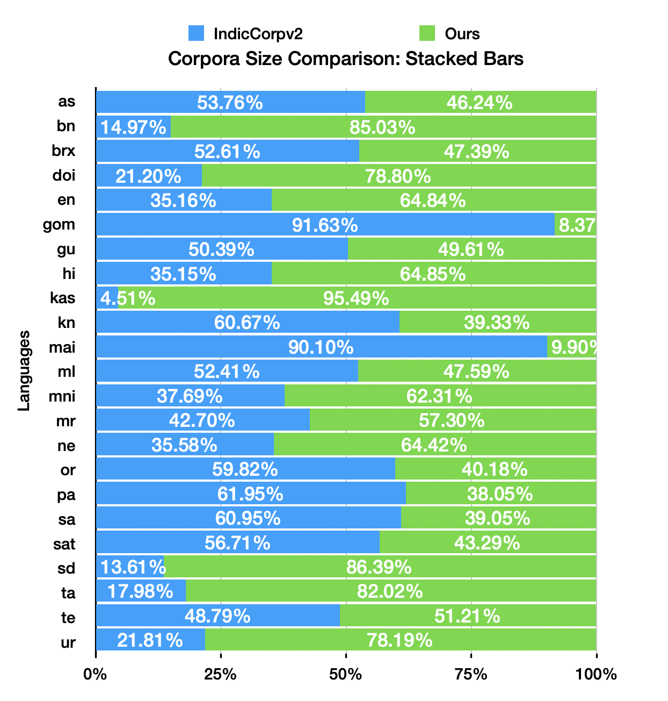
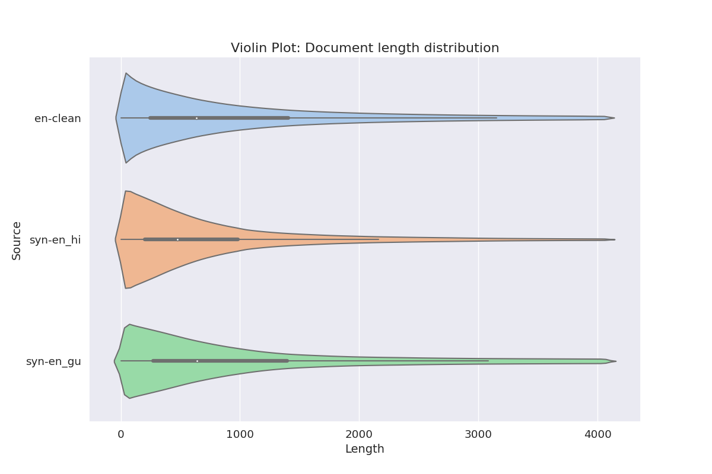

# 无需数据也能游刃有余：利用翻译文体打造预训练语言模型

发布时间：2024年03月20日

`LLM应用` `机器翻译` `预训练模型`

> Do Not Worry if You Do Not Have Data: Building Pretrained Language Models Using Translationese

> 本文探索利用机器翻译产生的“Translationese”作为预训练语言模型的合成数据源，以应对除英语外其他语言缺乏大量单语数据的问题。针对英语和印度语，我们将爬取的高质量单语文档翻译为目标语言，并在所得译文风格数据上训练出规模分别为2800万和8500万参数的语言模型。实验表明，这些模型在下游NLU和NLG任务上的表现仅比在纯净数据上预训练的模型略差3.56\%和1.51\%。同时，我们创新性地提出运用预先在纯净数据上训练过的轻量级TinyLMs有效筛选合成数据，从而显著提升模型性能。更有意思的是，我们发现在少量（10\%）纯净数据上延长预训练时间，可以极大地助力基于合成数据训练的模型。为了推动这一领域的发展，我们公开发布了一系列研究成果中收集和创建的数据集——IndicMonoDoc，它是迄今为止最大的单语文档级别语料库合辑，有望填补大型语言模型在处理英语与非英语语言时的性能鸿沟。

> In this paper, we explore the utility of \textit{Translationese} as synthetic data created using machine translation for pre-training language models (LMs). Pre-training requires vast amounts of monolingual data, which is mostly unavailable for languages other than English. Recently, there has been a growing interest in using synthetic data to address this data scarcity. We take the case of English and Indic languages and translate web-crawled monolingual documents (clean) into the target language. Then, we train language models containing 28M and 85M parameters on this translationese data (synthetic). We show that their performance on downstream natural language understanding and generative tasks is only 3.56\% poorer on NLU tasks and 1.51\% on NLG tasks than LMs pre-trained on clean data. Further, we propose the use of lightweight \textit{TinyLMs} pre-trained on clean data to filter synthetic data efficiently which significantly improves the performance of our models. We also find that LMs trained on synthetic data strongly benefit from extended pretraining on a tiny fraction (10\%) of clean data. We release the data we collected and created as a part of this work, \textit{IndicMonoDoc}, the largest collection of monolingual document-level corpora, which we hope will help bridge the gap between English and non-English performance for large language models.

[Arxiv](https://arxiv.org/abs/2403.13638)