# EEGDiR：一种脑电图去噪网络，旨在存储时间信息并通过 Retentive 网络实现全局建模。

发布时间：2024年03月20日

`分类：LLM应用

这篇论文摘要讨论了将自然语言处理中的记忆网络技术应用于EEG信号去噪的问题。虽然EEG信号处理与自然语言处理在本质上有所不同，但作者通过创新性地将一维EEG信号转换成二维形式以适配网络输入，成功地将记忆网络技术应用于EEG去噪。这种跨界融合不仅为EEG去噪提供了新的解决路径，也为深入洞察大脑活动和精确诊断神经疾病开辟了新的可能性。因此，这篇论文应该归类为LLM应用，因为它探讨了如何将大型语言模型（LLMs）中的记忆网络技术应用于非语言领域的实际问题。`

> EEGDiR: Electroencephalogram denoising network for temporal information storage and global modeling through Retentive Network

# 摘要

> 脑电图（EEG）信号对于医学诊断、脑科学研究及神经系统疾病探索具有不可替代的重要性。但是，EEG数据易受到生理和环境因素的干扰，产生噪声，这严重妨碍了对脑内活动的精确解读。为了解决这一问题，去噪技术变得极为关键。最新的深度学习方法在提升EEG信号的信噪比方面，相较于传统技术，展现了显著的优势。在大型语言模型（LLMs）中，记忆网络（Retnet）架构因其出色的特征提取和全局建模能力而广受青睐。鉴于EEG信号与自然语言在时间序列上的相似性，我们创新性地将自然语言处理中的记忆网络技术应用于EEG去噪。这一跨界融合不仅为EEG去噪提供了创新的解决路径，也为深入洞察大脑活动和精确诊断神经疾病开辟了新的可能性。然而，由于EEG信号本质上是一维的，而自然语言处理通常处理二维数据，直接将记忆网络应用于EEG去噪存在技术上的障碍。为此，我们提出了一种信号嵌入技术，将一维EEG信号转换成二维形式以适配网络输入，实验证明，该方法在提高去噪效果方面取得了显著成效。

> Electroencephalogram (EEG) signals play a pivotal role in clinical medicine, brain research, and neurological disease studies. However, susceptibility to various physiological and environmental artifacts introduces noise in recorded EEG data, impeding accurate analysis of underlying brain activity. Denoising techniques are crucial to mitigate this challenge. Recent advancements in deep learningbased approaches exhibit substantial potential for enhancing the signal-to-noise ratio of EEG data compared to traditional methods. In the realm of large-scale language models (LLMs), the Retentive Network (Retnet) infrastructure, prevalent for some models, demonstrates robust feature extraction and global modeling capabilities. Recognizing the temporal similarities between EEG signals and natural language, we introduce the Retnet from natural language processing to EEG denoising. This integration presents a novel approach to EEG denoising, opening avenues for a profound understanding of brain activities and accurate diagnosis of neurological diseases. Nonetheless, direct application of Retnet to EEG denoising is unfeasible due to the one-dimensional nature of EEG signals, while natural language processing deals with two-dimensional data. To facilitate Retnet application to EEG denoising, we propose the signal embedding method, transforming one-dimensional EEG signals into two dimensions for use as network inputs. Experimental results validate the substantial improvement in denoising effectiveness achieved by the proposed method.

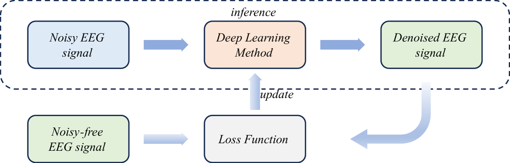

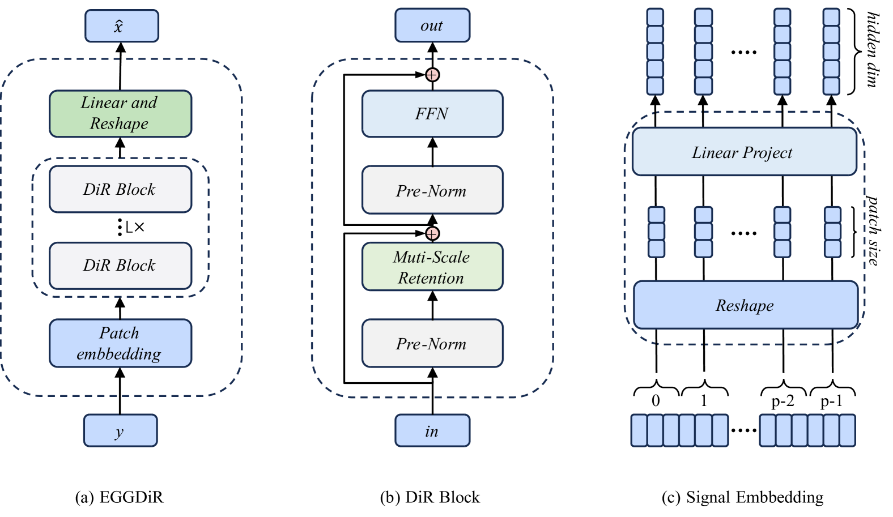

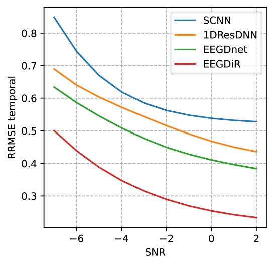

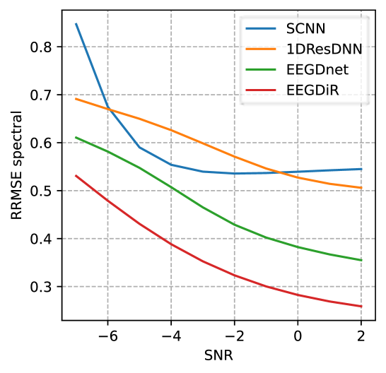

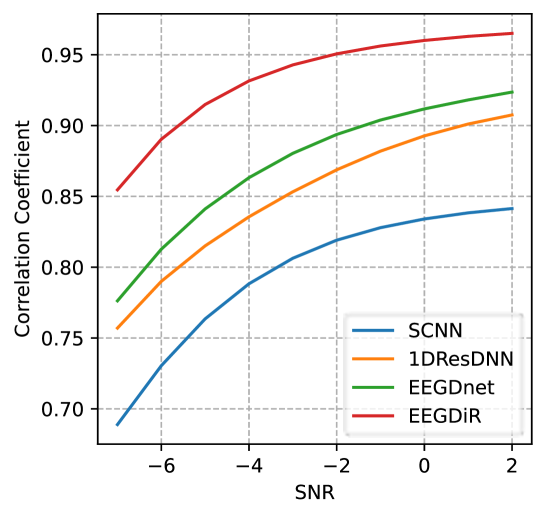

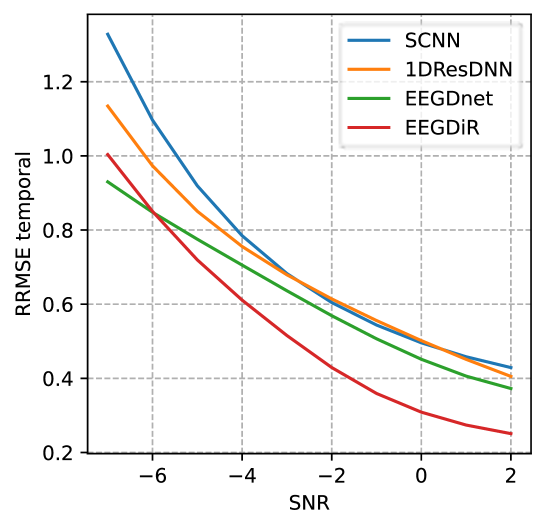

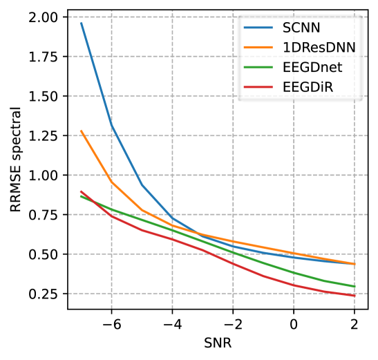

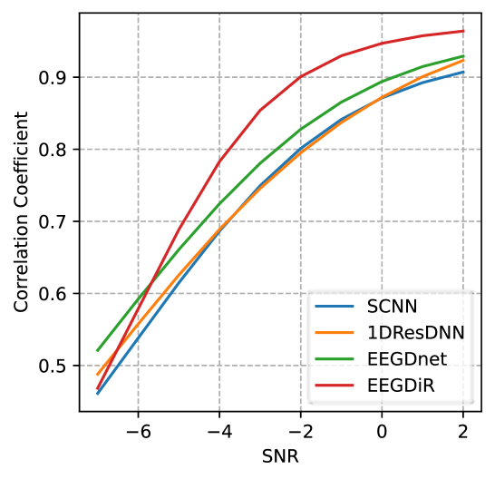

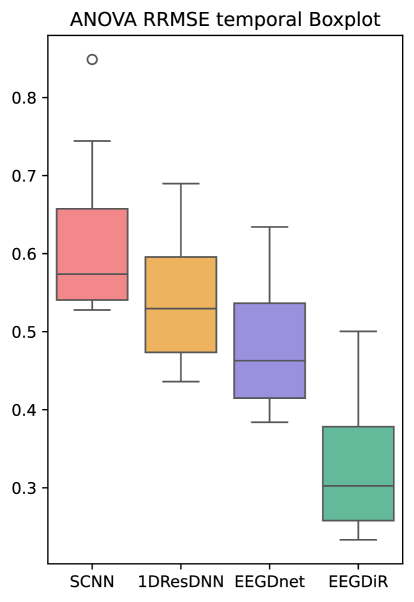

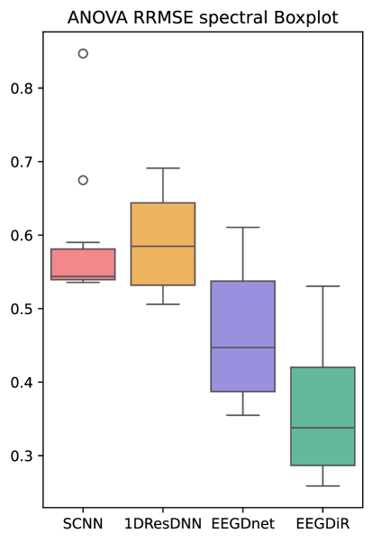

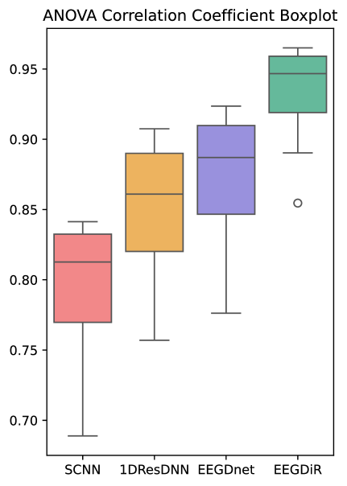

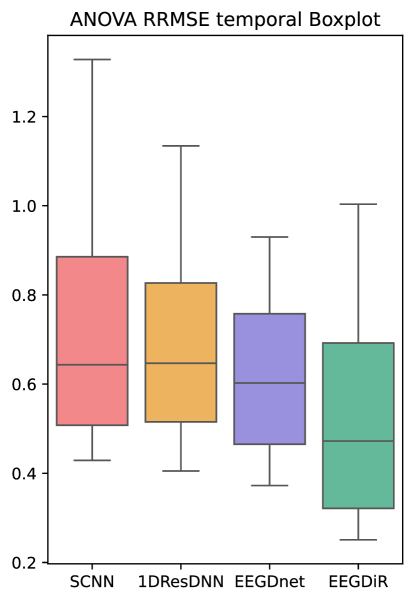

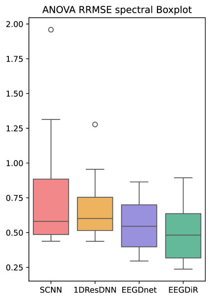

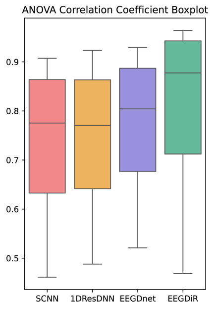

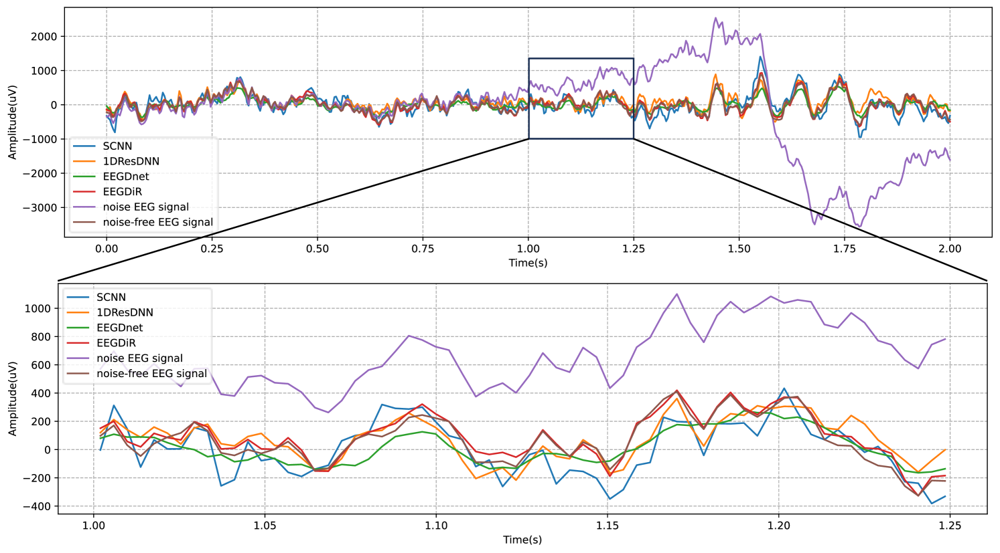

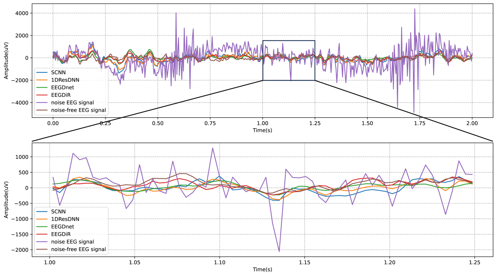

[Arxiv](https://arxiv.org/abs/2404.15289)