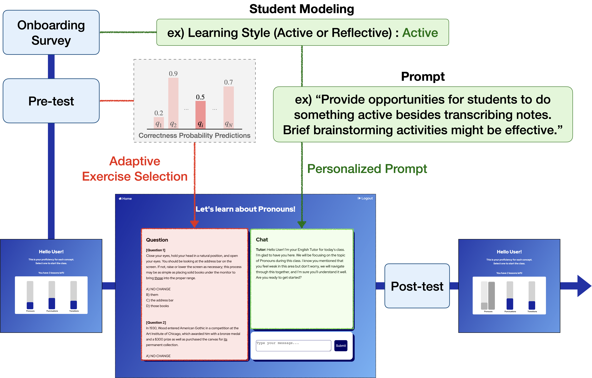
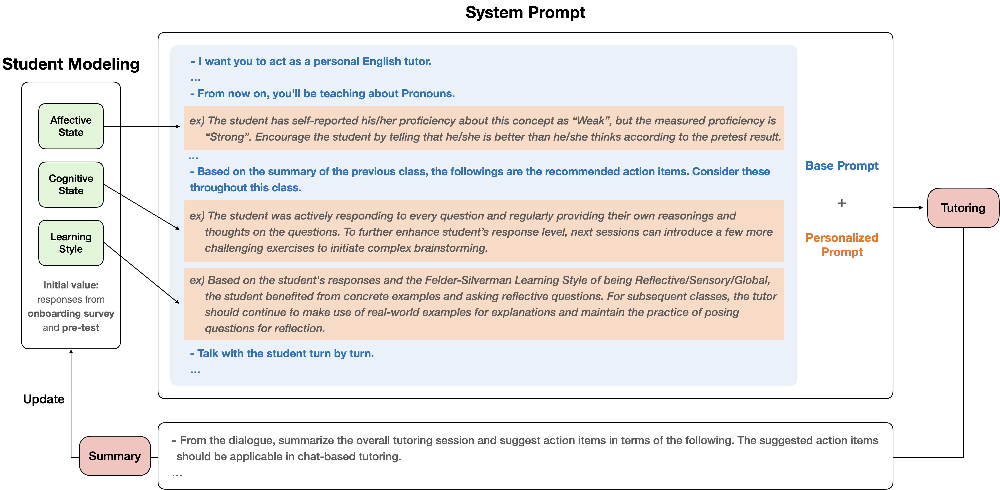
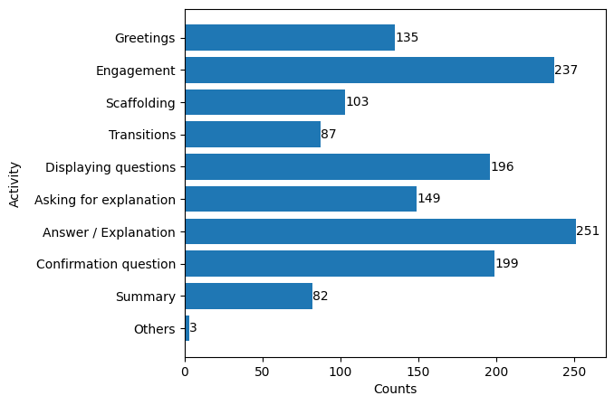
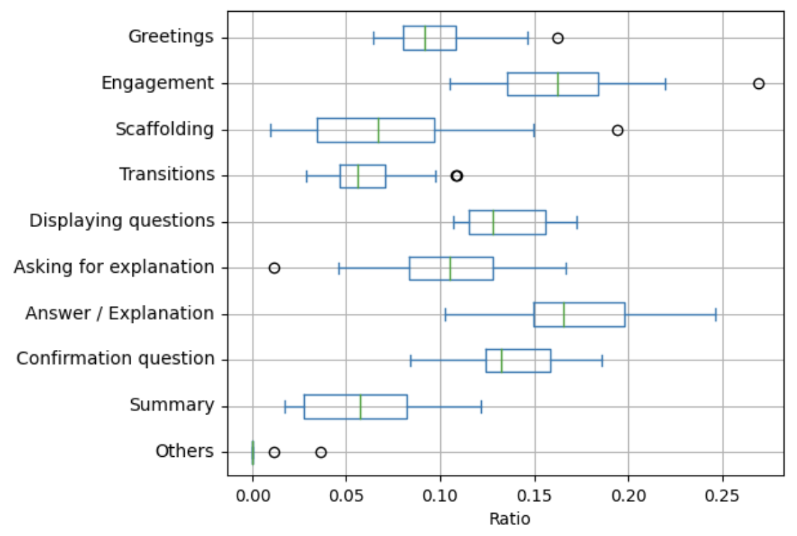

# 借助具备学生建模能力的对话式辅导系统，推动个性化学习的发展与深入实施

发布时间：2024年03月20日

`LLM应用` `个性化教学`

> Empowering Personalized Learning through a Conversation-based Tutoring System with Student Modeling

> 随着LLM在各领域展现卓越的零样本和少量样本推理能力，教育者们愈发关注将其应用于基于对话的辅导系统。但要打造一个既能精准评估学生、又能巧妙融入对话教学中的个性化辅导系统颇具挑战。本文探讨了一款包含两大核心模块的个性化辅导系统设计方案：一是配备诊断功能的学生模型模块；二是运用LLM与提示工程技术，结合学生评估成果与多元教学策略的对话式辅导模块。依据这一理念，我们搭建了一个以个性化为核心的原型辅导系统，并邀请20位参与者进行试用。实验证明，该系统架构确实有助于个性化教学，尤其突显了学生模型构建的重要性。目前，您可通过访问http://rlearning-its.com体验我们的在线演示系统。

> As the recent Large Language Models(LLM's) become increasingly competent in zero-shot and few-shot reasoning across various domains, educators are showing a growing interest in leveraging these LLM's in conversation-based tutoring systems. However, building a conversation-based personalized tutoring system poses considerable challenges in accurately assessing the student and strategically incorporating the assessment into teaching within the conversation. In this paper, we discuss design considerations for a personalized tutoring system that involves the following two key components: (1) a student modeling with diagnostic components, and (2) a conversation-based tutor utilizing LLM with prompt engineering that incorporates student assessment outcomes and various instructional strategies. Based on these design considerations, we created a proof-of-concept tutoring system focused on personalization and tested it with 20 participants. The results substantiate that our system's framework facilitates personalization, with particular emphasis on the elements constituting student modeling. A web demo of our system is available at http://rlearning-its.com.

[Arxiv](https://arxiv.org/abs/2403.14071)