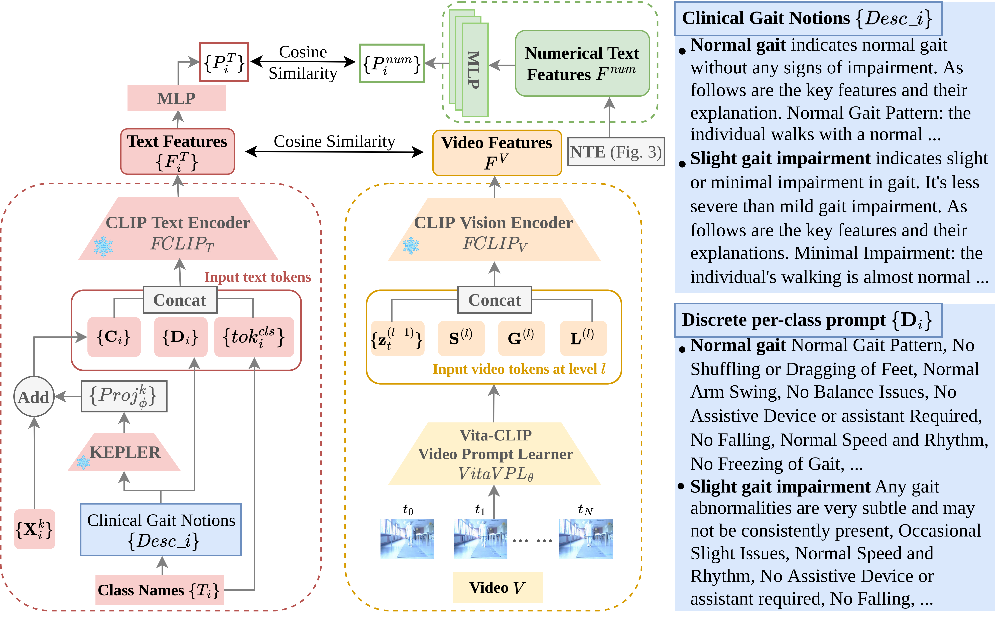
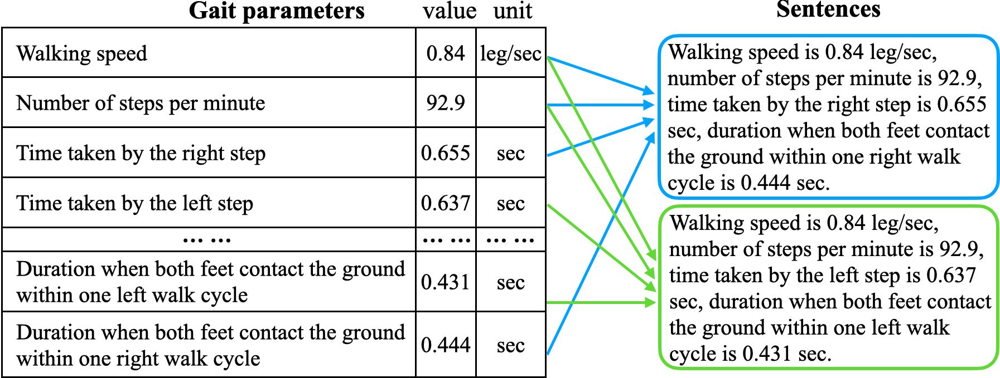
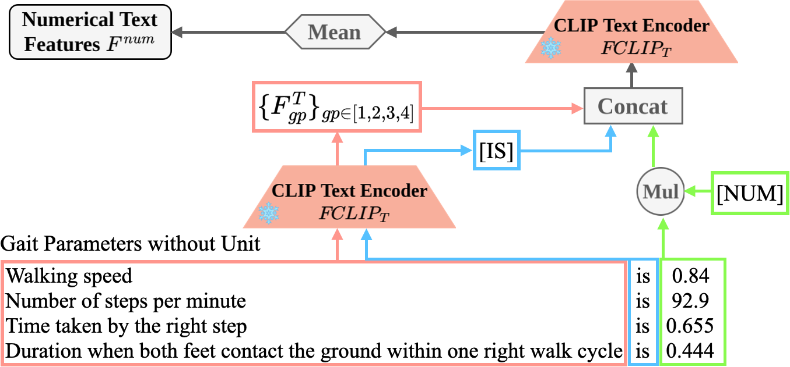
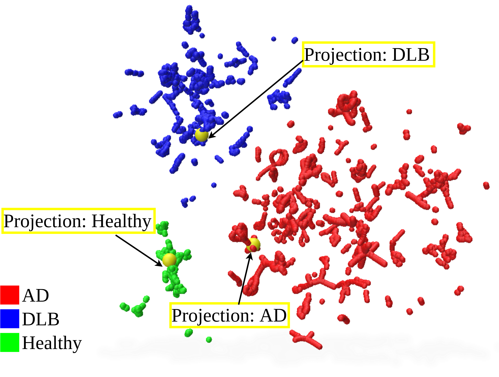
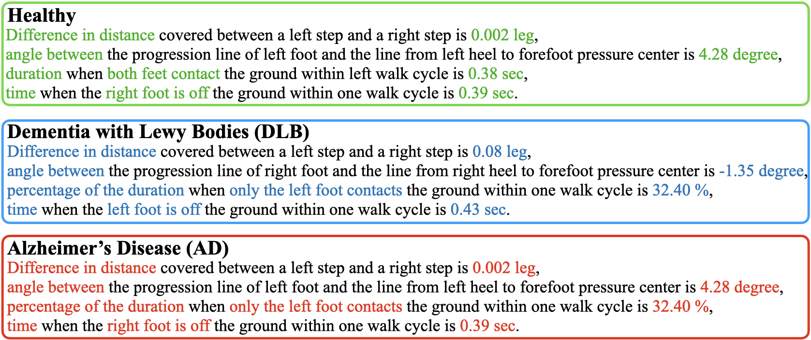
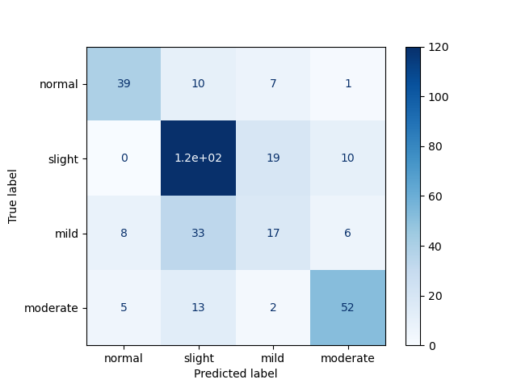
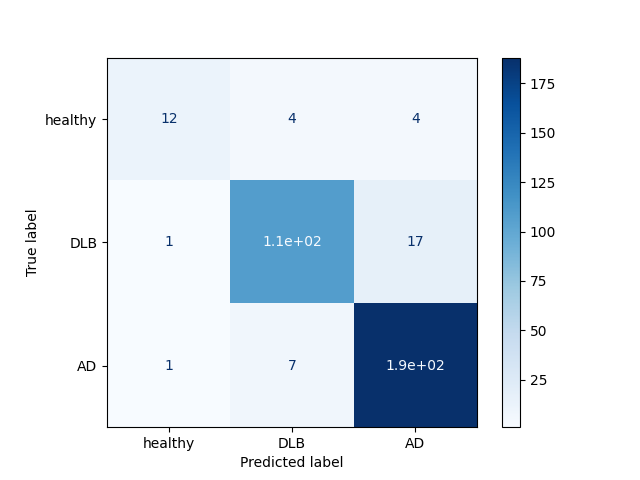

# 通过在视觉语言模型中注入更多知识，我们提升对神经退行性疾病步态视频分析的精准度与深度。这项研究聚焦于通过知识增强手段优化视觉语言模型，以期在相关疾病的步态视频分析中取得突破性进展。

发布时间：2024年03月20日

`LLM应用` `步态分析`

> Enhancing Gait Video Analysis in Neurodegenerative Diseases by Knowledge Augmentation in Vision Language Model

> 本研究提出一种创新的知识增强方法，针对单目步态视频分析诊断分组及步态损伤程度。该方法依托于大型预训练视觉语言模型(VLM)，通过融合步态视频、类别特定描述以及数值化的步态参数这三种不同模态信息，有效提升对患者步态视频的视觉、文本和数值理解深度。我们的主要贡献包括两部分：一是运用知识驱动的提示调优技术，借助类别特异性的医学描述引导文本提示的学习过程；二是将匹配的步态参数以数值文本形式融入，以强化文本表达中的量化特性。实验表明，我们的模型在基于视频的分类任务上远超现有最先进技术，并能巧妙地将学到的类别特异性文本特征转化为由定量步态参数词汇构建的自然语言描述。项目代码与模型将会在我们的项目主页开放获取。

> We present a knowledge augmentation strategy for assessing the diagnostic groups and gait impairment from monocular gait videos. Based on a large-scale pre-trained Vision Language Model (VLM), our model learns and improves visual, textual, and numerical representations of patient gait videos, through a collective learning across three distinct modalities: gait videos, class-specific descriptions, and numerical gait parameters. Our specific contributions are two-fold: First, we adopt a knowledge-aware prompt tuning strategy to utilize the class-specific medical description in guiding the text prompt learning. Second, we integrate the paired gait parameters in the form of numerical texts to enhance the numeracy of the textual representation. Results demonstrate that our model not only significantly outperforms state-of-the-art (SOTA) in video-based classification tasks but also adeptly decodes the learned class-specific text features into natural language descriptions using the vocabulary of quantitative gait parameters. The code and the model will be made available at our project page.

[Arxiv](https://arxiv.org/abs/2403.13756)