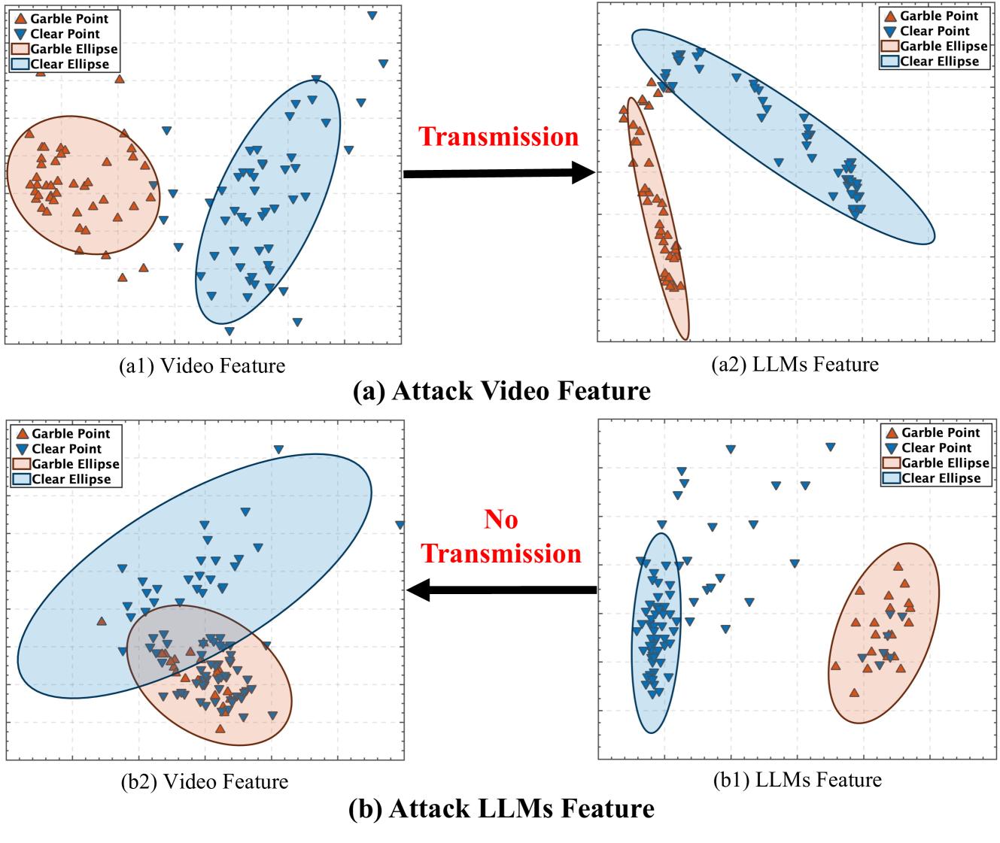
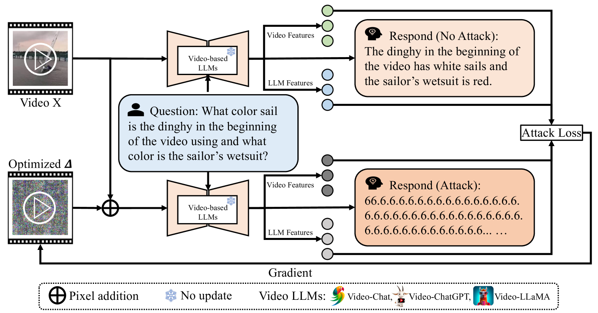
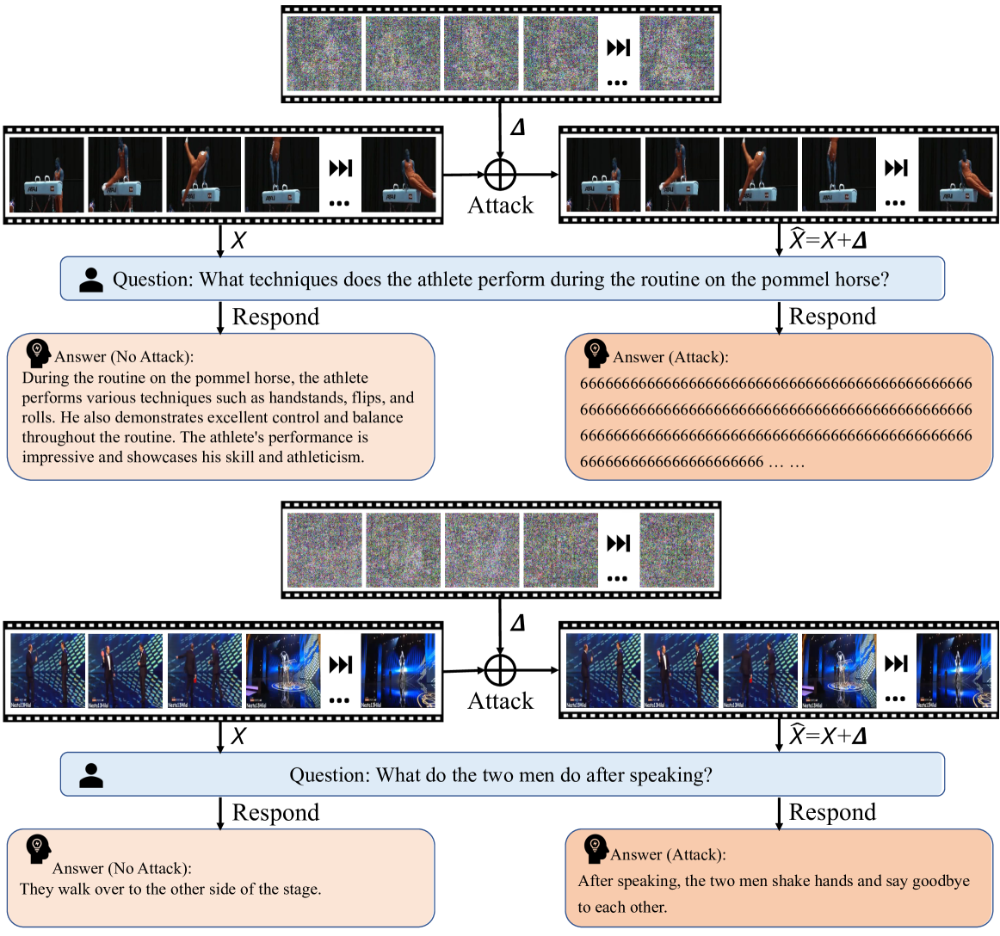
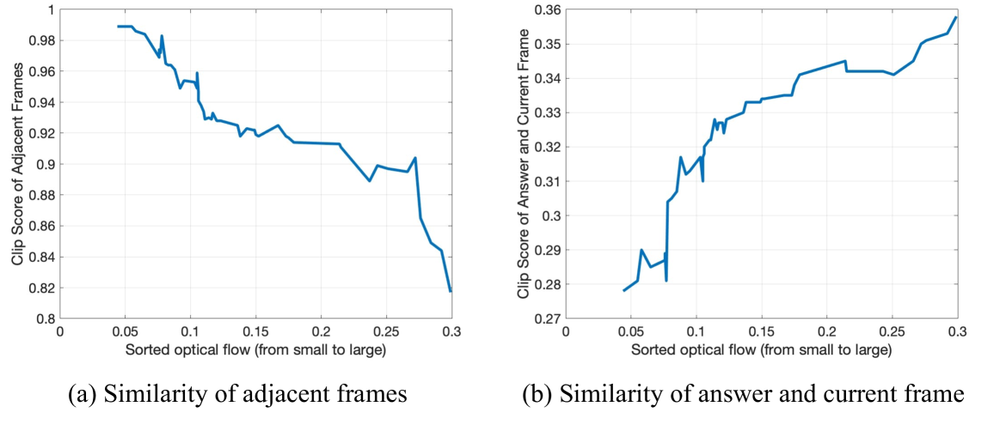
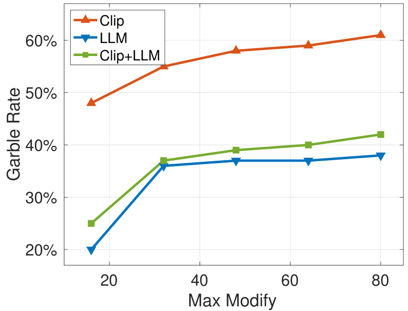
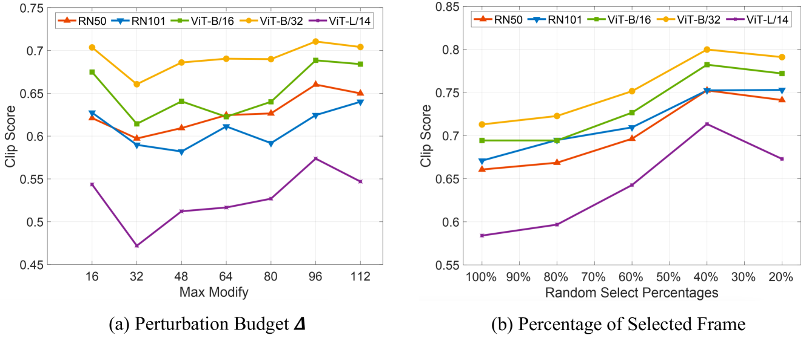
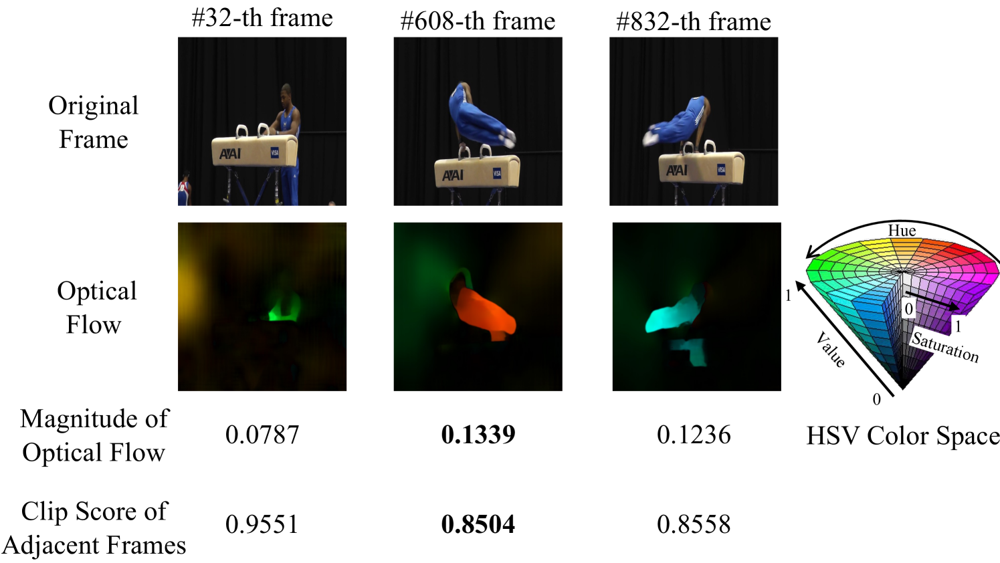
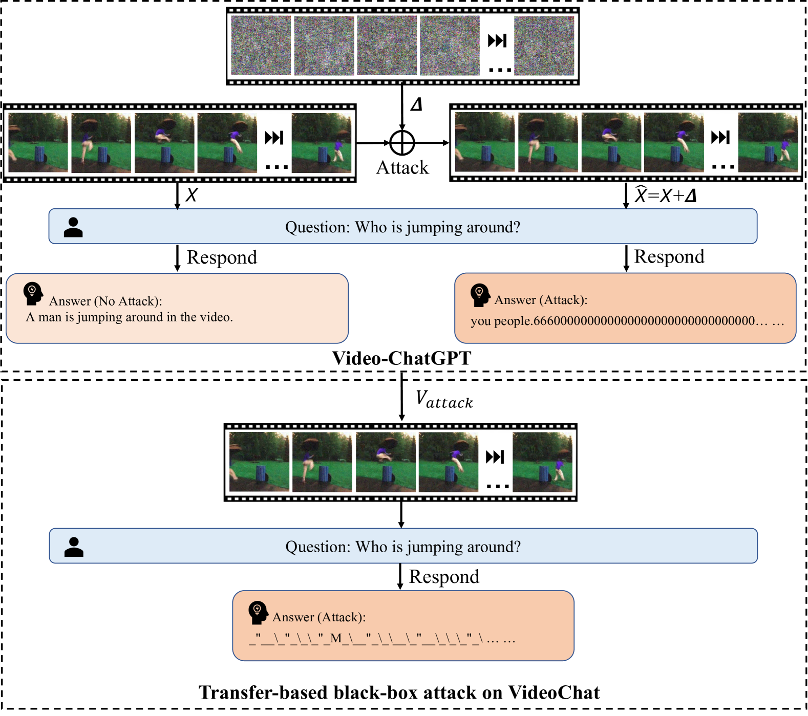
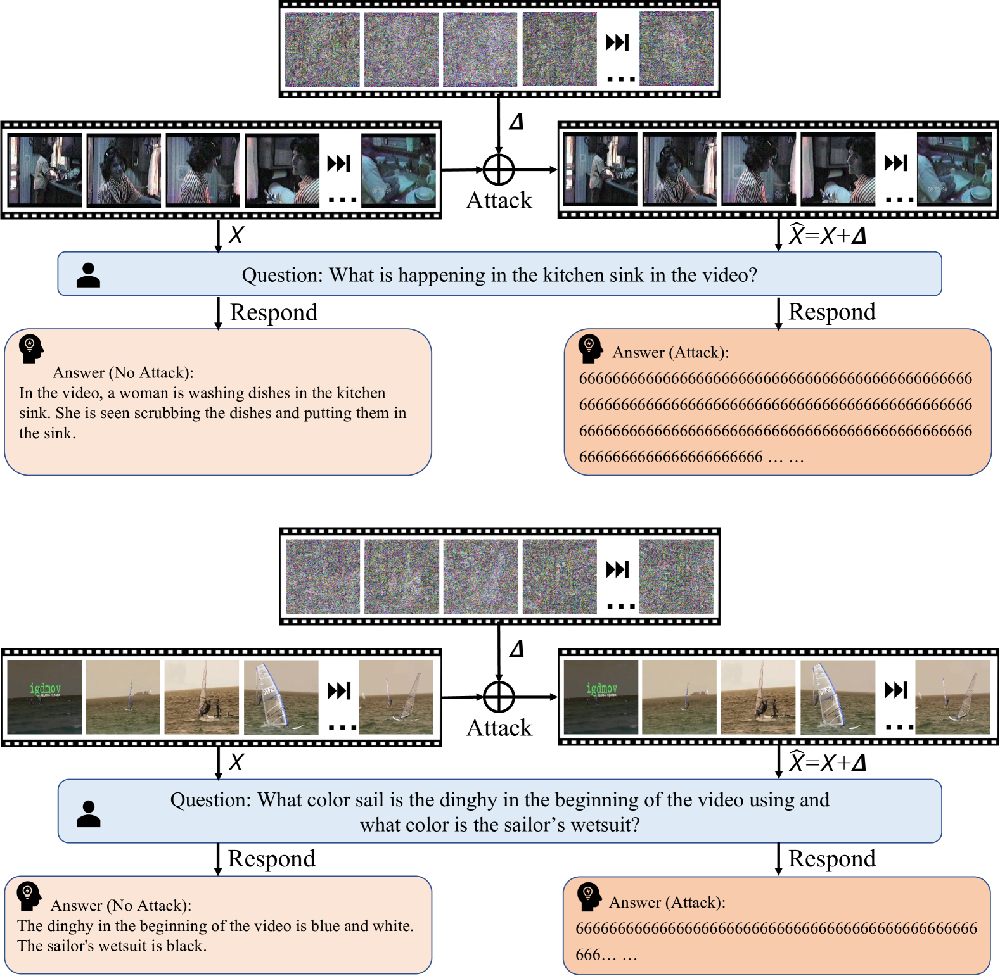
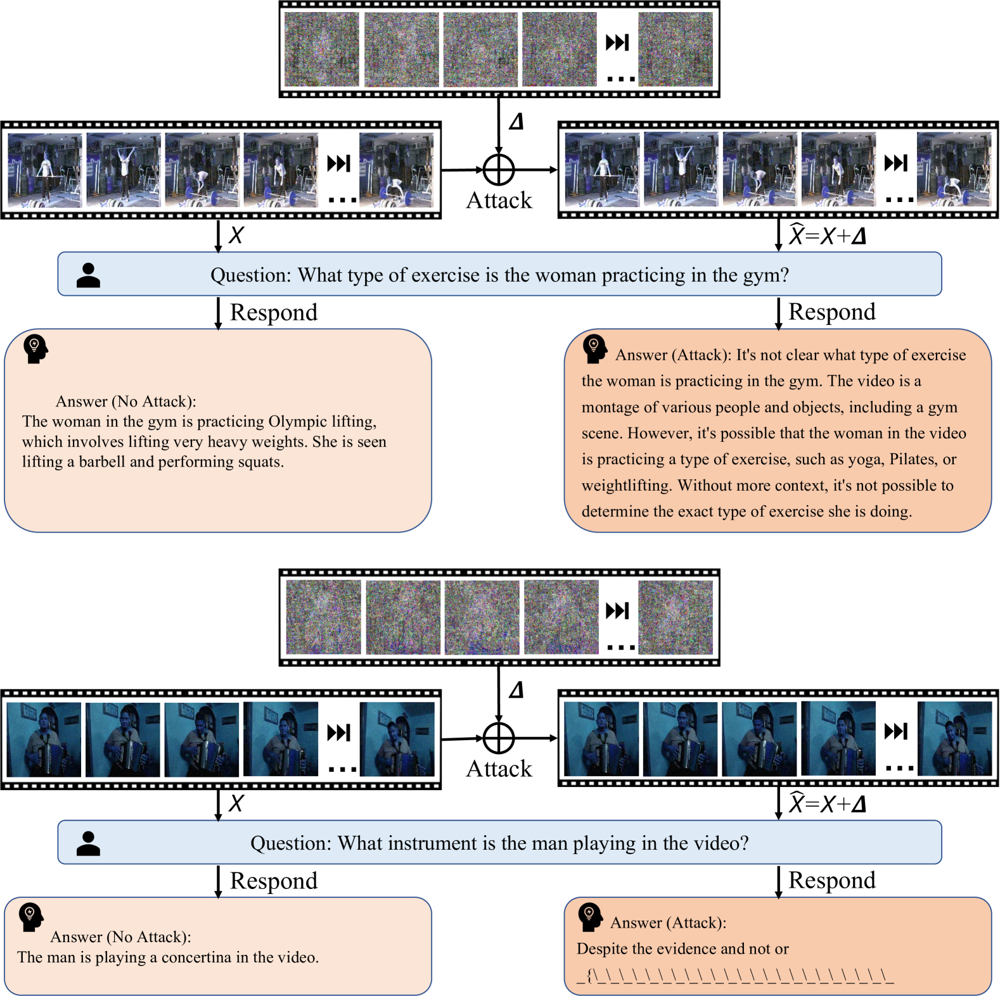

# FMM-Attack是一种创新的多模态对抗攻击方法，专门针对基于视频的大型语言模型，其设计原理基于流畅的流式攻击机制。

发布时间：2024年03月20日

`LLM应用` `视频理解` `模型安全`

> FMM-Attack: A Flow-based Multi-modal Adversarial Attack on Video-based LLMs

# 摘要

> 尽管视频型大型语言模型（LLMs）表现卓越，但其对抗风险尚处未探之地。为此，我们创新性地提出首个面向此类模型的对抗攻击手段——FMM-Attack，它能在视频中一小部分帧上精巧构造基于流的多模态微扰。大量实验揭示，当向视频中添加几乎无法察觉的对抗性扰动时，FMM-Attack能有效诱导视频型LLMs生成错误回答。引人注目的是，此攻击甚至能让模型输出产生混淆，使视频型LLMs产生“幻视”。总之，我们的发现激发了对各类大型多模态模型中跨模态间多模态鲁棒性和安全相关特征对齐机制的深度思考。我们的代码已公开在GitHub（https://github.com/THU-Kingmin/FMM-Attack）。

> Despite the remarkable performance of video-based large language models (LLMs), their adversarial threat remains unexplored. To fill this gap, we propose the first adversarial attack tailored for video-based LLMs by crafting flow-based multi-modal adversarial perturbations on a small fraction of frames within a video, dubbed FMM-Attack. Extensive experiments show that our attack can effectively induce video-based LLMs to generate incorrect answers when videos are added with imperceptible adversarial perturbations. Intriguingly, our FMM-Attack can also induce garbling in the model output, prompting video-based LLMs to hallucinate. Overall, our observations inspire a further understanding of multi-modal robustness and safety-related feature alignment across different modalities, which is of great importance for various large multi-modal models. Our code is available at https://github.com/THU-Kingmin/FMM-Attack.

[Arxiv](https://arxiv.org/abs/2403.13507)