# 驾驭大型语言模型之力，以赋能文本丰富的序列推荐任务

发布时间：2024年03月20日

`LLM应用` `推荐系统`

> Harnessing Large Language Models for Text-Rich Sequential Recommendation

> 随着LLMs技术的发展，其正在革新推荐系统的设计思路。但在面对推荐项含有大量文本信息（例如网购商品详情或社交媒体新闻标题）时，LLMs需要处理更长的行为序列文本以全面反映用户历史行为，这为LLM驱动的推荐系统带来了显著挑战，包括过长文本处理难题、高昂的时间和空间成本以及可能欠佳的模型性能。因此，本文创新性地提出了“LLM-TRSR”框架，专门用于解决富文本序列推荐问题。我们先将用户历史行为切分成多个片段，并运用基于LLM的摘要算法提炼关键信息；在此基础上，借鉴CNN和RNN在用户建模中取得的成功经验，我们独创了层次摘要和循环摘要两种策略。进一步，我们将用户偏好摘要、近期互动记录及候选物品信息整合成提示文本输入至LLM推荐器，并借助监督微调技术（SFT）对其精调优化，最终形成高性能推荐模型。此外，还利用低秩适应（LoRA）实现参数高效微调（PEFT）。实验证明，这一方案在两个公开数据集上表现卓越，充分彰显其实效性。

> Recent advances in Large Language Models (LLMs) have been changing the paradigm of Recommender Systems (RS). However, when items in the recommendation scenarios contain rich textual information, such as product descriptions in online shopping or news headlines on social media, LLMs require longer texts to comprehensively depict the historical user behavior sequence. This poses significant challenges to LLM-based recommenders, such as over-length limitations, extensive time and space overheads, and suboptimal model performance. To this end, in this paper, we design a novel framework for harnessing Large Language Models for Text-Rich Sequential Recommendation (LLM-TRSR). Specifically, we first propose to segment the user historical behaviors and subsequently employ an LLM-based summarizer for summarizing these user behavior blocks. Particularly, drawing inspiration from the successful application of Convolutional Neural Networks (CNN) and Recurrent Neural Networks (RNN) models in user modeling, we introduce two unique summarization techniques in this paper, respectively hierarchical summarization and recurrent summarization. Then, we construct a prompt text encompassing the user preference summary, recent user interactions, and candidate item information into an LLM-based recommender, which is subsequently fine-tuned using Supervised Fine-Tuning (SFT) techniques to yield our final recommendation model. We also use Low-Rank Adaptation (LoRA) for Parameter-Efficient Fine-Tuning (PEFT). We conduct experiments on two public datasets, and the results clearly demonstrate the effectiveness of our approach.

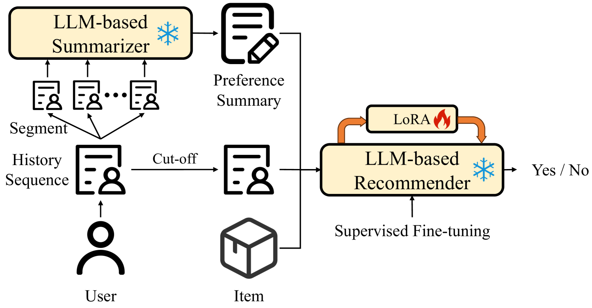

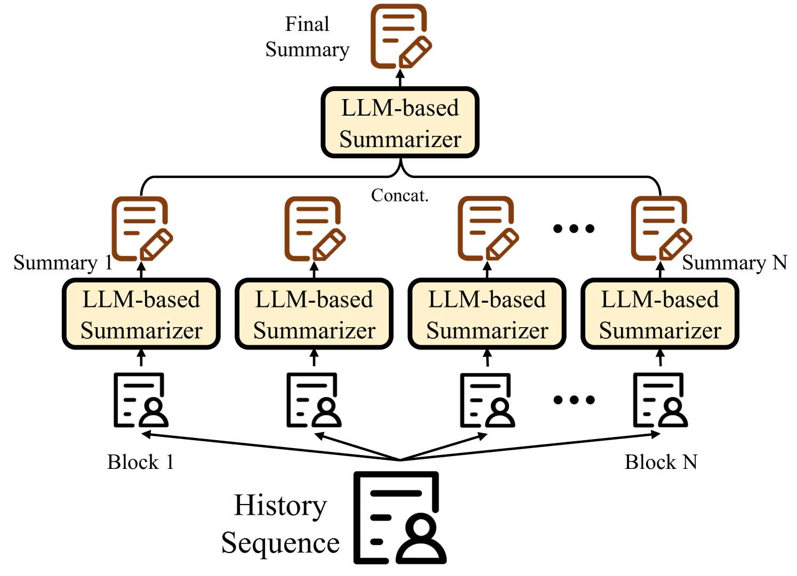

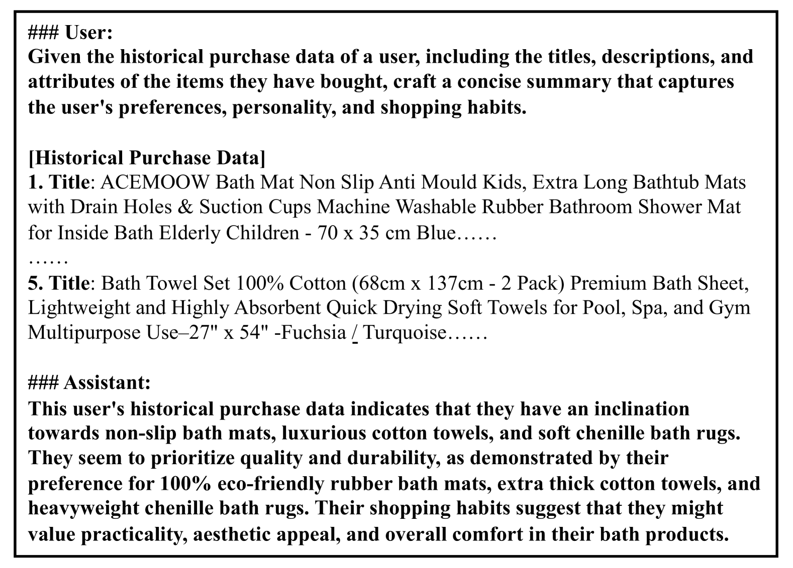

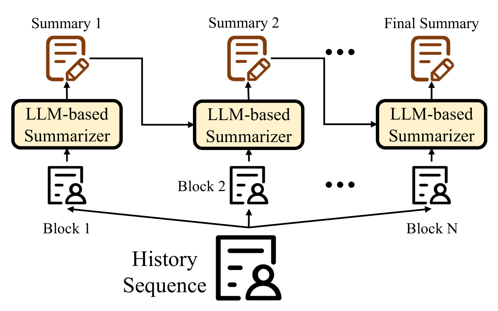

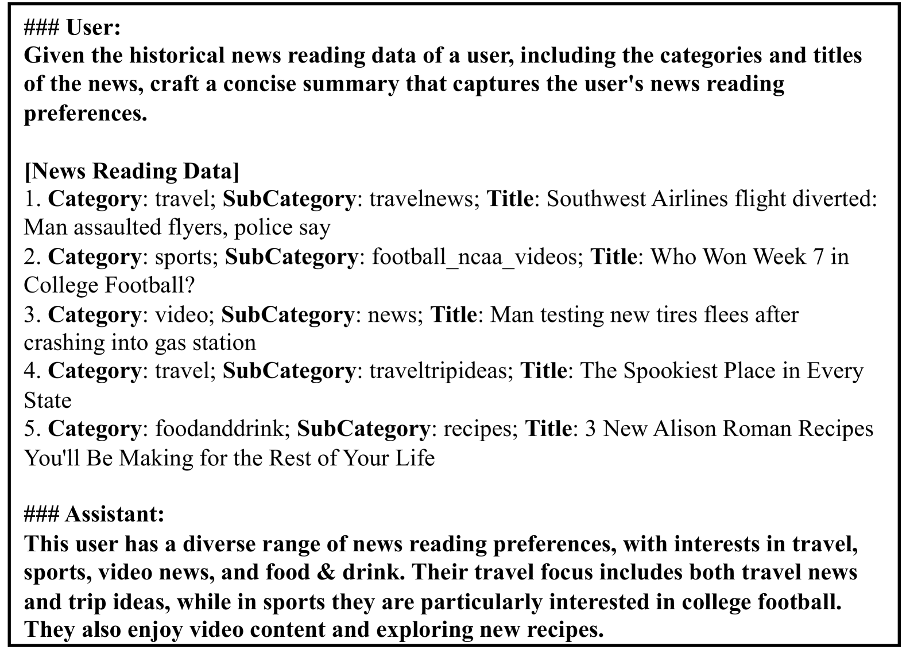

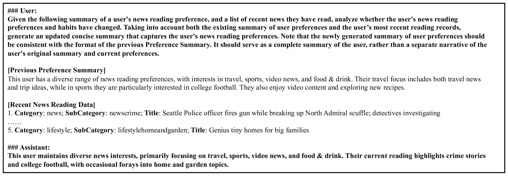

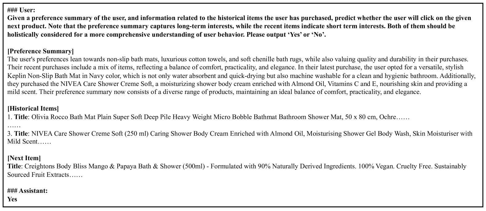

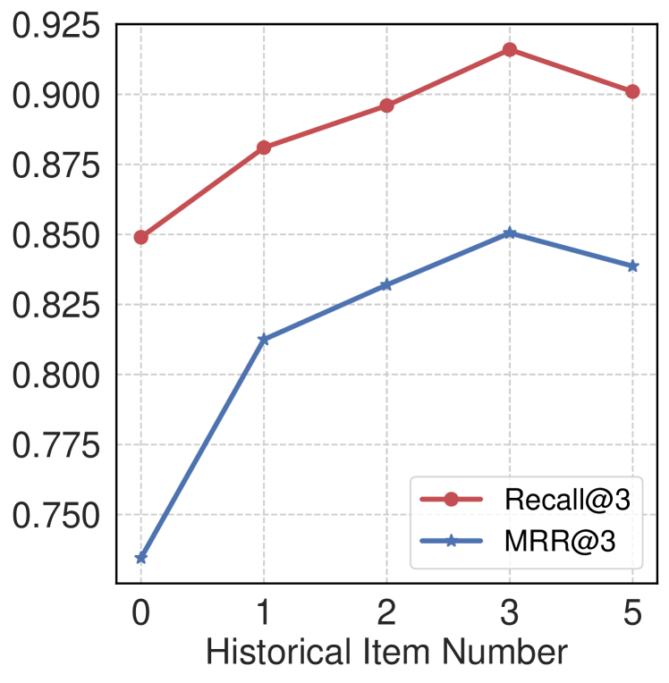

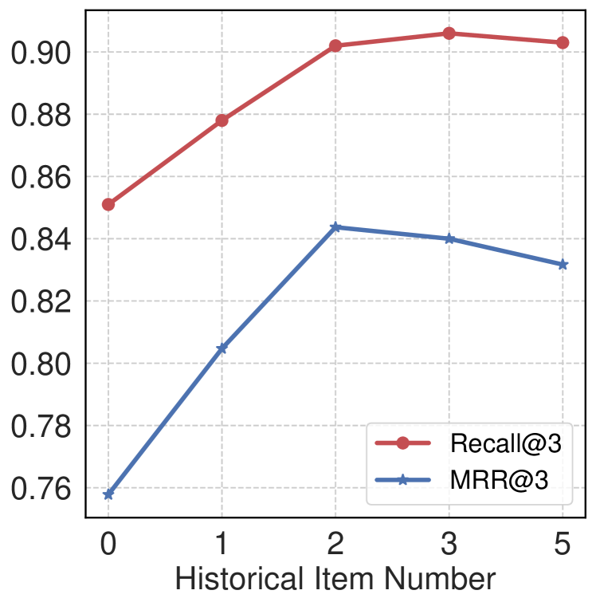

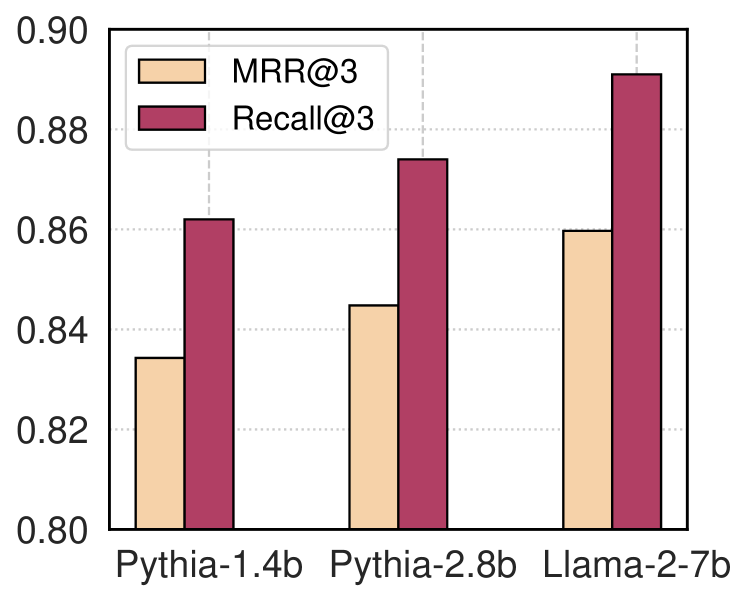

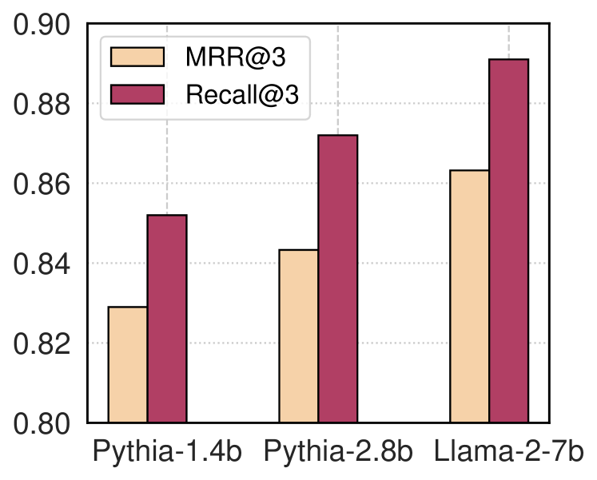

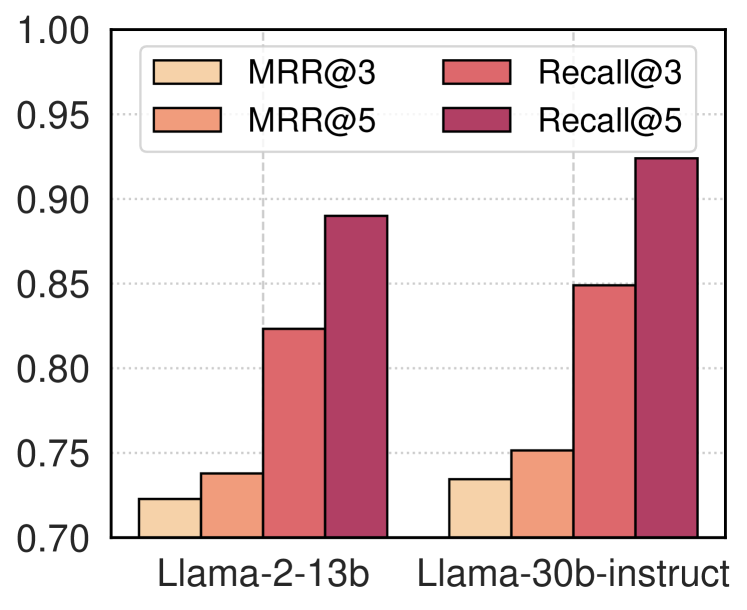

[Arxiv](https://arxiv.org/abs/2403.13325)