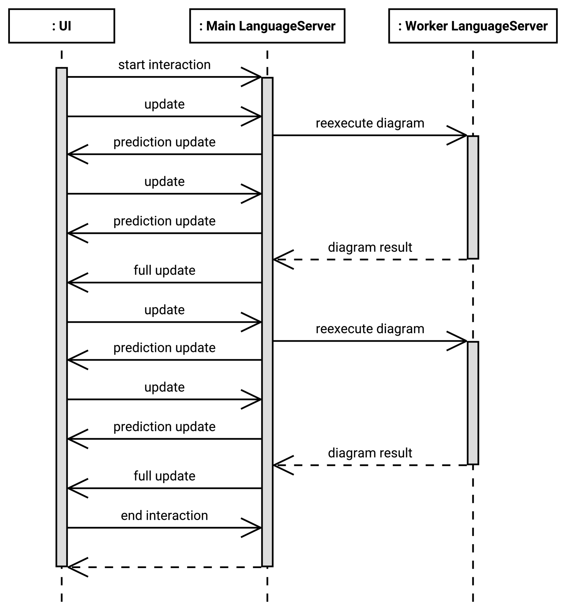
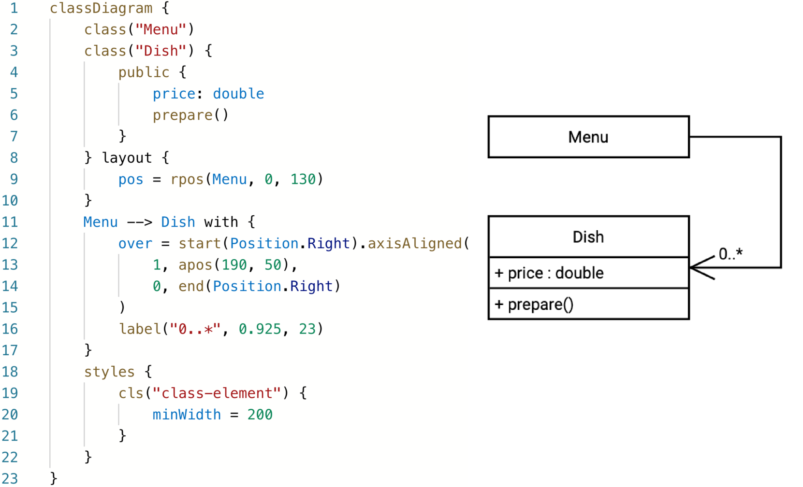
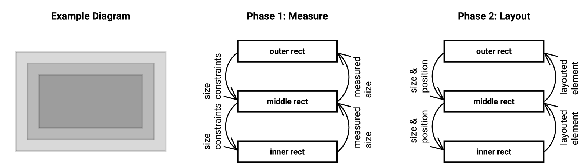
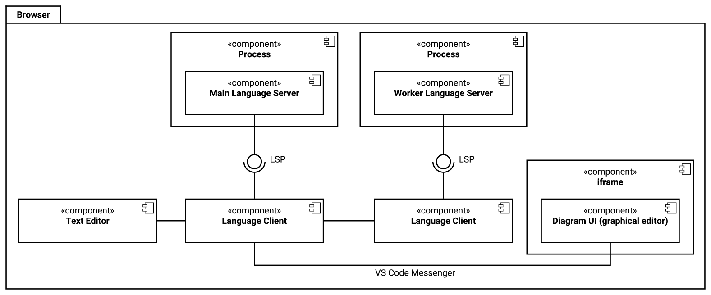

# HyLiMo 是一款创新的模块化绘图编辑器，作为 IDE 的扩展功能，专为技术与科学出版物设计。它实现了混合实时同步技术，使得科研人员在创作过程中能够无缝协作并同步编辑模块化图表。

发布时间：2024年03月20日

`Agent` `科研出版` `图形用户界面设计`

> HyLiMo: A Hybrid Live-Synchronized Modular Diagramming Editor as IDE Extension for Technical and Scientific Publications

> 在科研和技术出版物中设计适宜的图表是一项耗时费力的任务，需精细调整布局以有效传递信息。现有图表工具多采用可渲染和自动布局的文本型特定领域语言（DSL），或借助图形编辑器进行模型构建。尽管自动布局快速，但其效果往往难以满足多数出版物的需求；而图形编辑器在制作大型图表时颇为耗时。融合建模理念创新性地结合了DSL与图形编辑器的优势，用户可通过DSL高效生成图表，再通过图形编辑器精调渲染后的图表布局和样式。然而，现有的混合建模编辑器受限于特定类型图表，并不记录在DSL中的布局和样式信息。为此，我们提出了HyLiMo——一款混合实时同步模块化图表编辑器。HyLiMo利用内部DSL创建图表，并与互动式图形编辑器实时联动，让用户轻松修改布局和样式，所有改动均存储在DSL代码内。HyLiMo不受特定图表类型的限制，特别针对UML类图提供特色功能，并基于语言服务器协议开发为Web应用和IDE插件。我们的用户研究表明，这种方法能够大幅提升图表绘制的速度和精准度。

> Creating suitable diagrams for technical and scientific publications is challenging and time-consuming, as manual control over the layout is required to communicate information effectively. Existing diagramming tools usually allow modeling the diagrams via a textual domain-specific language (DSL) that can be rendered and auto-layouted or via a graphical editor. While auto-layout is fast, the results are often not satisfying for most publications. However, graphical editors are time-consuming to create large diagrams. The blended or hybrid modeling concept enables creating diagrams efficiently using a DSL and editing the rendered diagram via the graphical editor for fine-tuning. However, hybrid modeling editors are limited to individual diagram types and do not save the layout and style information in the textual description. Therefore, we propose HyLiMo, a hybrid live-synchronized modular diagramming editor. In HyLiMo, diagrams are created using an internal DSL and live synchronized with an interactive graphical editor for the rendered diagram, allowing a straightforward layout and style change, which is stored in the DSL code. HyLiMo is independent of specific diagram types, but we offer specific functionality for UML class diagrams. Using the language server protocol, we implement it as a web app and IDE extension. The results of our user study indicate that such an approach enables fast and precise diagramming.

[Arxiv](https://arxiv.org/abs/2403.13711)