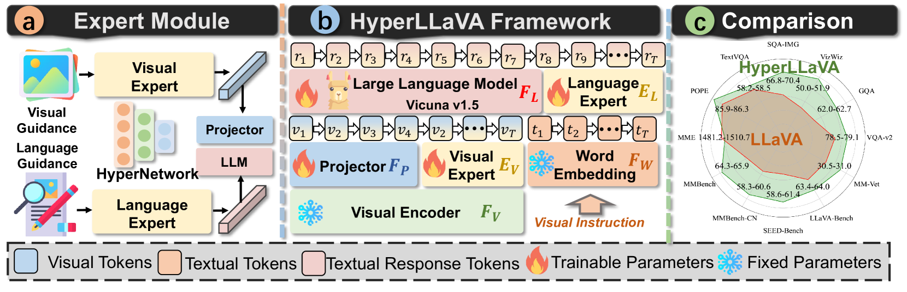
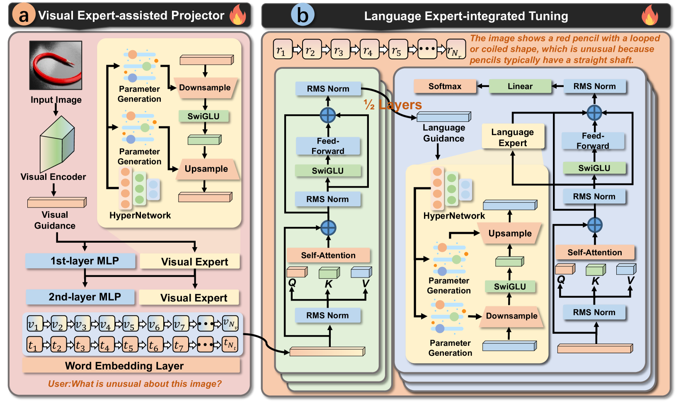
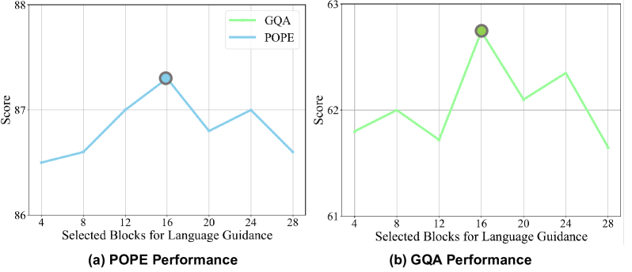
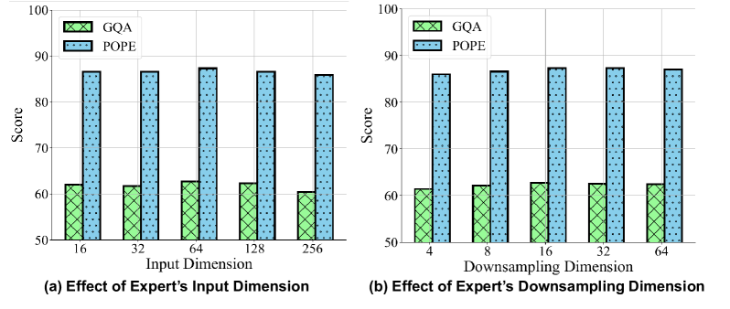

# HyperLLaVA 是一项创新技术，专为多模态大型语言模型设计，通过动态调整视觉和语言专家模块，实现模型性能优化。

发布时间：2024年03月20日

`Agent` `多模态` `语言模型`

> HyperLLaVA: Dynamic Visual and Language Expert Tuning for Multimodal Large Language Models

> 最新研究表明，随着多模态大型语言模型（MLLMs）规模的扩大，其在下游多模态任务上的性能得以显著提升。目前流行的MLLM范例如LLaVA，利用静态视觉-语言映射器将视觉特征转换为类文本标记，使静态LLM能通过视觉指令调整而具备理解视觉信息的能力。不过，共享同一组参数进行静态调整的方法虽有潜力，但在处理不同类型的下游多模态任务时可能受限于性能。鉴于此，我们提出了HyperLLaVA方案，它包含投影器与LLM参数的自适应调整，并各自配备由HyperNetworks驱动的动态视觉专家和语言专家。这两个专家根据视觉及语言指导生成适应性的参数变化，助力投影器和LLM在两阶段训练中实现动态建模。实验结果显示，我们的解决方案在现有的MLLM基准测试上，包括MME、MMBench、SEED-Bench和LLaVA-Bench，均明显超越了LLaVA。项目代码已开源，访问链接：https://github.com/DCDmllm/HyperLLaVA。

> Recent advancements indicate that scaling up Multimodal Large Language Models (MLLMs) effectively enhances performance on downstream multimodal tasks. The prevailing MLLM paradigm, \emph{e.g.}, LLaVA, transforms visual features into text-like tokens using a \emph{static} vision-language mapper, thereby enabling \emph{static} LLMs to develop the capability to comprehend visual information through visual instruction tuning. Although promising, the \emph{static} tuning strategy~\footnote{The static tuning refers to the trained model with static parameters.} that shares the same parameters may constrain performance across different downstream multimodal tasks. In light of this, we introduce HyperLLaVA, which involves adaptive tuning of the projector and LLM parameters, in conjunction with a dynamic visual expert and language expert, respectively. These experts are derived from HyperNetworks, which generates adaptive parameter shifts through visual and language guidance, enabling dynamic projector and LLM modeling in two-stage training.
  Our experiments demonstrate that our solution significantly surpasses LLaVA on existing MLLM benchmarks, including MME, MMBench, SEED-Bench, and LLaVA-Bench. ~\footnote{Our project is available on the link https://github.com/DCDmllm/HyperLLaVA}.

[Arxiv](https://arxiv.org/abs/2403.13447)