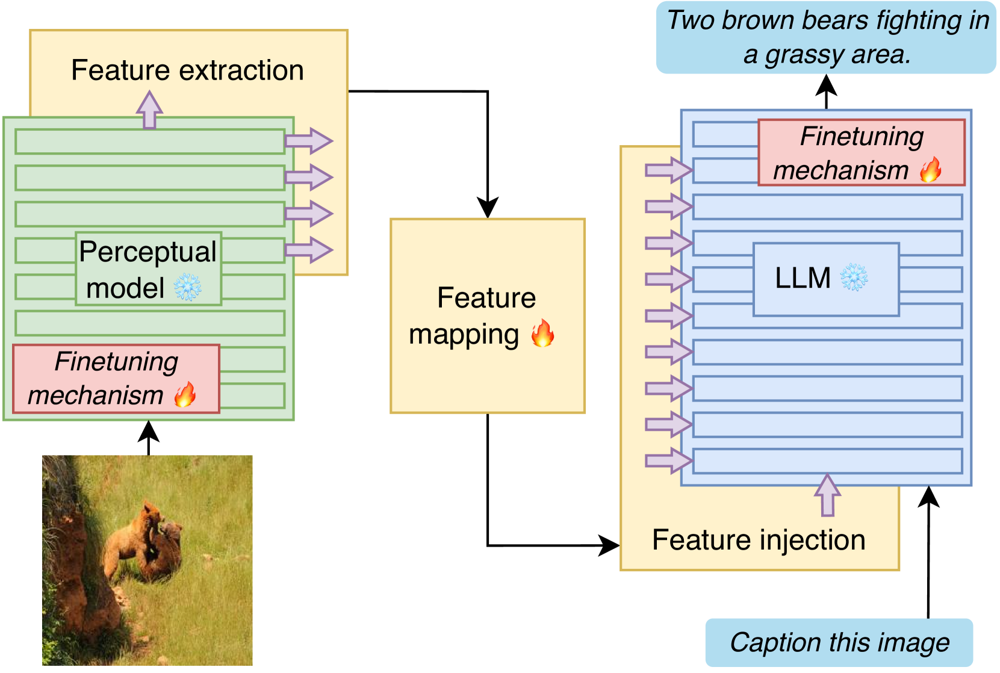
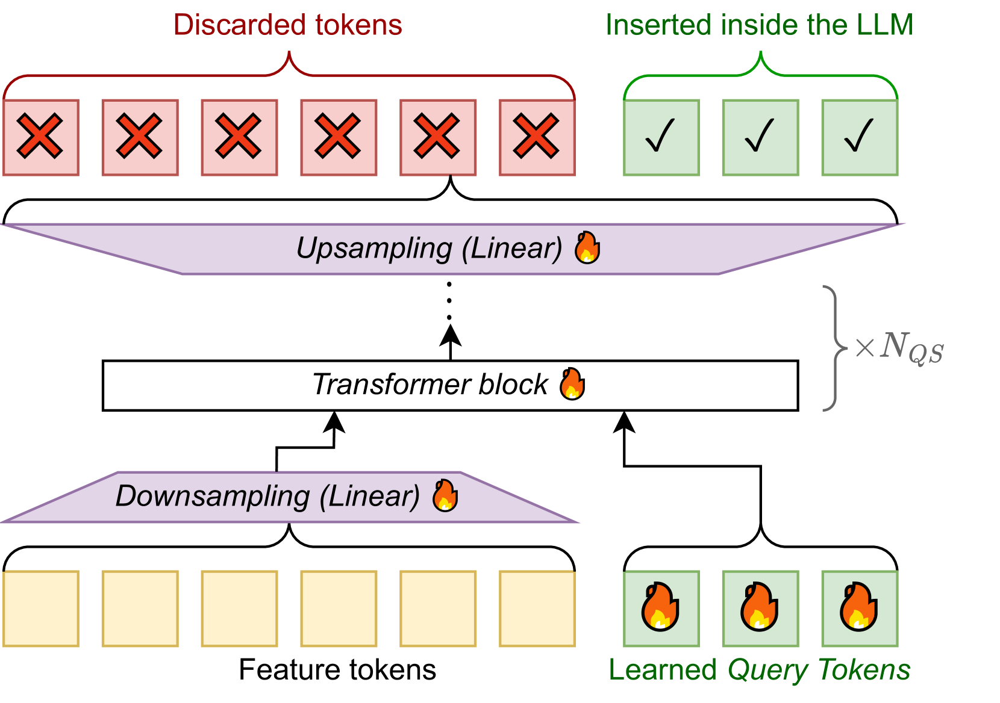
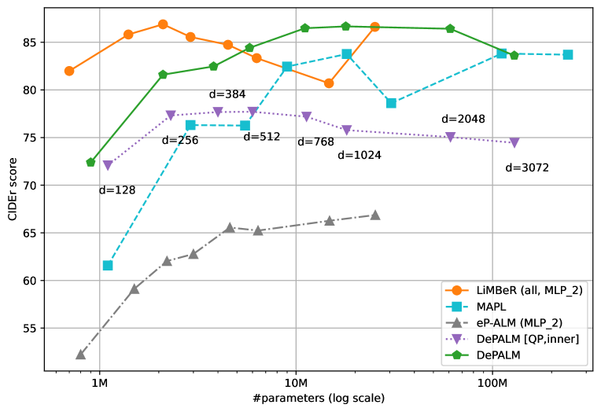
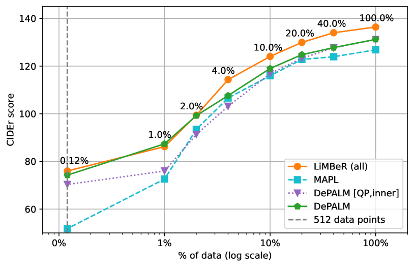
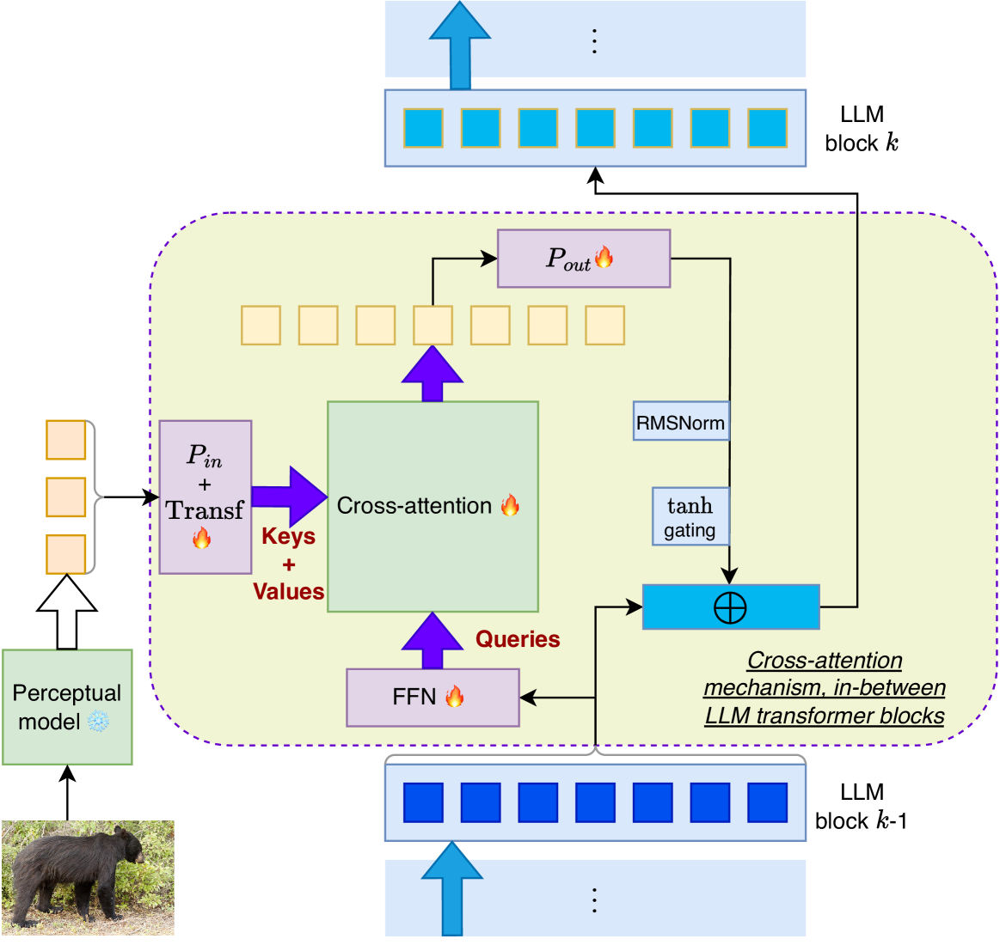

# 我们提出了针对大型语言模型（LLM）的数据高效感知增强的新基准方法，旨在提升模型在有限数据下的表现与泛化能力。

发布时间：2024年03月20日

`LLM应用` `计算机视觉`

> Improved Baselines for Data-efficient Perceptual Augmentation of LLMs

# 摘要

> 近期，LLMs 的能力突飞猛进，为各类应用场景带来了创新可能。比如在计算机视觉领域，通过与预训练的视觉模型联手，LLMs 能够赋能图像描述、视觉问答等多种跨模态任务。然而，当前对于如何有效对接 LLMs 与处理视觉、音频等数据的“感知骨干”模型的研究方法各异，且大多局限于特定任务、数据集及模型组合，导致难以直接对比这些接口机制的效果。为此，本研究对多种接口机制展开了全面深入的实验评估，跨越图像、视频、音频描述以及视觉问答等多个任务、多个数据集和骨干网络，尤其重视少量数据场景下的表现。实验结果显示，利用现有机制可在现有最佳成果基础上进一步提升性能，并且我们发掘了一种崭新的接口机制，它能在各类任务中接近乃至达到最优结果，同时还能显著缩短4倍的训练时间。

> The abilities of large language models (LLMs) have recently progressed to unprecedented levels, paving the way to novel applications in a wide variety of areas. In computer vision, LLMs can be used to prime vision-language tasks such image captioning and visual question answering when coupled with pre-trained vision backbones. While different approaches have been explored to interface LLMs with ``perceptual backbones'' that process, e.g., visual or audio data, they are often explored for different tasks, different datasets, and using different perceptual backbones and language models, hindering direct comparison of the interfacing mechanisms. To remedy this lack of comparability between methods, we present an extensive experimental evaluation of different interfacing mechanisms, across multiple tasks (including image, video, and audio captioning as well as visual question answering), datasets and backbones, paying special attention to low-data settings. We find improved performance using existing mechanisms over state-of-the-art results, and identify a new interfacing mechanism that yields (near) optimal results across different tasks, while obtaining a 4x reduction in training time.

[Arxiv](https://arxiv.org/abs/2403.13499)