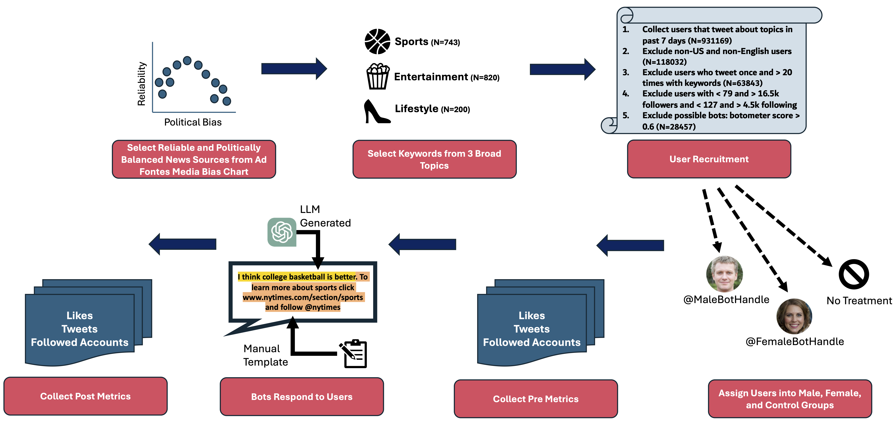
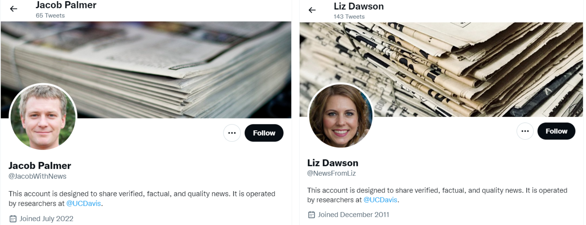
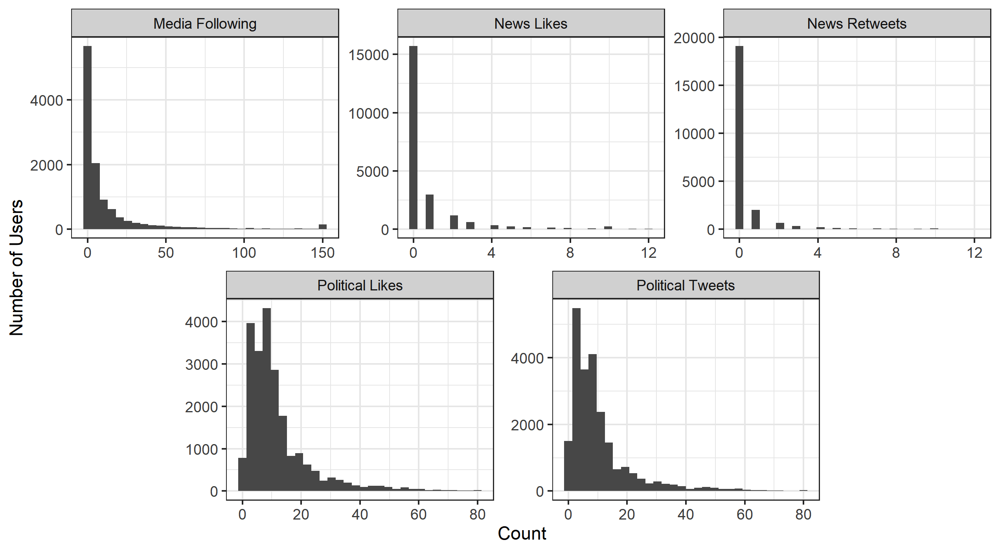
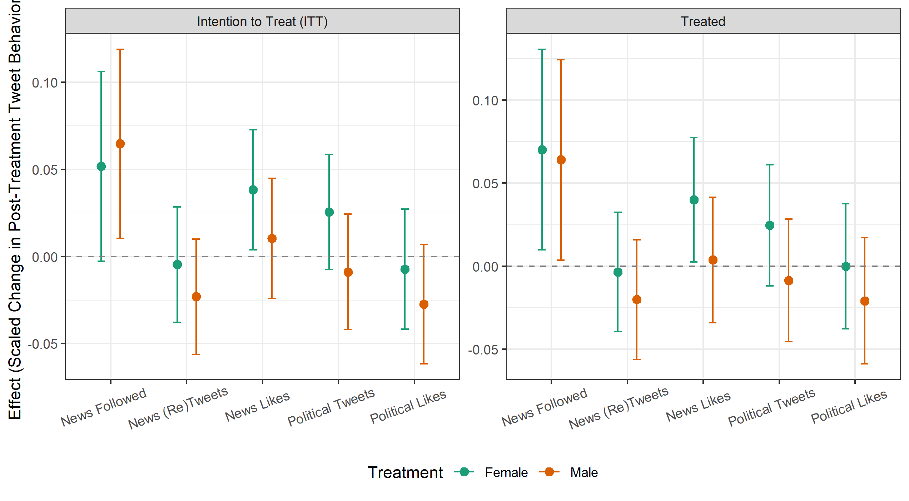
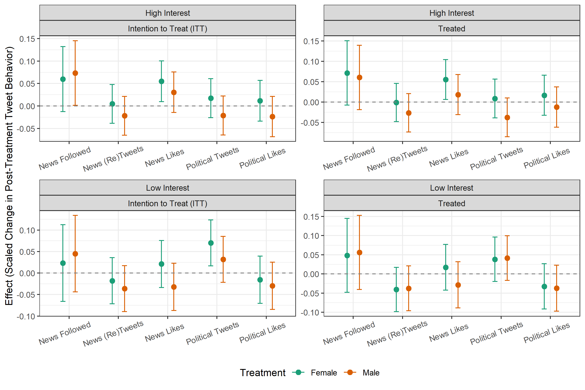
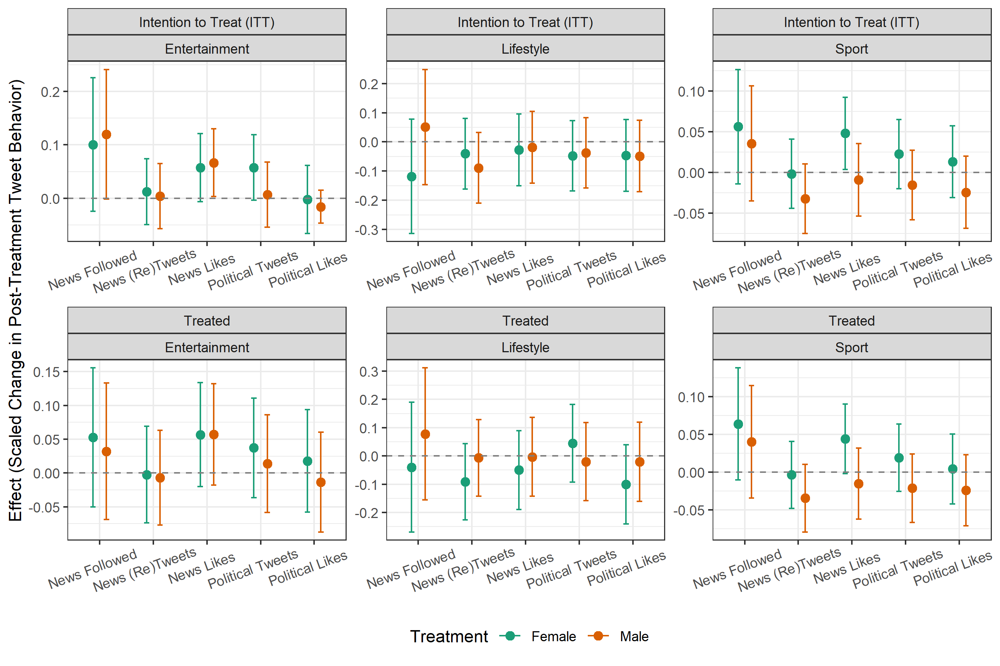

# 通过结合大型语言模型与拟人化机器人账户，我们探讨如何在社交媒体平台上有效激发用户对新闻内容的消费兴趣。

发布时间：2024年03月20日

`无法确定

根据提供的论文摘要，这篇论文并未直接讨论关于Agent、RAG、LLM理论或LLM应用的内容，它主要探讨的是使用GPT-2技术创建智能机器人来引导社交媒体用户接触权威新闻内容，并通过实地试验分析这种方法的效果。因此，这篇论文更适合归为“社交媒体干预研究”、“信息传播”或“NLP在社会影响中的应用”等相关分类，而不是上述四个选项之一。` `社交媒体`

> Incentivizing News Consumption on Social Media Platforms Using Large Language Models and Realistic Bot Accounts

> 当前美国民主正面临三大严峻挑战——极化加剧、公众信任下滑以及对民主规范的支持动摇。接触真实权威的高质量新闻有助于个体抵御这些威胁，增进对虚假信息、民粹主义和极端党派言论的抵抗力。本研究聚焦于如何在实际场景中优化用户对经验证且观点平衡新闻的接触与互动。为此，我们在2023年1月19日至2月3日期间开展了一场大规模的为期两周的实地试验，涉及28,457名推特用户。实验中，我们借助GPT-2技术创建了28个智能机器人，它们会对发表体育、娱乐或生活方式类推文的用户做出情境化回应，其中包含了两部分内容：链接至高质量新闻机构相关话题区域的网址，以及邀请用户关注该新闻机构推特账号的鼓励语句。此外，我们还设置了针对机器人性别差异的测试，让受试用户随机收到由“女性”或“男性”身份的机器人发送的回复。我们旨在探索这项长期干预措施能否有效提高用户关注新闻媒体机构、分享和点赞新闻内容、发布政治相关推文以及点赞政治内容的比例。研究结果显示，接受干预的用户确实更多地关注了新闻账户，而接受“女性”机器人干预的用户相较于对照组更愿意点赞新闻内容。不过，大多数结论的效应值相对较小，并且主要集中在实验前即表现出对政治话题兴趣的推特用户群体中。这些发现对于社交媒体平台和新闻机构具有指导价值，并为今后如何利用大型语言模型等计算方法有效促进用户在平台内对高质量新闻和公共事务的深度参与提供了新的研究方向。

> Polarization, declining trust, and wavering support for democratic norms are pressing threats to U.S. democracy. Exposure to verified and quality news may lower individual susceptibility to these threats and make citizens more resilient to misinformation, populism, and hyperpartisan rhetoric. This project examines how to enhance users' exposure to and engagement with verified and ideologically balanced news in an ecologically valid setting. We rely on a large-scale two-week long field experiment (from 1/19/2023 to 2/3/2023) on 28,457 Twitter users. We created 28 bots utilizing GPT-2 that replied to users tweeting about sports, entertainment, or lifestyle with a contextual reply containing two hardcoded elements: a URL to the topic-relevant section of quality news organization and an encouragement to follow its Twitter account. To further test differential effects by gender of the bots, treated users were randomly assigned to receive responses by bots presented as female or male. We examine whether our over-time intervention enhances the following of news media organization, the sharing and the liking of news content and the tweeting about politics and the liking of political content. We find that the treated users followed more news accounts and the users in the female bot treatment were more likely to like news content than the control. Most of these results, however, were small in magnitude and confined to the already politically interested Twitter users, as indicated by their pre-treatment tweeting about politics. These findings have implications for social media and news organizations, and also offer direction for future work on how Large Language Models and other computational interventions can effectively enhance individual on-platform engagement with quality news and public affairs.

[Arxiv](https://arxiv.org/abs/2403.13362)