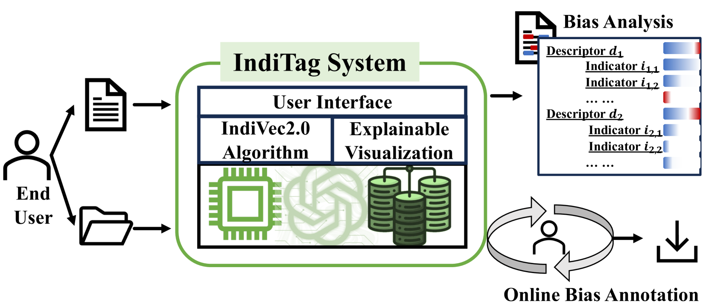
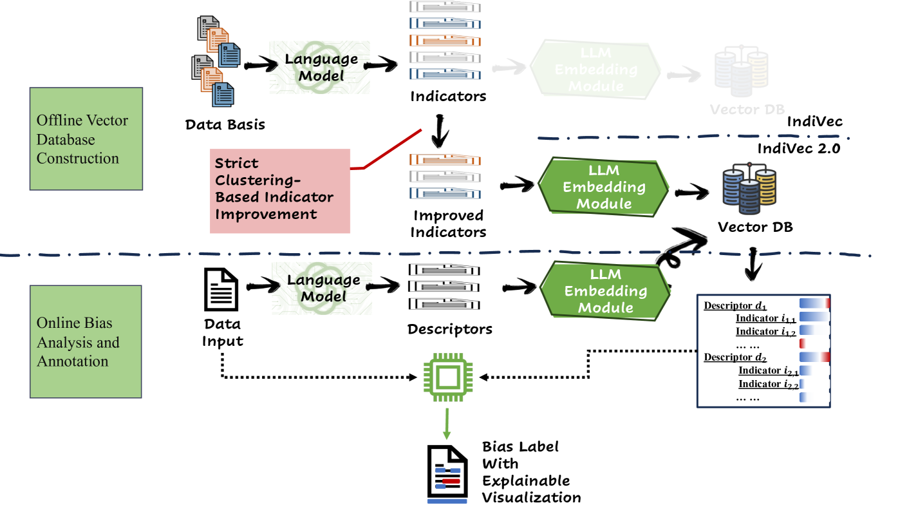

# IndiTag 是一个创新的在线系统，通过运用细粒度的偏见指标对媒体内容进行全面深度分析并提供精准注解，以实现对媒体偏见的实时解析。

发布时间：2024年03月20日

`Agent` `媒体分析` `新闻传播`

> IndiTag: An Online Media Bias Analysis and Annotation System Using Fine-Grained Bias Indicators

# 摘要

> 面对信息洪流和舆论分化，理解媒体偏见成为了确保明智决策和营造平衡公共话语的关键。IndiTag是一个创新的在线媒体偏见分析与标注系统，它运用细致入微的偏见指标深入解析并标注数字内容中的偏见。通过结合大型语言模型、偏见指标和向量数据库技术，IndiTag能高效识别并解读内容中的偏见。该系统配备直观易用的界面，既支持自动偏见分析，也方便人工标注，提供了一个全方位的深度偏见探究平台。我们通过针对多个来源新闻文章的四组数据集进行实验，充分证明了IndiTag的强大效能和广泛适用性。此外，我们还探讨了IndiTag如何助力提升大众媒体素养、协助事实核查工作以及增强数字媒体平台的透明度与责任意识。IndiTag作为一款有力工具，在数字化时代推动形成更加知情、审慎且包容的公共话语中发挥着重要作用。您可以通过访问https://youtu.be/Gt2T4T7DYqs观看演示视频，同时我们也为最终用户上线了在线系统，并在https://github.com/lylin0/IndiTag公开了源代码。

> In the age of information overload and polarized discourse, understanding media bias has become imperative for informed decision-making and fostering a balanced public discourse. This paper presents IndiTag, an innovative online media bias analysis and annotation system that leverages fine-grained bias indicators to dissect and annotate bias in digital content. IndiTag offers a novel approach by incorporating large language models, bias indicator, vector database to automatically detect and interpret bias. Complemented by a user-friendly interface facilitating both automated bias analysis and manual annotation, IndiTag offers a comprehensive platform for in-depth bias examination. We demonstrate the efficacy and versatility of IndiTag through experiments on four datasets encompassing news articles from diverse platforms. Furthermore, we discuss potential applications of IndiTag in fostering media literacy, facilitating fact-checking initiatives, and enhancing the transparency and accountability of digital media platforms. IndiTag stands as a valuable tool in the pursuit of fostering a more informed, discerning, and inclusive public discourse in the digital age. The demonstration video can be accessed from https://youtu.be/Gt2T4T7DYqs. We release an online system for end users and the source code is available at https://github.com/lylin0/IndiTag.

[Arxiv](https://arxiv.org/abs/2403.13446)