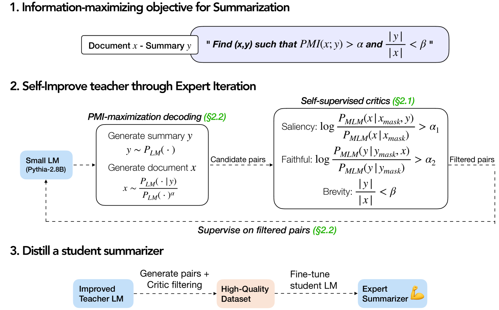
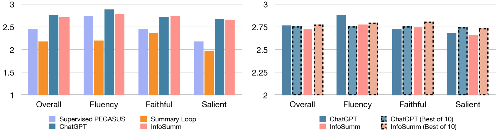
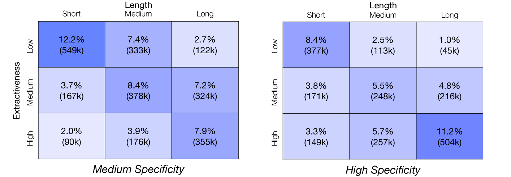
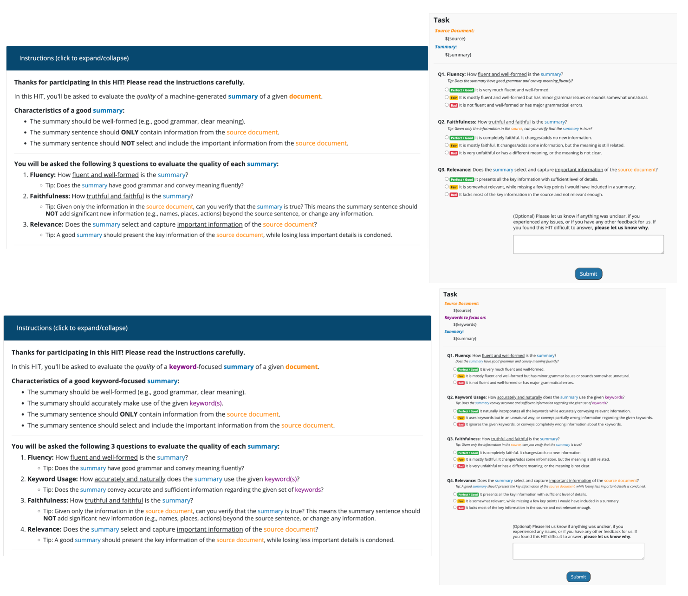
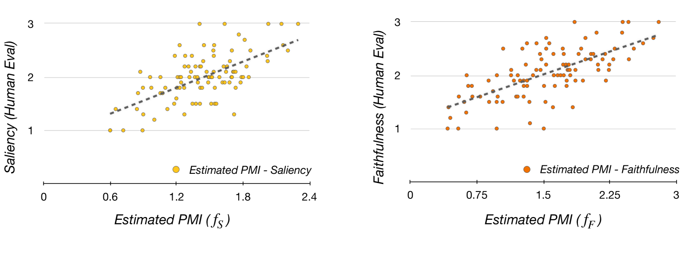
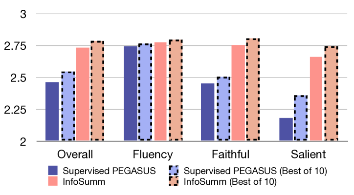
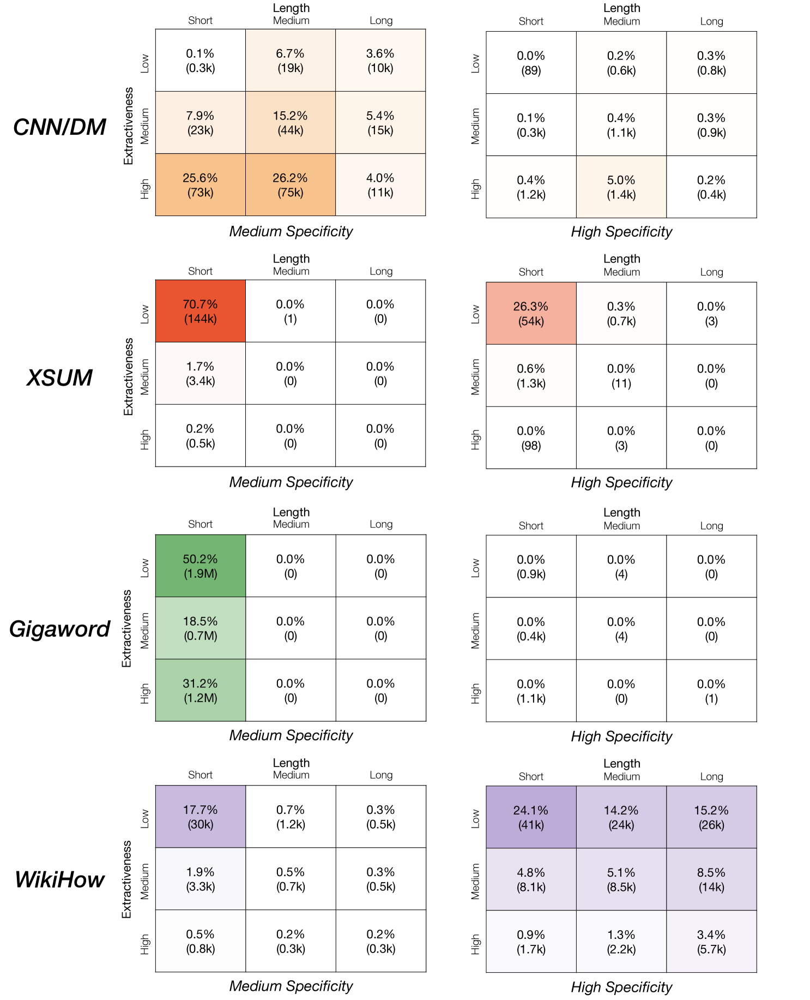

# 为了解决无参考摘要问题，我们引入了一种基于信息理论的蒸馏技术。该方法旨在通过提炼关键信息，有效提升自动摘要的质量和准确性，即使在缺乏参考标准的情况下也能实现精准总结。

发布时间：2024年03月20日

`LLM应用` `自动摘要`

> Information-Theoretic Distillation for Reference-less Summarization

# 摘要

> 现今，自动摘要领域的赢家策略是直接运用ChatGPT等专有大型语言模型（LLMs），或以其为师进行模仿学习。然而，在享受此类大型模型带来的便捷之余，一个问题仍然突出：若寻求更具成本效益、可控且强劲的摘要生成方法，小型模型能否通过另一种途径也达到同样竞争力的表现呢？为此，我们创新推出了InfoSumm框架，它依据信息论的摘要目标，无需倚赖LLMs自身能力或人工参考摘要，就能提炼出高效能的摘要器。我们首先创造性地借助原始文档与摘要间的互信息理论，重新定义了摘要应有的三大要素：显著性、忠实度和简洁性。以此为基础，我们从尚未掌握摘要技能的Pythia-2.8B模型起步，通过自我训练优化模型以追求理想摘要的信息核心指标。经过对升级版教师模型的精炼提取，我们成功打造了一个小巧却实力不凡的摘要器，仅包含568M个参数，即便未曾借鉴ChatGPT的能力，也能与其展开激烈竞争并取得良好表现。大量深入分析证明，相比领域内的监督学习模型及当前最先进的无监督方法，我们的方法在人工评估中更胜一筹，尤其在可控摘要任务上更是力压ChatGPT。

> The current winning recipe for automatic summarization is using proprietary large-scale language models (LLMs) such as ChatGPT as is, or imitation learning from them as teacher models. While increasingly ubiquitous dependence on such large-scale language models is convenient, there remains an important question of whether small-scale models could have achieved competitive results, if we were to seek an alternative learning method -- that allows for a more cost-efficient, controllable, yet powerful summarizer. We present InfoSumm, a novel framework to distill a powerful summarizer based on the information-theoretic objective for summarization, without relying on either the LLM's capability or human-written references. To achieve this, we first propose a novel formulation of the desiderata of summarization (saliency, faithfulness and brevity) through the lens of mutual information between the original document and the summary. Based on this formulation, we start off from Pythia-2.8B as the teacher model, which is not yet capable of summarization, then self-train the model to optimize for the information-centric measures of ideal summaries. Distilling from the improved teacher, we arrive at a compact but powerful summarizer with only 568M parameters that performs competitively against ChatGPT, without ever relying on ChatGPT's capabilities. Extensive analysis demonstrates that our approach outperforms in-domain supervised models in human evaluation, let alone state-of-the-art unsupervised methods, and wins over ChatGPT in controllable summarization.

[Arxiv](https://arxiv.org/abs/2403.13780)