# 本研究采用机器学习方法，将大型语言模型整合应用于交通事件管理中的事故严重程度分类。

发布时间：2024年03月20日

`LLM应用` `事件管理`

> Integrating Large Language Models for Severity Classification in Traffic Incident Management: A Machine Learning Approach

> 本研究着眼于大型语言模型如何提升交通事件管理中机器学习效能，通过比较现代语言模型生成特征在利用事故报告分类事件严重性时能否超越或媲美常规预测准确度。我们研究了多种语言模型与诸如梯度提升决策树、随机森林及极端梯度提升等机器学习算法的不同搭配效果，并采用传统文本特征与语言模型衍生特征及其组合对事件严重性进行分类。研究发现，将语言模型产生的特征与直接从事故报告提取的特征相结合，在采用随机森林和极端梯度提升方法时，能够显著提升或至少保持与现有机器学习方法在确定事件严重等级上的同等表现。我们借助均衡样本数据集上的 F1 分数对此进行了量化验证。本研究的核心价值在于展示如何将大型语言模型无缝融入事件管理的机器学习流程中，简化对非结构化文本特征的抽取，同时结合传统机器学习手段，提高或维持对事件严重程度预测的精准度。该研究成果通过有效运用语言处理模型优化了事故严重性分类的建模实践，为在事件严重性分类领域中融合语言处理能力和传统数据资源改善机器学习管道带来了深刻的启示。

> This study evaluates the impact of large language models on enhancing machine learning processes for managing traffic incidents. It examines the extent to which features generated by modern language models improve or match the accuracy of predictions when classifying the severity of incidents using accident reports. Multiple comparisons performed between combinations of language models and machine learning algorithms, including Gradient Boosted Decision Trees, Random Forests, and Extreme Gradient Boosting. Our research uses both conventional and language model-derived features from texts and incident reports, and their combinations to perform severity classification. Incorporating features from language models with those directly obtained from incident reports has shown to improve, or at least match, the performance of machine learning techniques in assigning severity levels to incidents, particularly when employing Random Forests and Extreme Gradient Boosting methods. This comparison was quantified using the F1-score over uniformly sampled data sets to obtain balanced severity classes. The primary contribution of this research is in the demonstration of how Large Language Models can be integrated into machine learning workflows for incident management, thereby simplifying feature extraction from unstructured text and enhancing or matching the precision of severity predictions using conventional machine learning pipeline. The engineering application of this research is illustrated through the effective use of these language processing models to refine the modelling process for incident severity classification. This work provides significant insights into the application of language processing capabilities in combination with traditional data for improving machine learning pipelines in the context of classifying incident severity.

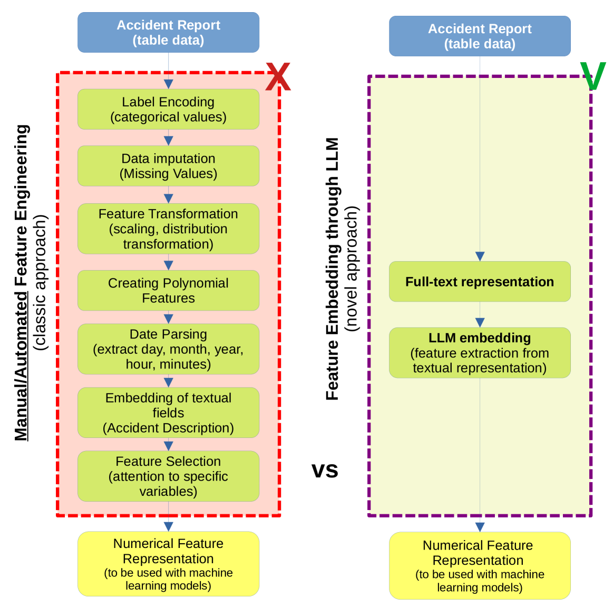

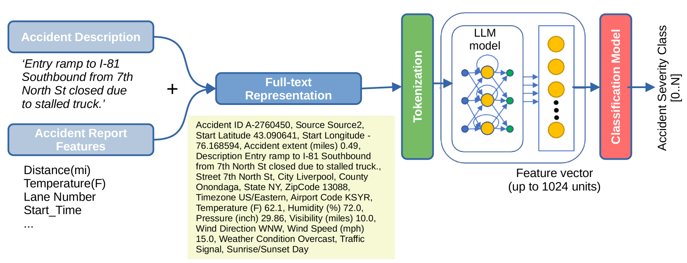

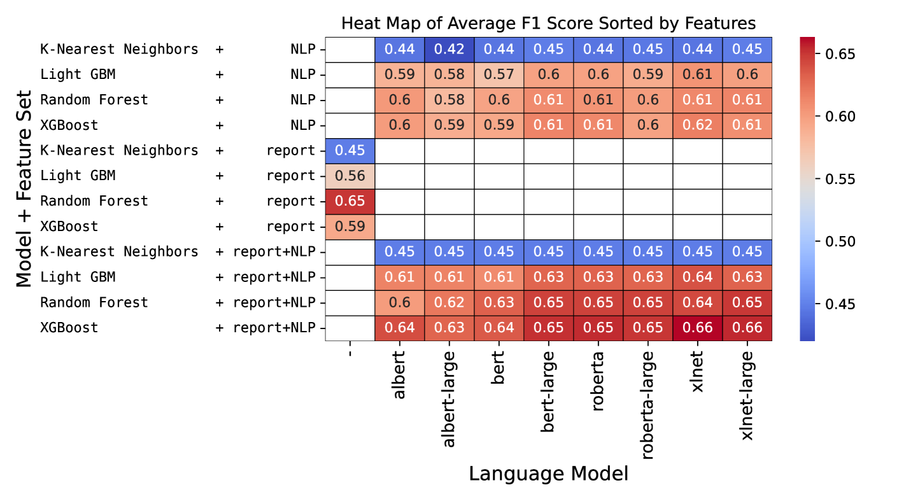

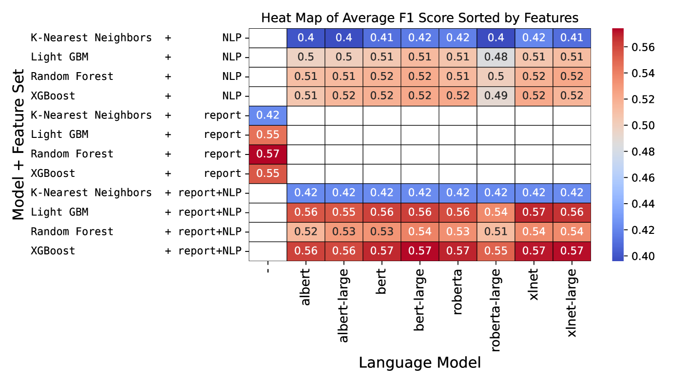

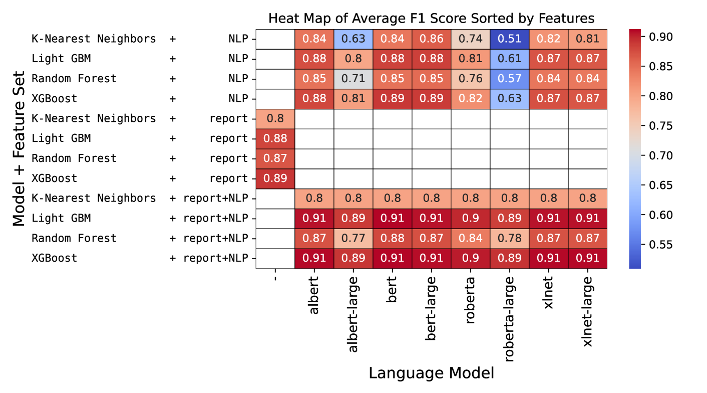

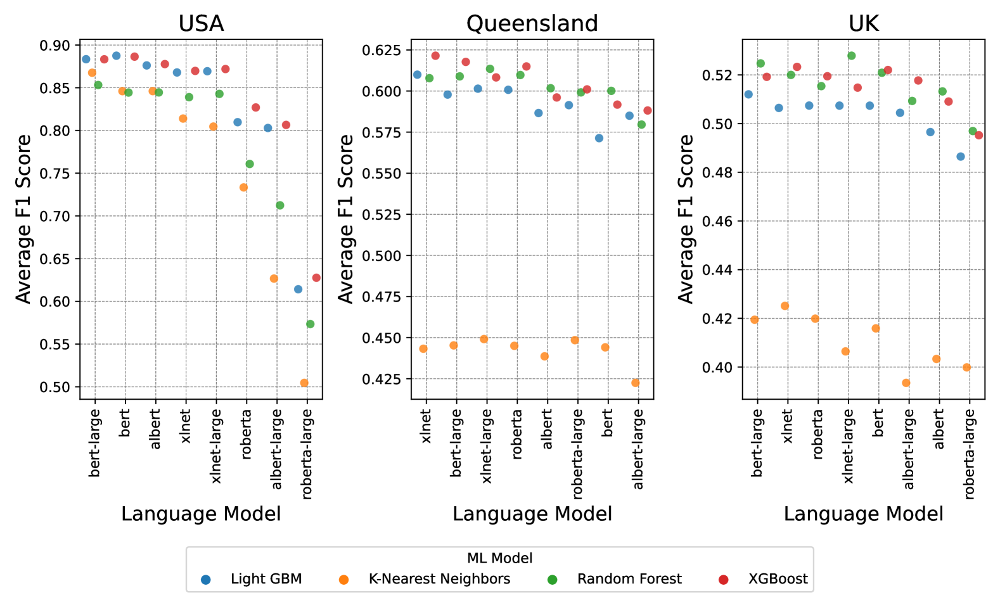

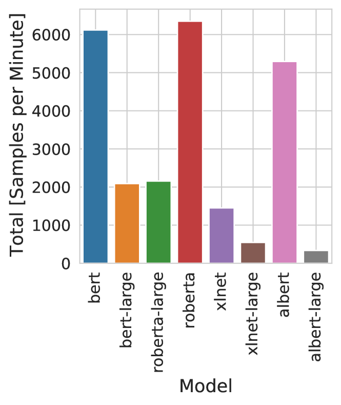

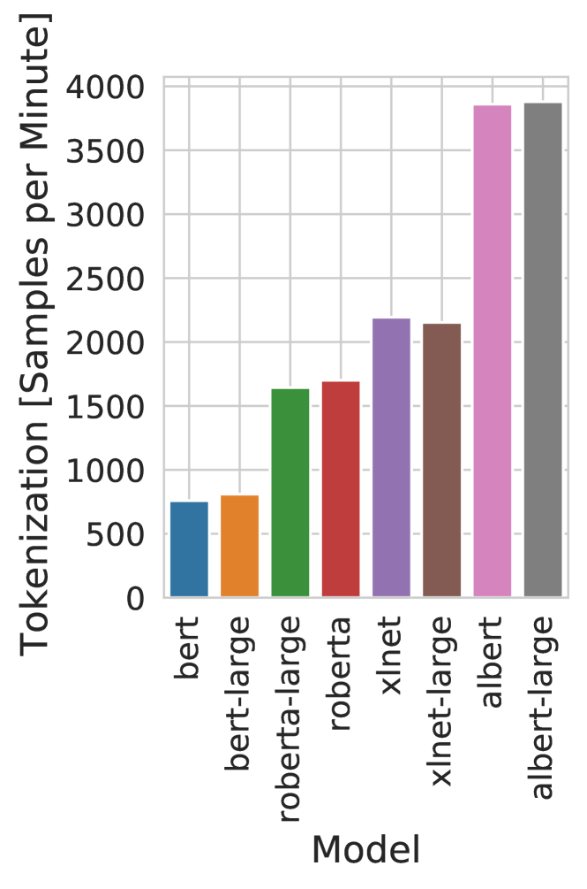

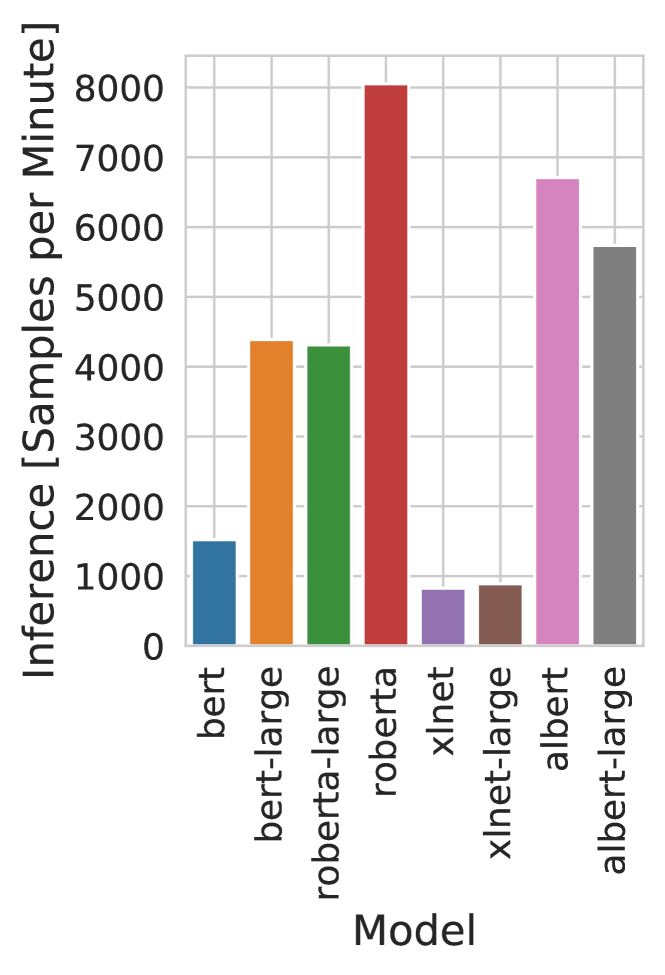

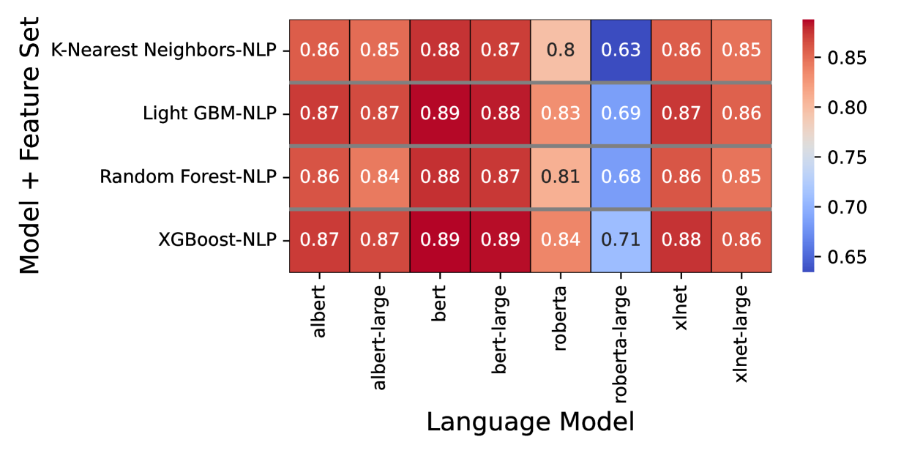

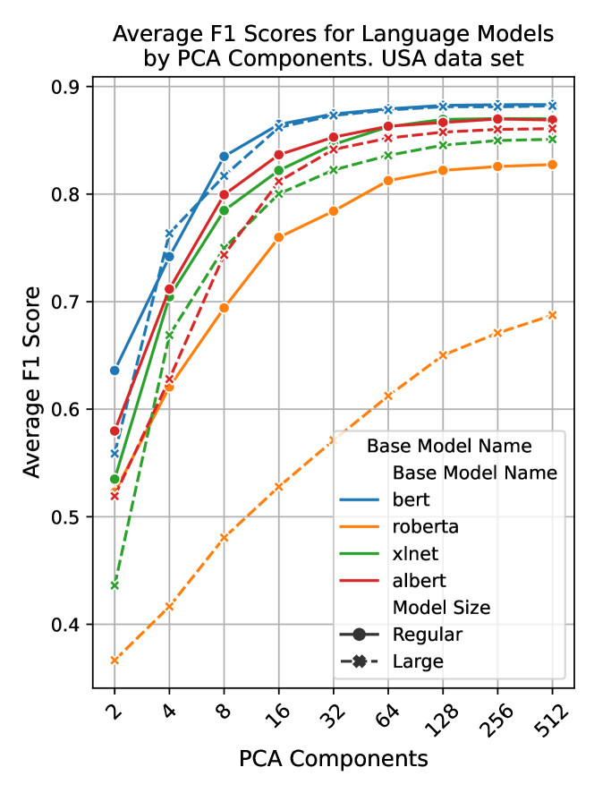

[Arxiv](https://arxiv.org/abs/2403.13547)