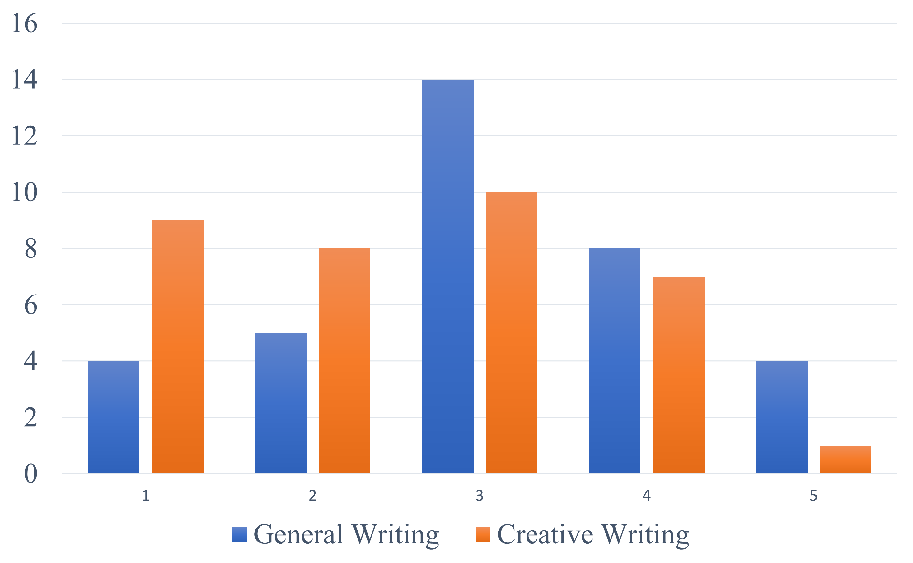
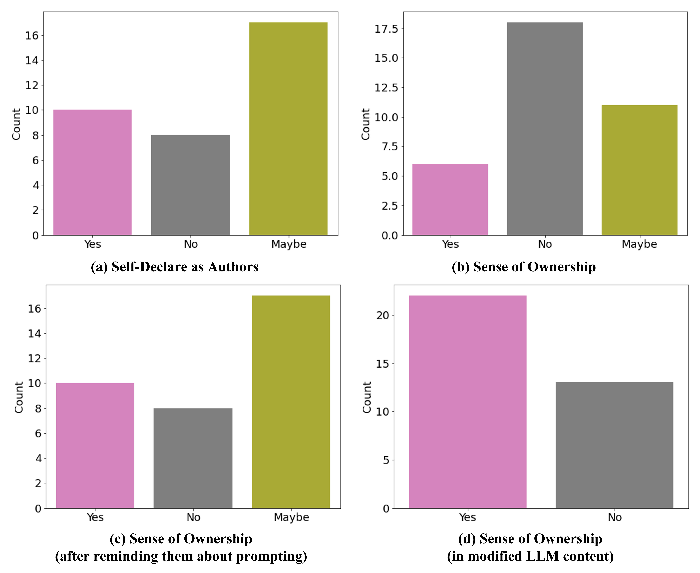

# 大型语言模型（LLM）充当写作助手时，我们深入探讨了人们对作品所有权和逻辑推理的看法。

发布时间：2024年03月20日

`LLM应用` `写作辅助` `人机交互`

> LLMs as Writing Assistants: Exploring Perspectives on Sense of Ownership and Reasoning

# 摘要

> 写作中的所有权意识让我们在思考、时间和投入上变得吝啬，进而对作品产生依恋。但借助写作助手时，我们却面临一个心理难题：并非所有内容都是我们亲手创作的。比如，在创意活动中，我们更容易将成就归功于大型语言模型（LLMs），尽管它们对待各项任务一视同仁。而且，尽管我们不完全认为LLM产出的内容是自己的，却毫不犹豫地声称自己是作者。通过一项简短调查，我们探究这些问题，旨在深化对写作中人机互动的认知过程的理解，并借此优化写作辅助系统。

> Sense of ownership in writing confines our investment of thoughts, time, and contribution, leading to attachment to the output. However, using writing assistants introduces a mental dilemma, as some content isn't directly our creation. For instance, we tend to credit Large Language Models (LLMs) more in creative tasks, even though all tasks are equal for them. Additionally, while we may not claim complete ownership of LLM-generated content, we freely claim authorship. We conduct a short survey to examine these issues and understand underlying cognitive processes in order to gain a better knowledge of human-computer interaction in writing and improve writing aid systems.

[Arxiv](https://arxiv.org/abs/2404.00027)