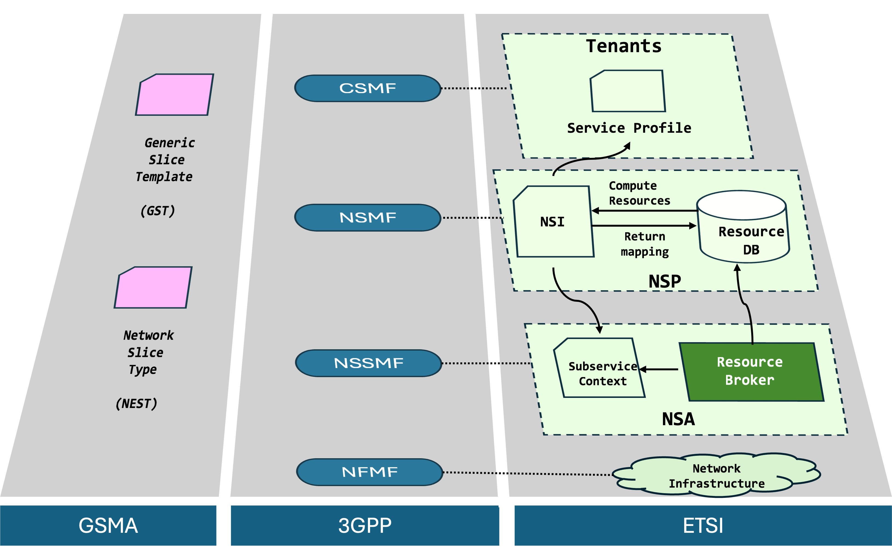
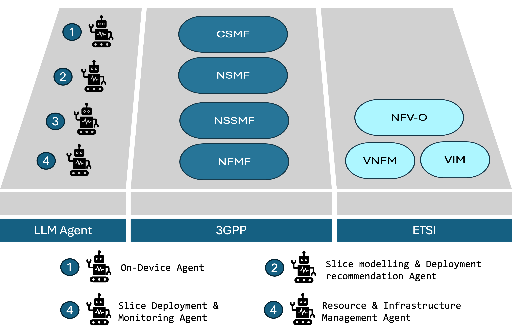
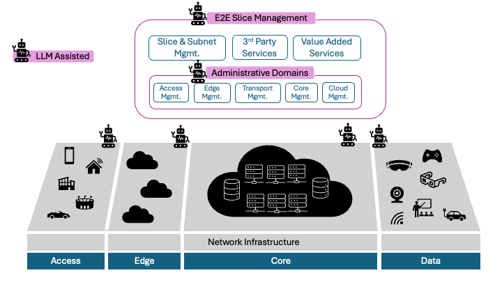
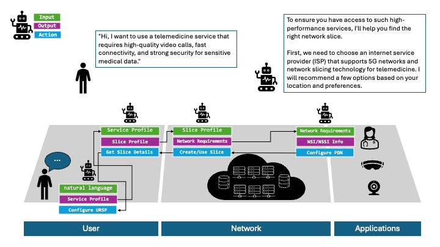
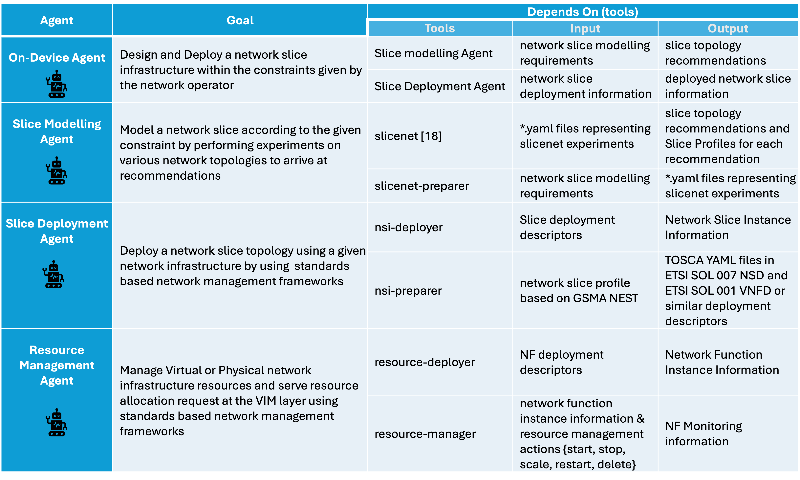
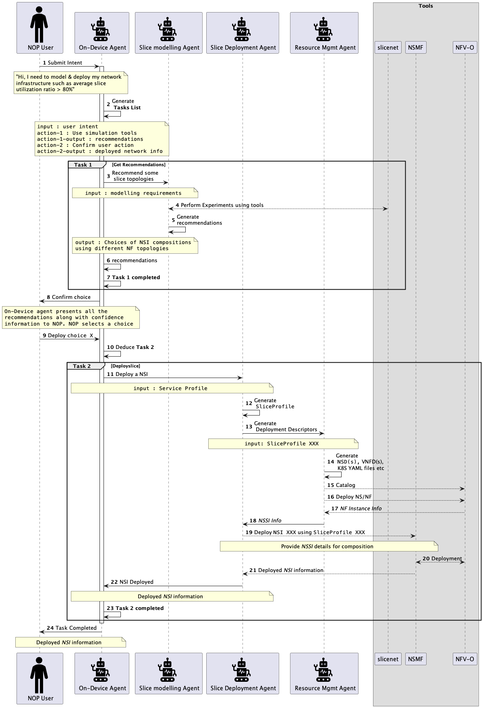

# 大型语言模型邂逅网络切片的管理与编排，共同探索智能优化的新疆界。

发布时间：2024年03月20日

`Agent` `网络通信` `虚拟化技术`

> Large Language Models meet Network Slicing Management and Orchestration

> 网络切片这项未来网络的关键技术，可在共用硬件基础上构建个性化虚拟网络，凭借其按需提供的专享资源推动创新与灵活性。然而，面对多行政域环境下不断涌现的新服务需求复杂性，现行的编排和管理模式显得捉襟见肘。本文展望一种依托大型语言模型（LLMs）及多智能体系统的网络切片新模式，提出一个能够无缝融入现有管理和编排（MANO）架构的框架。在这个框架下，LLMs负责将用户的实际需求转化为技术规范，匹配网络功能至基础设施，并全程驾驭切片的生命周期；而多智能体系统则助力各行政域之间的协同工作。此外，本文也探讨了实现这一框架过程中遇到的挑战及其潜在的应对策略。

> Network slicing, a cornerstone technology for future networks, enables the creation of customized virtual networks on a shared physical infrastructure. This fosters innovation and agility by providing dedicated resources tailored to specific applications. However, current orchestration and management approaches face limitations in handling the complexity of new service demands within multi-administrative domain environments. This paper proposes a future vision for network slicing powered by Large Language Models (LLMs) and multi-agent systems, offering a framework that can be integrated with existing Management and Orchestration (MANO) frameworks. This framework leverages LLMs to translate user intent into technical requirements, map network functions to infrastructure, and manage the entire slice lifecycle, while multi-agent systems facilitate collaboration across different administrative domains. We also discuss the challenges associated with implementing this framework and potential solutions to mitigate them.

[Arxiv](https://arxiv.org/abs/2403.13721)