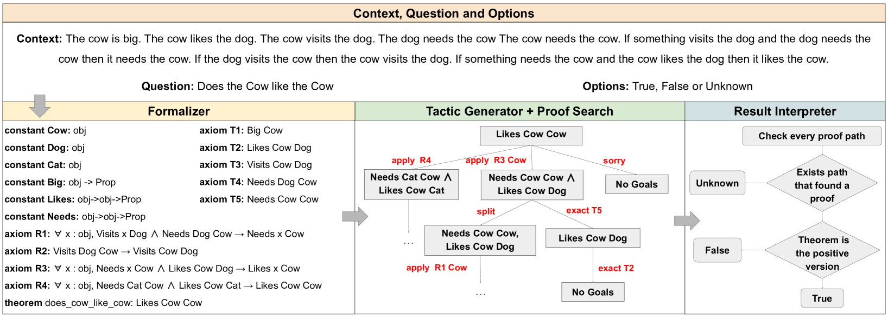
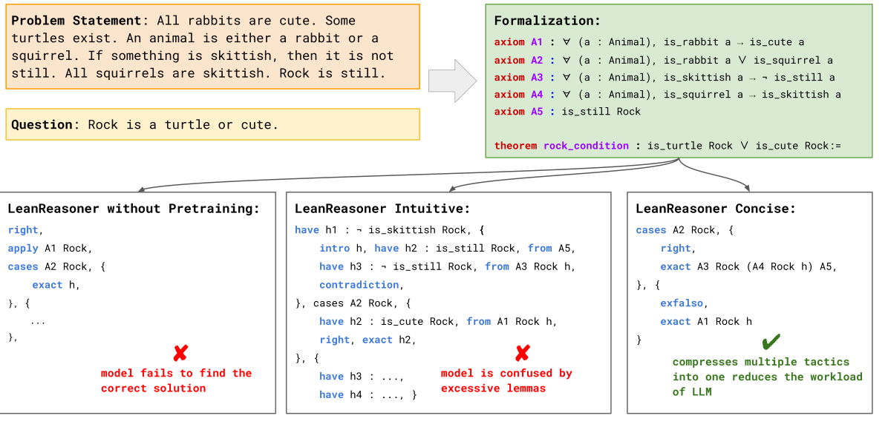

# LeanReasoner 是一种利用 Lean 技术强化复杂逻辑推理性能的方法。

发布时间：2024年03月20日

`LLM应用` `逻辑推理` `定理证明`

> LeanReasoner: Boosting Complex Logical Reasoning with Lean

> 面对复杂逻辑推理挑战，LLMs常显得力不从心，原因在于逻辑矛盾和推理本身的难度。为此，我们采用定理证明工具Lean，将其用于解决此类问题。具体来说，我们将逻辑推理难题转化为Lean中的定理，然后通过对这些定理进行证明或反证，有效避免了逻辑不一致的风险，并充分利用Lean丰富全面的定理证明库，提升了处理复杂推理任务的能力。经过实践验证，本方法在FOLIO数据集上取得了顶尖效果，并在ProofWriter上逼近这一水准，而且值得一提的是，实现这些成绩仅依赖于对每个数据集微调不到100个领域内样本。

> Large language models (LLMs) often struggle with complex logical reasoning due to logical inconsistencies and the inherent difficulty of such reasoning. We use Lean, a theorem proving framework, to address these challenges. By formalizing logical reasoning problems into theorems within Lean, we can solve them by proving or disproving the corresponding theorems. This method reduces the risk of logical inconsistencies with the help of Lean's symbolic solver. It also enhances our ability to treat complex reasoning tasks by using Lean's extensive library of theorem proofs. Our method achieves state-of-the-art performance on the FOLIO dataset and achieves performance near this level on ProofWriter. Notably, these results were accomplished by fine-tuning on fewer than 100 in-domain samples for each dataset.

[Arxiv](https://arxiv.org/abs/2403.13312)