# 为实现视觉定位，本研究聚焦于结合模型与数据进行学习。

发布时间：2024年03月20日

`Agent` `计算机视觉`

> Learning from Models and Data for Visual Grounding

> 我们提出了一种名为 SynGround 的新颖框架，它将数据驱动学习和多种大规模预训练模型的知识迁移相结合，以显著增强预训练视觉-语言模型对图像的理解力（即视觉接地）。知识迁移的过程始于图像描述生成器生成图像说明，这些说明既可作为文本到图像生成器合成图像的引导信息，又可作为根据大型语言模型抽取关键短语、合成文本查询的依据。此外，我们运用开放词汇对象检测器为合成的图像和文本生成精准的边界框。我们通过优化掩码注意力一致性目标，使用这一精心构造的数据集对预训练视觉-语言模型进行微调，使其区域标注与基于梯度的模型解释紧密匹配。最终得到的模型显著提高了市面现有视觉-语言模型的视觉理解性能，在 Flickr30k 数据集中，ALBEF 的指向游戏精度从 79.38% 提升到了 87.26%，而在 RefCOCO+ 测试集 A 和 B 中分别实现了从 69.35% 到 79.06%、从 53.77% 到 63.67% 的大幅提升。

> We introduce SynGround, a novel framework that combines data-driven learning and knowledge transfer from various large-scale pretrained models to enhance the visual grounding capabilities of a pretrained vision-and-language model. The knowledge transfer from the models initiates the generation of image descriptions through an image description generator. These descriptions serve dual purposes: they act as prompts for synthesizing images through a text-to-image generator, and as queries for synthesizing text, from which phrases are extracted using a large language model. Finally, we leverage an open-vocabulary object detector to generate synthetic bounding boxes for the synthetic images and texts. We finetune a pretrained vision-and-language model on this dataset by optimizing a mask-attention consistency objective that aligns region annotations with gradient-based model explanations. The resulting model improves the grounding capabilities of an off-the-shelf vision-and-language model. Particularly, SynGround improves the pointing game accuracy of ALBEF on the Flickr30k dataset from 79.38% to 87.26%, and on RefCOCO+ Test A from 69.35% to 79.06% and on RefCOCO+ Test B from 53.77% to 63.67%.

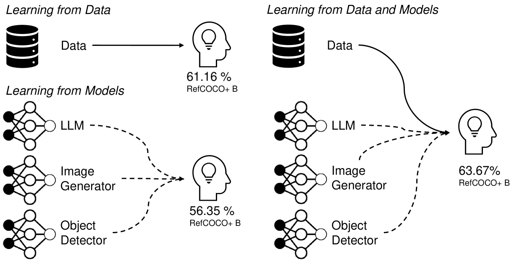

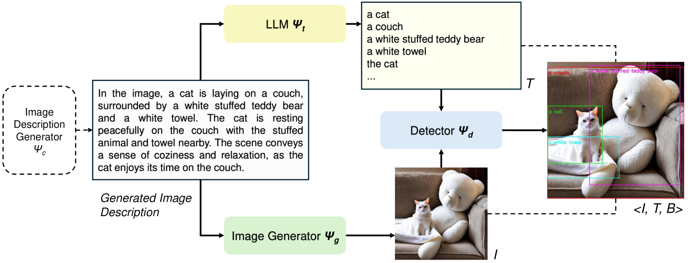

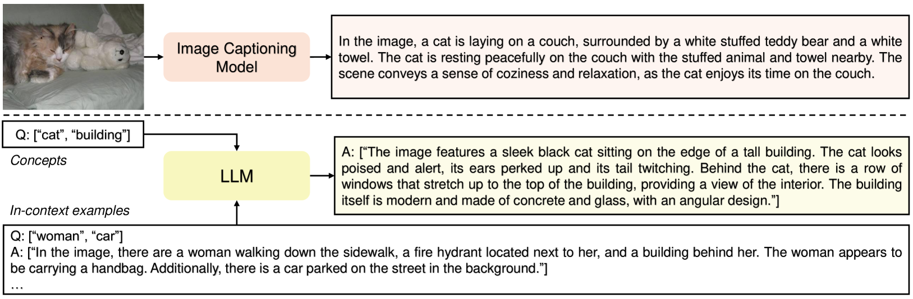

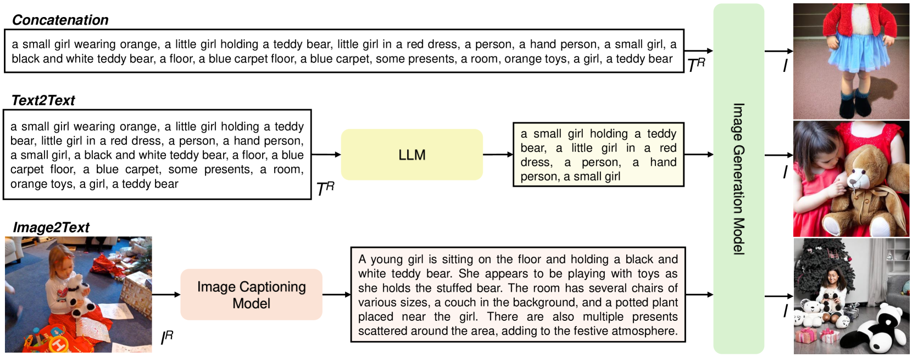

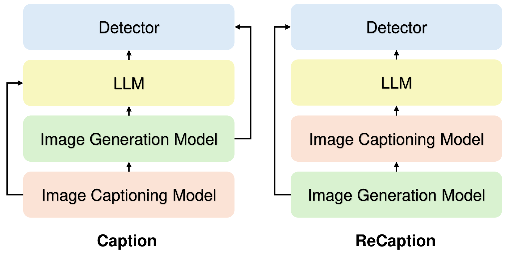

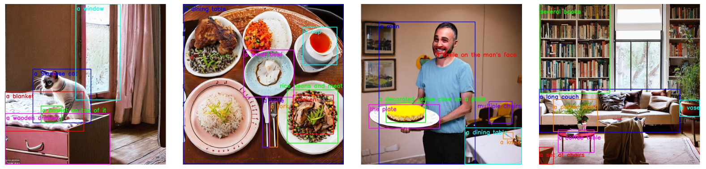

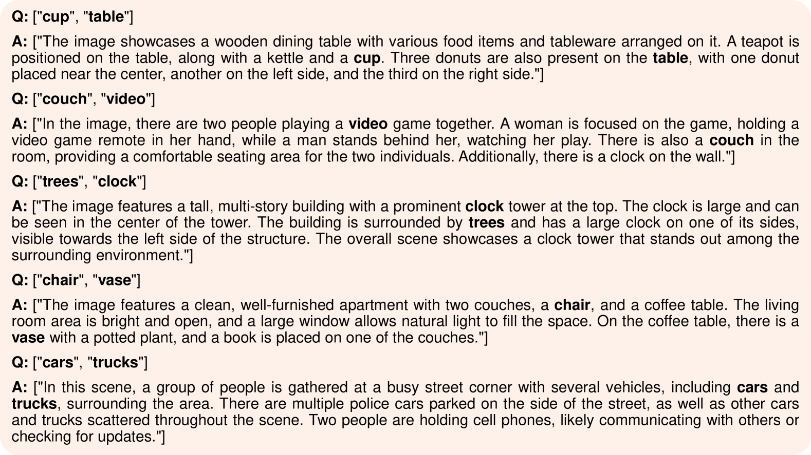

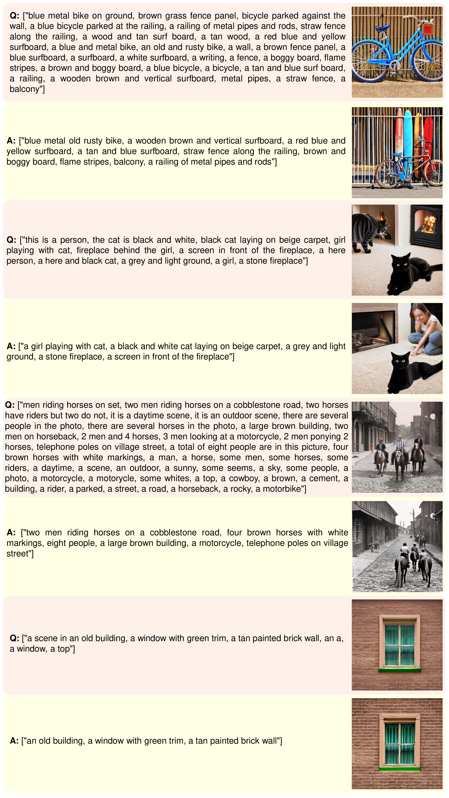

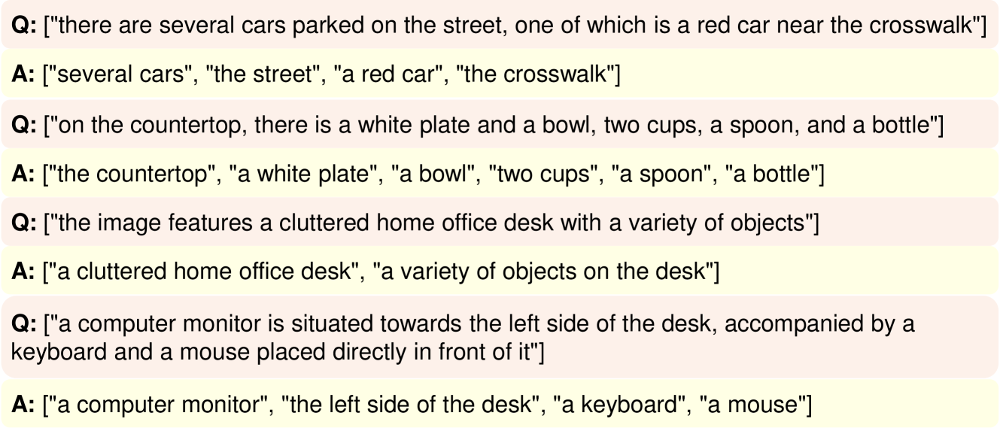

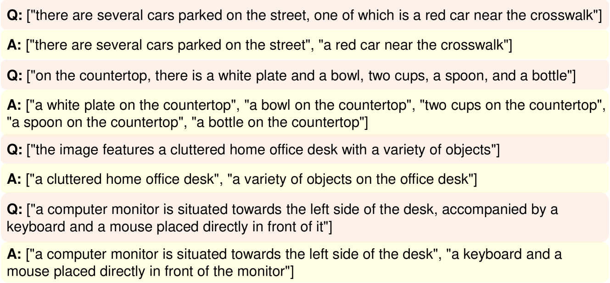

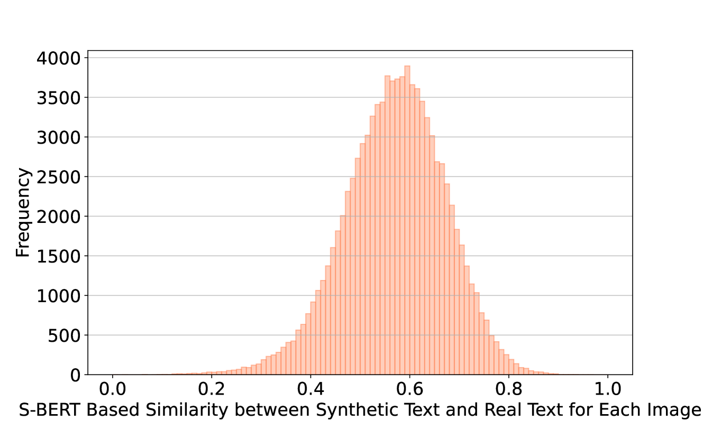

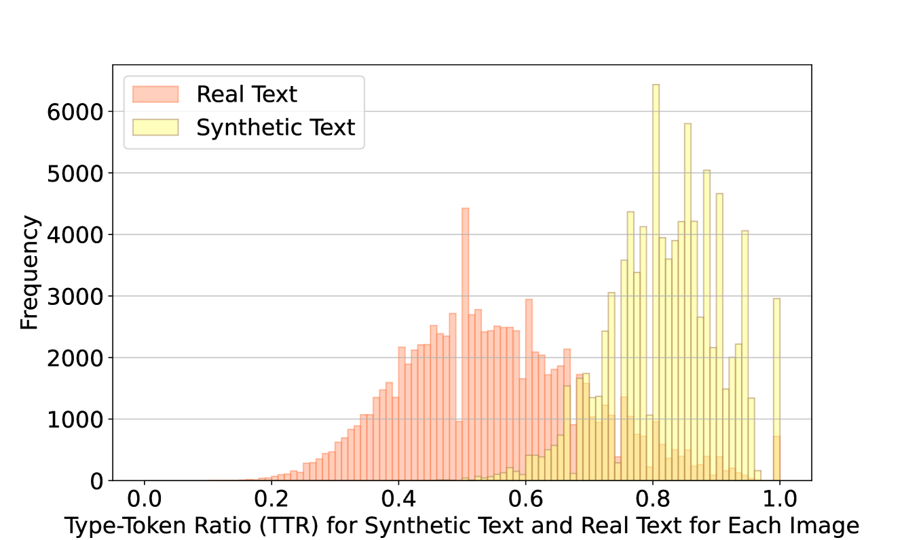

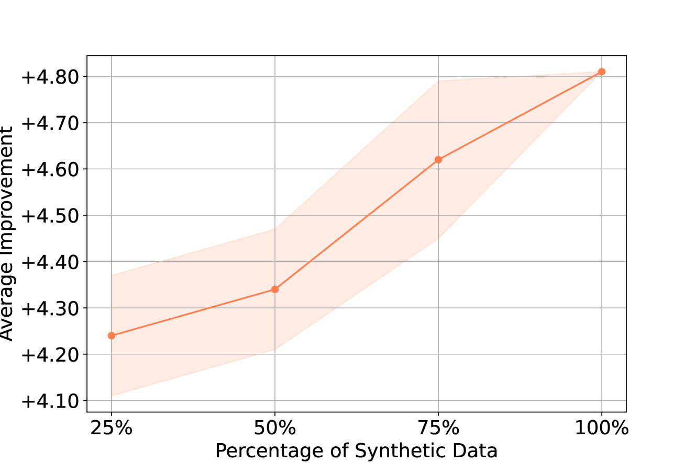

[Arxiv](https://arxiv.org/abs/2403.13804)