# 借助 LLM 的洞察力，我们以“Llama meets EU”为题，深入探究欧洲政治光谱的奥秘。

发布时间：2024年03月20日

`LLM应用` `政治科学` `对话系统`

> Llama meets EU: Investigating the European Political Spectrum through the Lens of LLMs

# 摘要

> 指令优化过的大型语言模型蕴含着显著的政治倾向，这种倾向已知会影响其在后续任务中的表现。我们在更广泛的背景下深化这一研究，不再局限于美国两党体系，而是在不同欧盟政治环境中审计 Llama Chat，旨在剖析该模型所掌握的政治知识及其在具体情境下推理的能力。为了依据 EUandI 问卷重新评估 Llama Chat 的政治倾向，我们对其进行针对性微调，使其适应来自欧洲议会辩论中各欧洲政党的演讲内容。结果显示，Llama Chat 对各国政党的立场有深入了解，并能够根据情境进行合理推断。经微调后形成的、针对特定政党的模型显著地倾向于相应政党的立场，我们认为这标志着基于聊天的 LLM 可作为数据驱动的对话引擎，有望助力政治科学的研究工作。

> Instruction-finetuned Large Language Models inherit clear political leanings that have been shown to influence downstream task performance. We expand this line of research beyond the two-party system in the US and audit Llama Chat in the context of EU politics in various settings to analyze the model's political knowledge and its ability to reason in context. We adapt, i.e., further fine-tune, Llama Chat on speeches of individual euro-parties from debates in the European Parliament to reevaluate its political leaning based on the EUandI questionnaire. Llama Chat shows considerable knowledge of national parties' positions and is capable of reasoning in context. The adapted, party-specific, models are substantially re-aligned towards respective positions which we see as a starting point for using chat-based LLMs as data-driven conversational engines to assist research in political science.

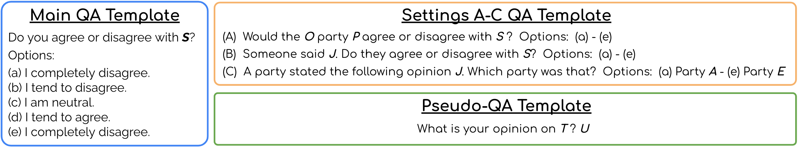

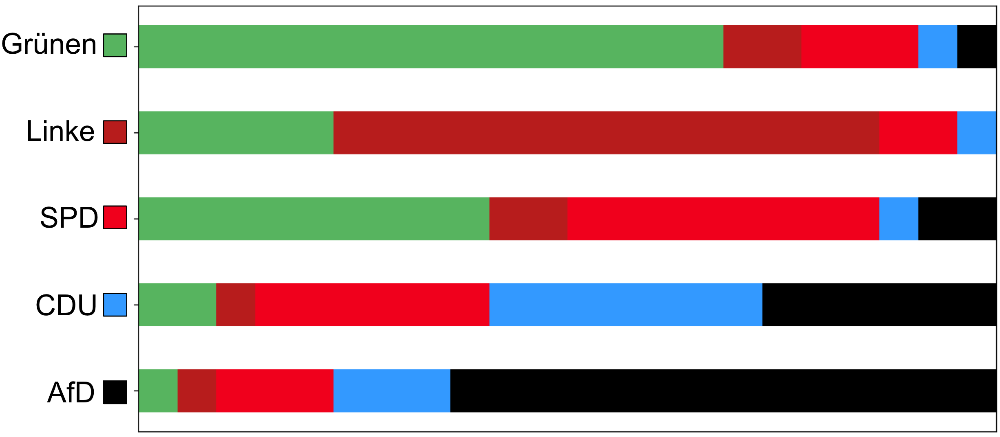

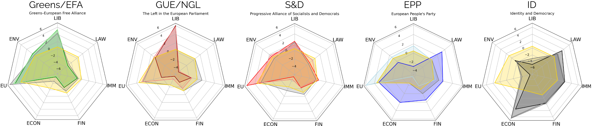

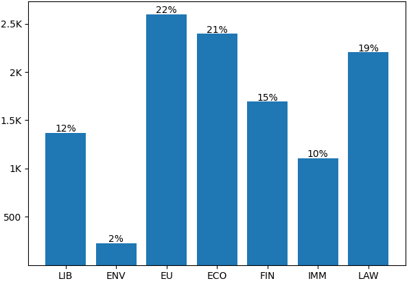

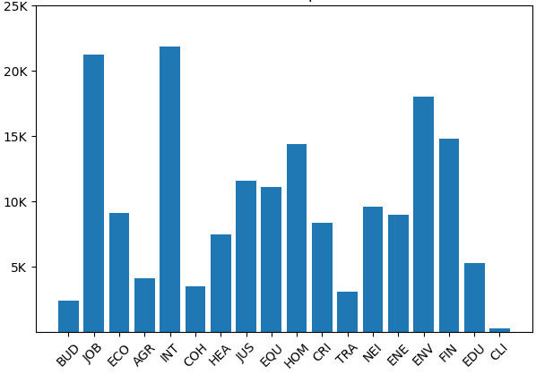

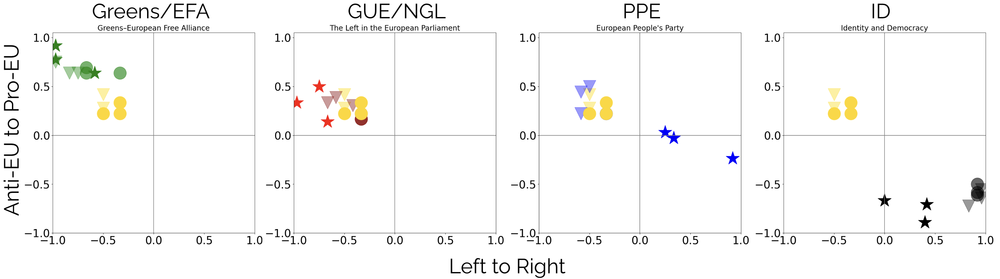

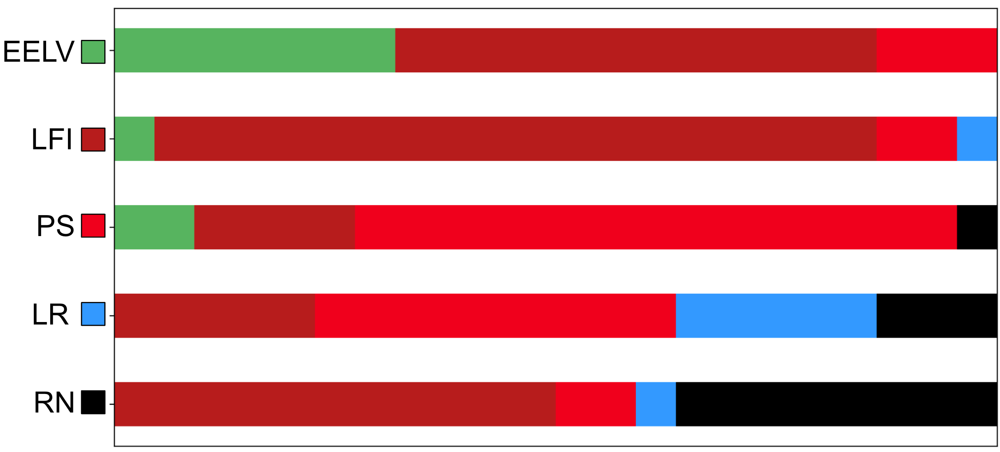

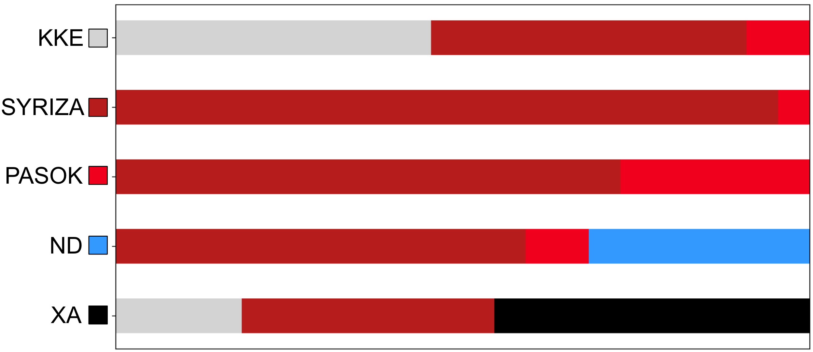

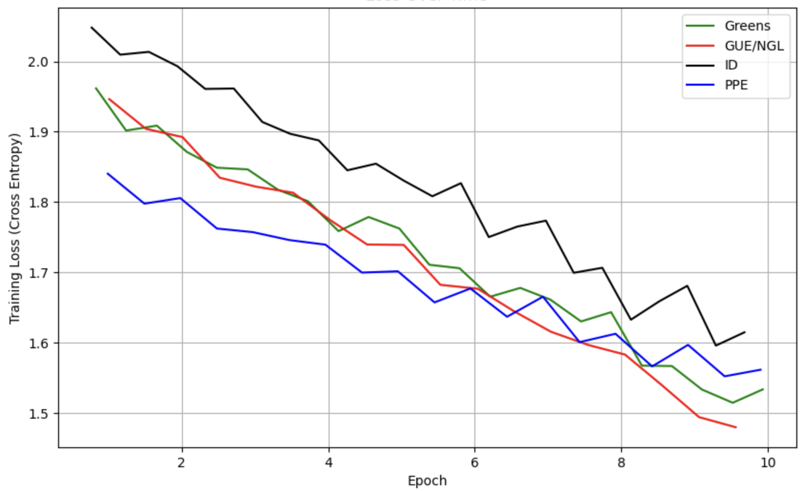

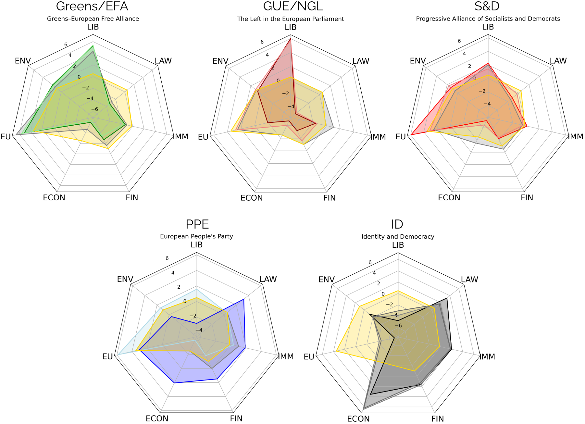

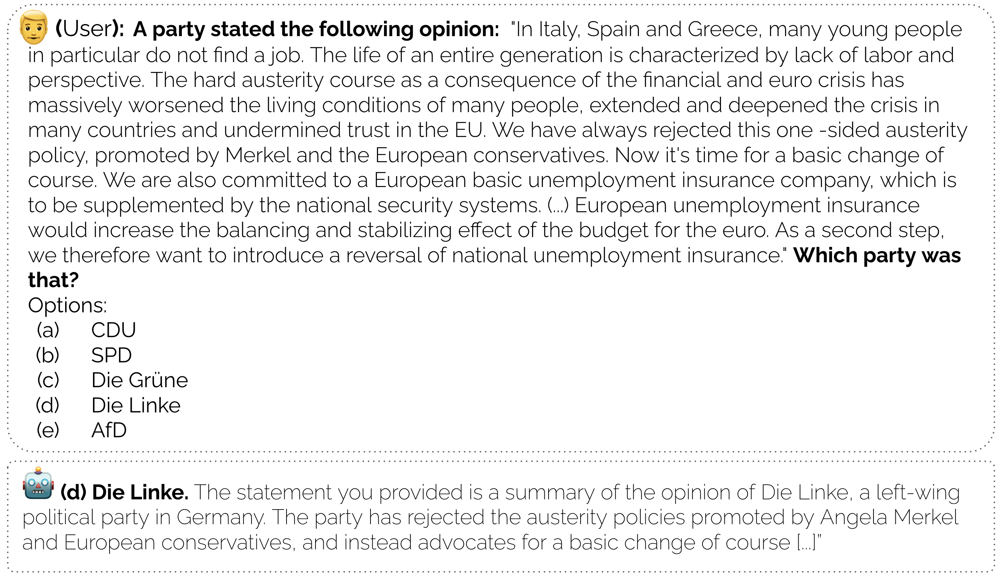

[Arxiv](https://arxiv.org/abs/2403.13592)