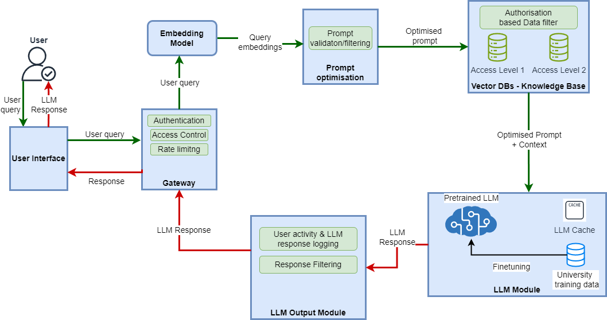

# 为全面描绘LLM安全态势，我们提出了一项详尽的利益相关者风险评估方案，旨在深入剖析LLM领域的安全风险因素，并为各利益相关方提供针对性的评估参考。

发布时间：2024年03月20日

`LLM安全` `人工智能` `信息安全`

> Mapping LLM Security Landscapes: A Comprehensive Stakeholder Risk Assessment Proposal

# 摘要

> LLMs的广泛应用开启了变革的新纪元，在文本生成和问题解决上彰显非凡实力，但同时也带来了不容忽视的重大风险和安全隐患。尽管安全防护措施持续升级，攻击者仍能钻空子，这让人们对LLMs整体可靠性产生怀疑。更令人担忧的是，一些组织在未充分认识潜在危险时，就已将LLM融入系统并投入使用。目前，OWASP和MITRE的研究仅提供了威胁和漏洞的概况，却缺乏针对性强、简明扼要的风险分析手段，供从事LLM技术研发、应用开发及关键决策的相关人士参考。为此，我们提议采用类似于评估传统系统风险的OWASP风险评级方法论，设计一套针对LLM的风险评估流程。通过情境分析识别可能的威胁源，并将系统组件与脆弱性因素一一对应。借此评估遭受网络攻击的可能性，进而展开详尽的影响分析，构建全面的威胁矩阵。此外，我们将各类威胁对应至三大关键利益相关群体——从事模型微调的开发者、借助第三方API的应用开发者以及终端用户。我们构建的威胁矩阵能全方位呈现与LLM相关的各类风险，助力各方做出明智决策，实施有效防御策略。此流程犹如一把实用且全面的“武器”，为安全从业者提供了宝贵资源管理建议，有力提升了整个系统的安全性。

> The rapid integration of Large Language Models (LLMs) across diverse sectors has marked a transformative era, showcasing remarkable capabilities in text generation and problem-solving tasks. However, this technological advancement is accompanied by significant risks and vulnerabilities. Despite ongoing security enhancements, attackers persistently exploit these weaknesses, casting doubts on the overall trustworthiness of LLMs. Compounding the issue, organisations are deploying LLM-integrated systems without understanding the severity of potential consequences. Existing studies by OWASP and MITRE offer a general overview of threats and vulnerabilities but lack a method for directly and succinctly analysing the risks for security practitioners, developers, and key decision-makers who are working with this novel technology. To address this gap, we propose a risk assessment process using tools like the OWASP risk rating methodology which is used for traditional systems. We conduct scenario analysis to identify potential threat agents and map the dependent system components against vulnerability factors. Through this analysis, we assess the likelihood of a cyberattack. Subsequently, we conduct a thorough impact analysis to derive a comprehensive threat matrix. We also map threats against three key stakeholder groups: developers engaged in model fine-tuning, application developers utilizing third-party APIs, and end users. The proposed threat matrix provides a holistic evaluation of LLM-related risks, enabling stakeholders to make informed decisions for effective mitigation strategies. Our outlined process serves as an actionable and comprehensive tool for security practitioners, offering insights for resource management and enhancing the overall system security.

[Arxiv](https://arxiv.org/abs/2403.13309)