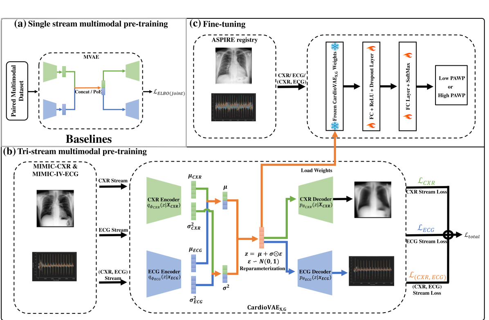
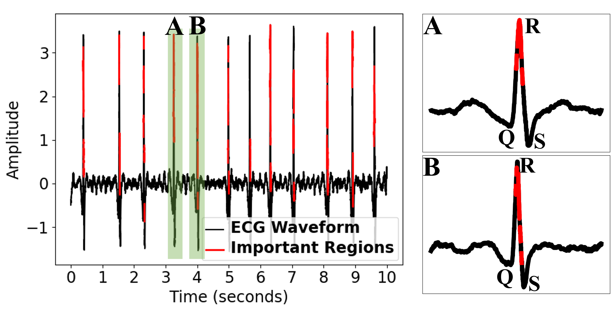
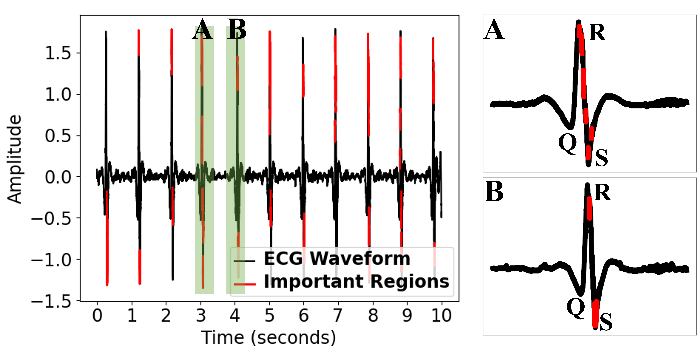

# 针对心脏血流动力学不稳定性检测这一问题，我们提出了一种创新的多模态变分自编码器方法，旨在以低成本实现高效准确的检测。该技术旨在整合多种模态的数据信息，以便更精准地识别心脏血流动力学中的不稳定状况。

发布时间：2024年03月20日

`Agent` `心脏疾病诊断`

> Multimodal Variational Autoencoder for Low-cost Cardiac Hemodynamics Instability Detection

> 近年来，在利用机器学习技术通过单一数据源（如心脏MRI）检测心脏血流动力学不稳定性方面取得了一定成果，但受限于医疗领域常见的标注病人数据不足问题，此类方法往往效果欠佳。同时，关于结合多种检查手段（如MRI、超声心动图等）研究CHDI的方法鲜有探索，且大多成本高昂。针对这些问题，我们创新性地设计了一个名为$\text{CardioVAE}_\text{X,G}$的多模态变分自编码器，该模型能以低成本整合胸部X光片（CXR）和心电图（ECG）信息，并在大规模无标签数据集上预训练。特别的是，$\text{CardioVAE}_\text{X,G}$采用了独特的三通道预训练策略，既能捕捉不同模态间的共享特征，也能提取模态特异性特征，使得模型可在单模态或多模态数据集上灵活微调。我们在MIMIC数据库中包含50,982名受试者的大型未标注数据集上预训练模型，并在来自ASPIRE注册库的795名带有标签的受试者数据集上对预训练模型进行微调。详尽的对比研究表明，$\text{CardioVAE}_\text{X,G}$表现出色，其AUROC值为0.79，准确率为0.77，标志着在非侵入式预测CHDI方面取得了重大突破。而且，此模型在提供与临床特征紧密相关的预测解释方面尤为出色，有力支持了临床决策制定。

> Recent advancements in non-invasive detection of cardiac hemodynamic instability (CHDI) primarily focus on applying machine learning techniques to a single data modality, e.g. cardiac magnetic resonance imaging (MRI). Despite their potential, these approaches often fall short especially when the size of labeled patient data is limited, a common challenge in the medical domain. Furthermore, only a few studies have explored multimodal methods to study CHDI, which mostly rely on costly modalities such as cardiac MRI and echocardiogram. In response to these limitations, we propose a novel multimodal variational autoencoder ($\text{CardioVAE}_\text{X,G}$) to integrate low-cost chest X-ray (CXR) and electrocardiogram (ECG) modalities with pre-training on a large unlabeled dataset. Specifically, $\text{CardioVAE}_\text{X,G}$ introduces a novel tri-stream pre-training strategy to learn both shared and modality-specific features, thus enabling fine-tuning with both unimodal and multimodal datasets. We pre-train $\text{CardioVAE}_\text{X,G}$ on a large, unlabeled dataset of $50,982$ subjects from a subset of MIMIC database and then fine-tune the pre-trained model on a labeled dataset of $795$ subjects from the ASPIRE registry. Comprehensive evaluations against existing methods show that $\text{CardioVAE}_\text{X,G}$ offers promising performance (AUROC $=0.79$ and Accuracy $=0.77$), representing a significant step forward in non-invasive prediction of CHDI. Our model also excels in producing fine interpretations of predictions directly associated with clinical features, thereby supporting clinical decision-making.

[Arxiv](https://arxiv.org/abs/2403.13658)