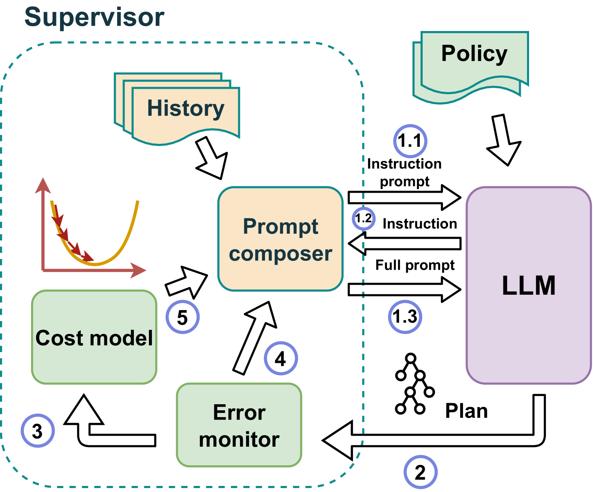
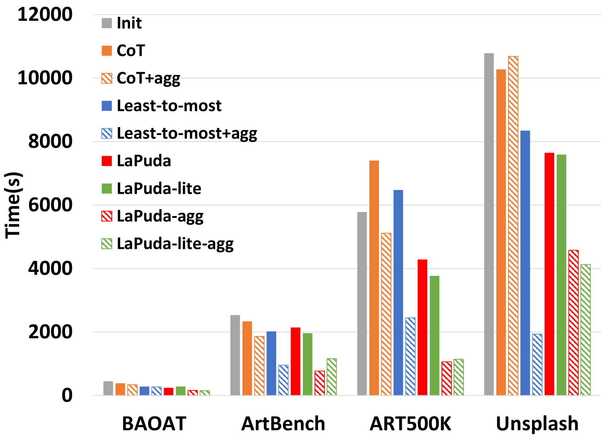

# 革新升级，告别繁琐规则——推出基于大型语言模型（LLM）的策略驱动型多模态查询优化器 v1，实现智能化优化。

发布时间：2024年03月20日

`LLM应用` `数据库` `查询优化`

> No more optimization rules: LLM-enabled policy-based multi-modal query optimizer (version 1)

# 摘要

> 大型语言模型（LLM）为机器学习与深度学习的发展树立了一个重要里程碑。近期的研究关注其在单模态和多模态查询规划中的表现，但对LLM的查询优化潜力却鲜有触及。作为关乎查询计划执行效率的关键乃至核心环节，深入探究LLM的优化能力显得尤为必要。当前市面上的查询优化器大多基于预设规则或是结合成本估算的规则系统，这意味着构建一个新的多模态查询优化器需要手动编写成百上千条规则，耗时费力，且这一挑战尚无良好解决方案。在此背景下，本研究探索了LLM在查询优化上的潜能，并运用LLM技术研发出一款创新的、基于LLM与策略驱动的多模态查询优化器——LaPuda。不同于传统的详尽枚举优化规则，LaPuda仅借助少量抽象策略就能引导LLM高效完成优化任务，极大地节省了时间和人力成本。为进一步确保LLM优化过程的正确性和避免错误决策，我们借鉴了梯度下降法的理念，创新性地提出了一种引导成本下降（GCD）算法，以保证优化路径的精准导向。实验结果显示，相较于对照组，我们的方法在多数场景下都能实现性能超越，如通过我们的方法生成的优化查询计划可使执行速度提升1至3倍。

> Large language model (LLM) has marked a pivotal moment in the field of machine learning and deep learning. Recently its capability for query planning has been investigated, including both single-modal and multi-modal queries. However, there is no work on the query optimization capability of LLM. As a critical (or could even be the most important) step that significantly impacts the execution performance of the query plan, such analysis and attempts should not be missed. From another aspect, existing query optimizers are usually rule-based or rule-based + cost-based, i.e., they are dependent on manually created rules to complete the query plan rewrite/transformation. Given the fact that modern optimizers include hundreds to thousands of rules, designing a multi-modal query optimizer following a similar way is significantly time-consuming since we will have to enumerate as many multi-modal optimization rules as possible, which has not been well addressed today. In this paper, we investigate the query optimization ability of LLM and use LLM to design LaPuda, a novel LLM and Policy based multi-modal query optimizer. Instead of enumerating specific and detailed rules, LaPuda only needs a few abstract policies to guide LLM in the optimization, by which much time and human effort are saved. Furthermore, to prevent LLM from making mistakes or negative optimization, we borrow the idea of gradient descent and propose a guided cost descent (GCD) algorithm to perform the optimization, such that the optimization can be kept in the correct direction. In our evaluation, our methods consistently outperform the baselines in most cases. For example, the optimized plans generated by our methods result in 1~3x higher execution speed than those by the baselines.

[Arxiv](https://arxiv.org/abs/2403.13597)