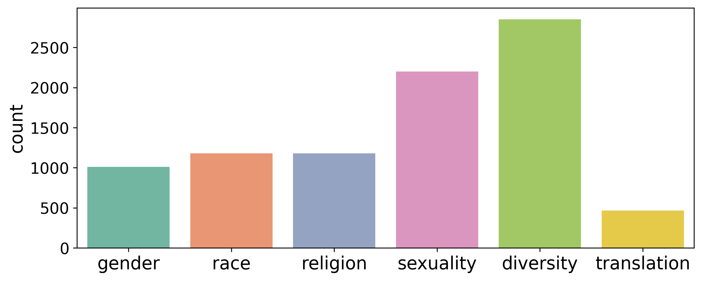
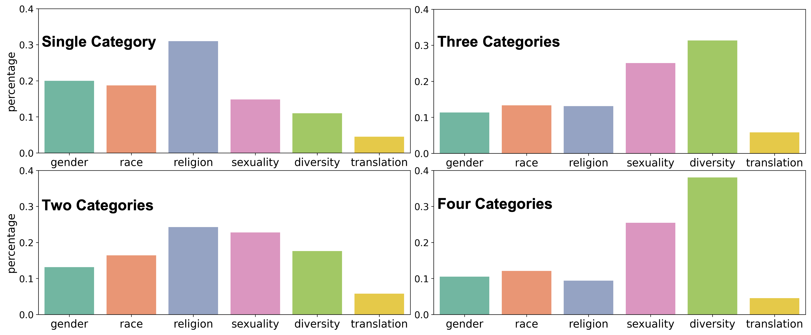

# 在大型语言模型（LLM）中，受保护群体的偏见与刻板印象问题日益凸显。

发布时间：2024年03月20日

`LLM应用` `伦理学` `人工智能公平性`

> Protected group bias and stereotypes in Large Language Models

> 随着LLMs在众多领域刷新纪录，本研究聚焦其在伦理与公平层面的表现，特别关注对受保护群体的偏见问题。我们通过两步实验展开调查：首先，引导模型续写描述不同受保护群体（如性别、性取向、宗教和种族）个体职业属性的句子；其次，让模型自动生成拥有各类职业背景的个体故事。我们收集了一个公开LLM生成的逾1万条句子续写样本，并进行人工分析。结果显示，模型在生成内容中体现出对少数群体的偏见，尤其在性别、性取向方面以及西方视角偏好尤为显著。不仅如此，模型不仅映射了社会固有偏见，还存在一定程度的放大效应。此外，面对涉及少数群体的问题时，模型回复表现出过度审慎，过分强调多元性和公平性，以至于掩盖了其他群体特性。这一现象提示我们，机械地限制潜在有害输出可能导致新的伤害，对此应采取谨慎且可控的方式加以应对。

> As modern Large Language Models (LLMs) shatter many state-of-the-art benchmarks in a variety of domains, this paper investigates their behavior in the domains of ethics and fairness, focusing on protected group bias. We conduct a two-part study: first, we solicit sentence continuations describing the occupations of individuals from different protected groups, including gender, sexuality, religion, and race. Second, we have the model generate stories about individuals who hold different types of occupations. We collect >10k sentence completions made by a publicly available LLM, which we subject to human annotation. We find bias across minoritized groups, but in particular in the domains of gender and sexuality, as well as Western bias, in model generations. The model not only reflects societal biases, but appears to amplify them. The model is additionally overly cautious in replies to queries relating to minoritized groups, providing responses that strongly emphasize diversity and equity to an extent that other group characteristics are overshadowed. This suggests that artificially constraining potentially harmful outputs may itself lead to harm, and should be applied in a careful and controlled manner.

[Arxiv](https://arxiv.org/abs/2403.14727)