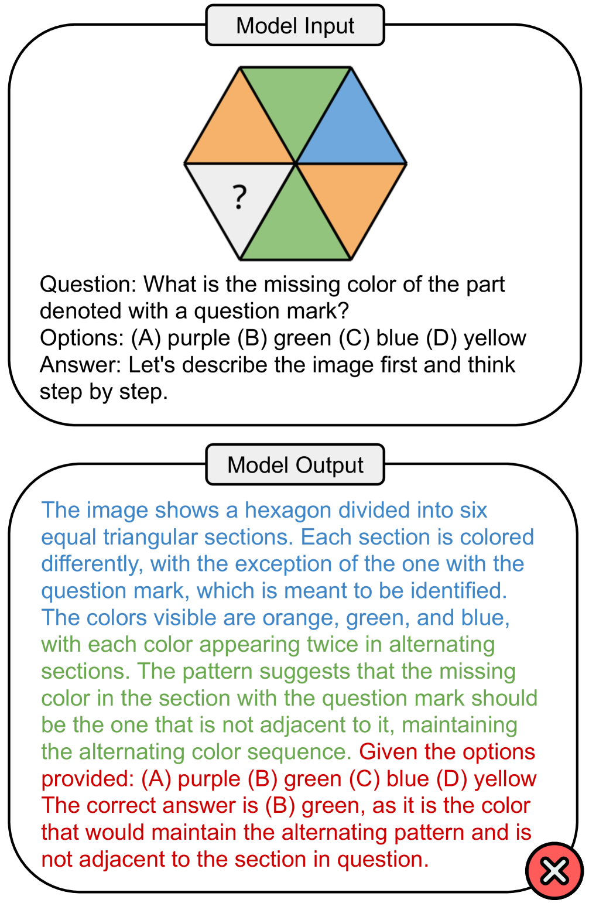
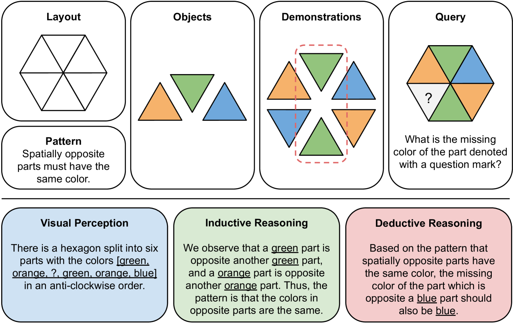
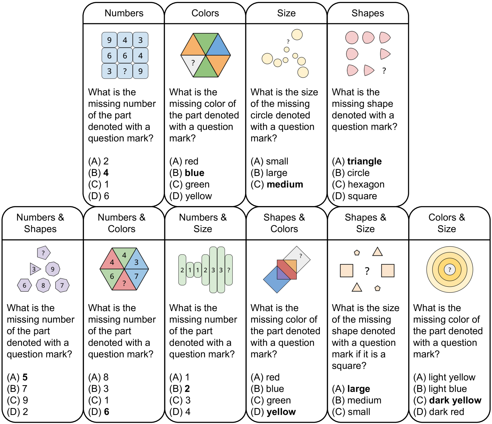
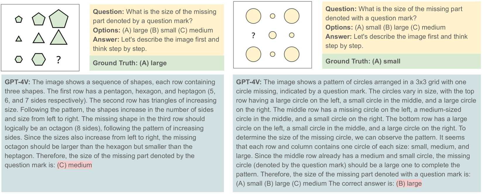
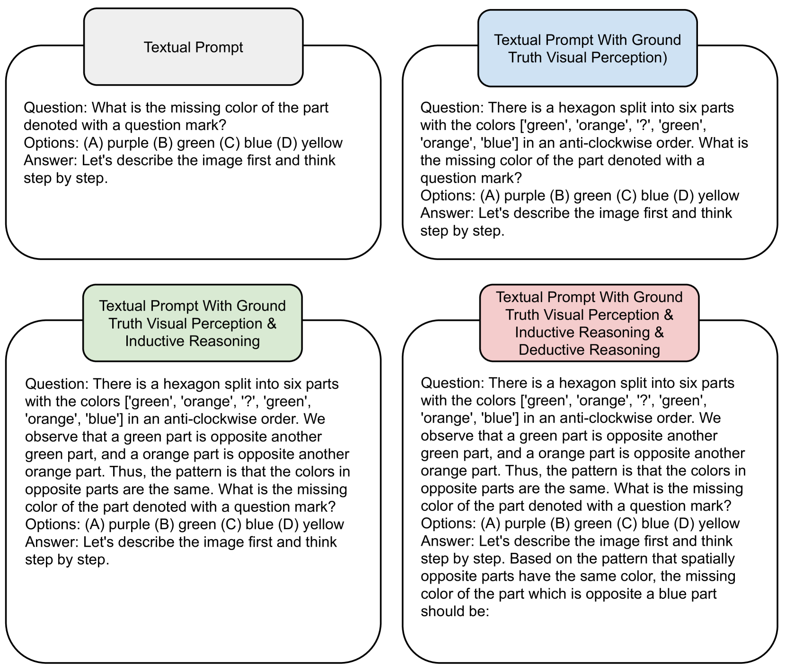

# PuzzleVQA——借助抽象视觉模式揭示语言模型在处理多模态推理难题时所面临的挑战

发布时间：2024年03月20日

`Agent` `多模态` `人工智能`

> PuzzleVQA: Diagnosing Multimodal Reasoning Challenges of Language Models with Abstract Visual Patterns

# 摘要

> 大型多模态模型凭借集成多模态理解能力，将大型语言模型的能力推向新高度，但其如何模仿人类的一般智能和推理能力仍是个未知数。为此，我们推出了基于抽象图案的谜题集PuzzleVQA，以检验模型在处理颜色、数字、尺寸、形状等基本概念时的表现。实验表明，即使是当前最先进的大型多模态模型，在面对简单抽象图案时也难以有效泛化，比如最新的GPT-4V也只能解决不到一半的谜题。为探究这一问题，我们采用逐步引导的方法，借助真实世界的视觉感知、归纳推理与演绎推理解析来调试模型。深入分析显示，GPT-4V的主要短板在于视觉感知和归纳推理方面的能力不足。此项研究旨在揭示大型多模态模型的局限性，并为未来更贴近人类认知过程的发展提供启示（相关数据和代码将公开发布于https://github.com/declare-lab/LLM-PuzzleTest）。

> Large multimodal models extend the impressive capabilities of large language models by integrating multimodal understanding abilities. However, it is not clear how they can emulate the general intelligence and reasoning ability of humans. As recognizing patterns and abstracting concepts are key to general intelligence, we introduce PuzzleVQA, a collection of puzzles based on abstract patterns. With this dataset, we evaluate large multimodal models with abstract patterns based on fundamental concepts, including colors, numbers, sizes, and shapes. Through our experiments on state-of-the-art large multimodal models, we find that they are not able to generalize well to simple abstract patterns. Notably, even GPT-4V cannot solve more than half of the puzzles. To diagnose the reasoning challenges in large multimodal models, we progressively guide the models with our ground truth reasoning explanations for visual perception, inductive reasoning, and deductive reasoning. Our systematic analysis finds that the main bottlenecks of GPT-4V are weaker visual perception and inductive reasoning abilities. Through this work, we hope to shed light on the limitations of large multimodal models and how they can better emulate human cognitive processes in the future (Our data and code will be released publicly at https://github.com/declare-lab/LLM-PuzzleTest).

[Arxiv](https://arxiv.org/abs/2403.13315)