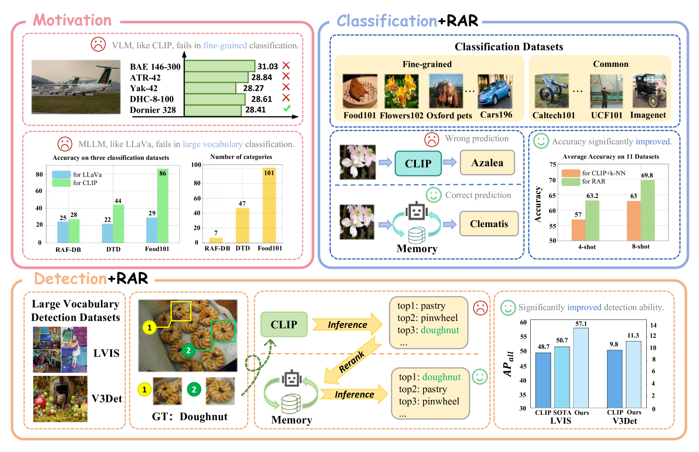
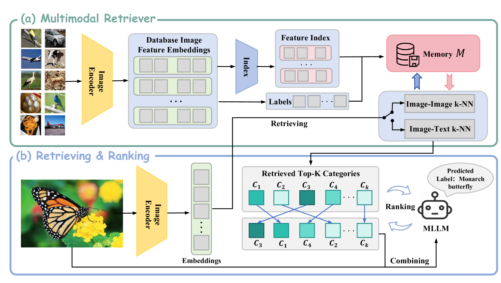
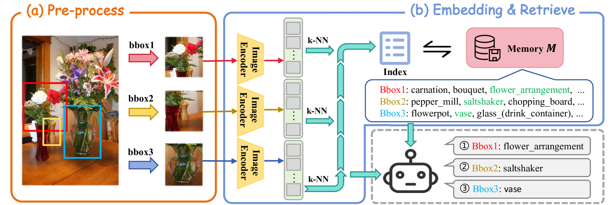
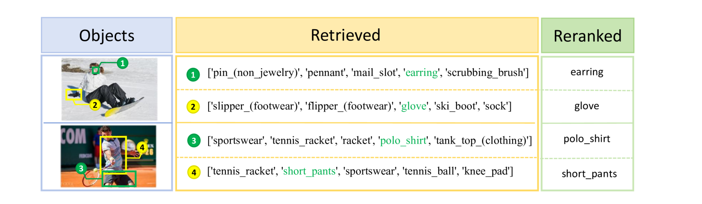
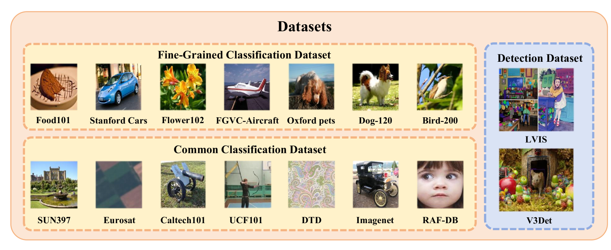
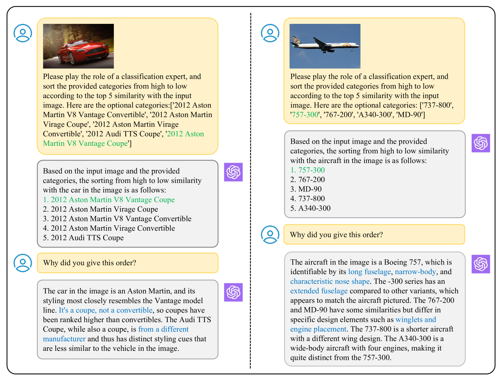
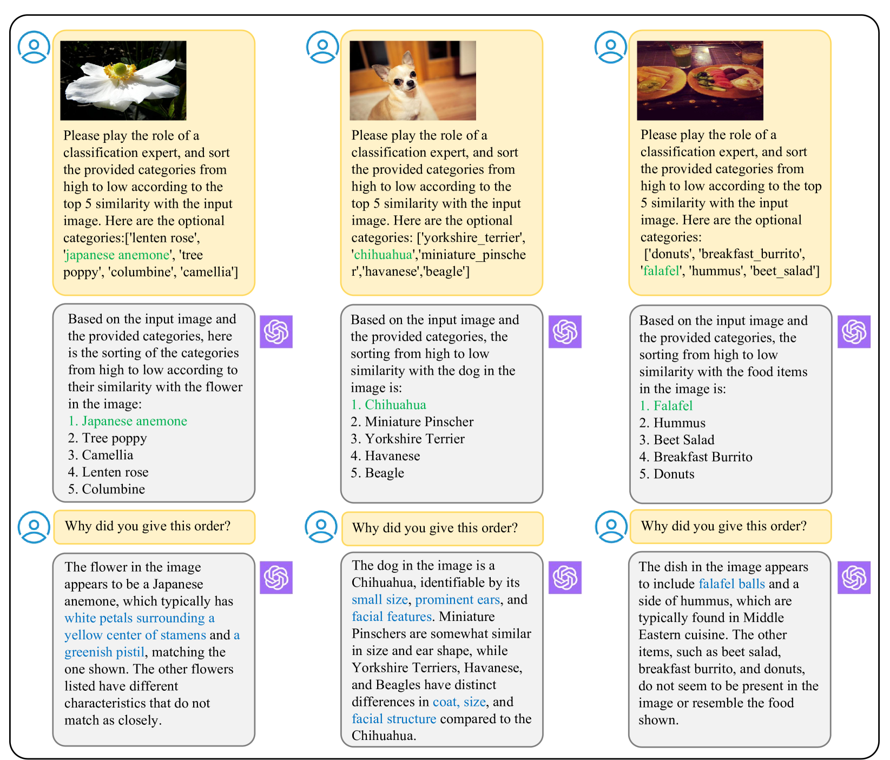
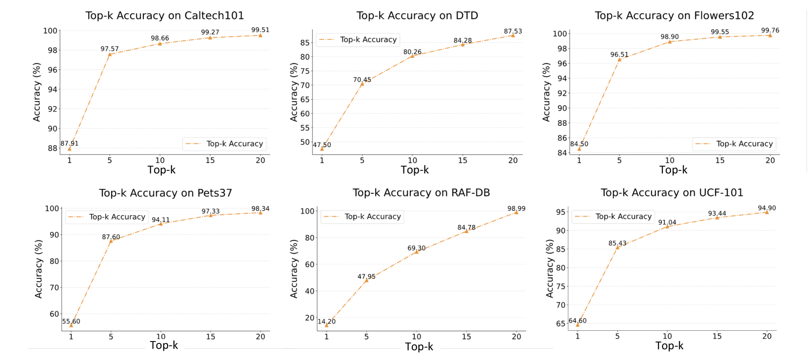
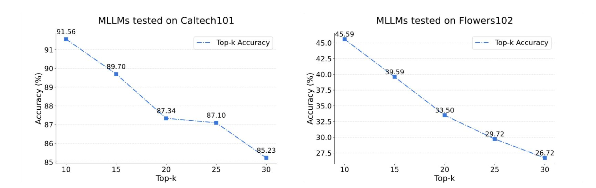
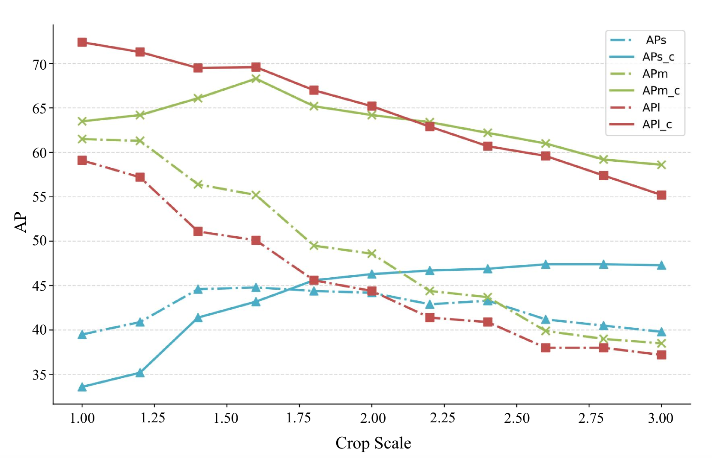

# RAR技术针对视觉识别任务，通过检索与排名策略优化多模态预训练模型（MLLMs），从而增强了其性能。

发布时间：2024年03月20日

`RAG` `计算机视觉`

> RAR: Retrieving And Ranking Augmented MLLMs for Visual Recognition

# 摘要

> CLIP 利用对比学习，擅长识别人物众多的候选对象，但因其关注广泛的联系，对于细微差别的辨别力受限。而 MLLMs 凭借大规模网络级预训练所积累的深厚知识，在细粒度分类上表现卓越，不过随着类别数量增多，其性能会因模型复杂度上升及有限上下文窗口制约而下滑。为此，本文提出了一项名为 RAR 的针对 MLLMs 的检索与排序增强方案，旨在整合二者优势，提升包含大量且细粒度丰富的词汇特征数据集的少量样本乃至零样本识别能力。我们首先构建了一个基于 CLIP 的多模态检索器，用于超越当前上下文窗口储存不同类别的显性记忆。在推断过程中，RAR 从记忆库中搜寻最相似的前 k 个结果，再利用 MLLMs 对这些结果进行排序并做出最终预测。这种方法不仅有效克服了细粒度识别的内在局限，还成功保持了模型庞大的知识体系，从而在一系列视觉-语言识别任务中实现了显著的精度提升。尤其值得一提的是，该方法在5个细粒度视觉识别基准测试、11个少量样本图像识别数据集以及在零样本识别设定下的2个目标检测数据集中，都取得了明显的性能突破。

> CLIP (Contrastive Language-Image Pre-training) uses contrastive learning from noise image-text pairs to excel at recognizing a wide array of candidates, yet its focus on broad associations hinders the precision in distinguishing subtle differences among fine-grained items. Conversely, Multimodal Large Language Models (MLLMs) excel at classifying fine-grained categories, thanks to their substantial knowledge from pre-training on web-level corpora. However, the performance of MLLMs declines with an increase in category numbers, primarily due to growing complexity and constraints of limited context window size. To synergize the strengths of both approaches and enhance the few-shot/zero-shot recognition abilities for datasets characterized by extensive and fine-grained vocabularies, this paper introduces RAR, a Retrieving And Ranking augmented method for MLLMs. We initially establish a multi-modal retriever based on CLIP to create and store explicit memory for different categories beyond the immediate context window. During inference, RAR retrieves the top-k similar results from the memory and uses MLLMs to rank and make the final predictions. Our proposed approach not only addresses the inherent limitations in fine-grained recognition but also preserves the model's comprehensive knowledge base, significantly boosting accuracy across a range of vision-language recognition tasks. Notably, our approach demonstrates a significant improvement in performance on 5 fine-grained visual recognition benchmarks, 11 few-shot image recognition datasets, and the 2 object detection datasets under the zero-shot recognition setting.

[Arxiv](https://arxiv.org/abs/2403.13805)