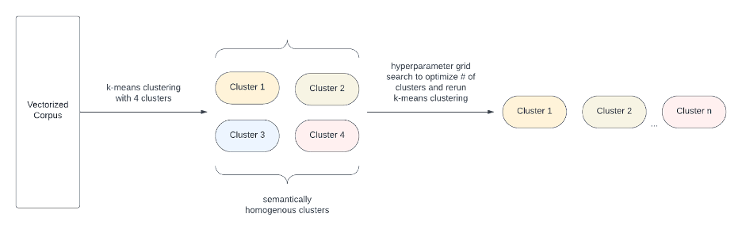
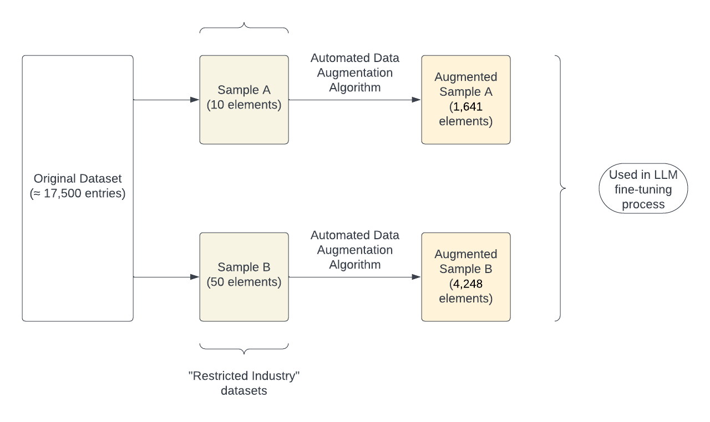

# 针对“受限行业”，我们采用自动化数据集增强技术并结合偏见量化手段，以期有效降低大型语言模型中的偏差问题。

发布时间：2024年03月20日

`LLM应用` `偏见检测` `自动化处理` `模型优化` `人工智能道德

自然语言处理` `偏见消除`

> Reducing Large Language Model Bias with Emphasis on 'Restricted Industries': Automated Dataset Augmentation and Prejudice Quantification

> 面对大型语言模型不断壮大的能力，其潜在的偏见问题不容忽视。本文创新性地提出一种自动化去偏机制，在识别出偏见源头的基础上，针对数据匮乏的“受限行业”场景，采用特定的数据集增强策略。同时，我们新创mb指数和db指数两种衡量指标，以全面考量模型固有架构与训练数据双方面导致的偏见程度。

> Despite the growing capabilities of large language models, there exists concerns about the biases they develop. In this paper, we propose a novel, automated mechanism for debiasing through specified dataset augmentation in the lens of bias producers and in the context of 'restricted industries' with limited data. We additionally create two new additional metrics, the mb-index and db-index, to quantify bias, considering the idea that bias occurs due to both intrinsic model architecture and dataset.

[Arxiv](https://arxiv.org/abs/2403.13925)