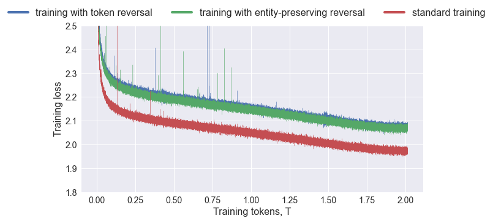

# 为解决反转难题，我们采用反向训练策略。通过逆向训练法，旨在探究和克服大型模型在处理特定任务时所面临的“反转难题”。

发布时间：2024年03月20日

`LLM理论`

> Reverse Training to Nurse the Reversal Curse

# 摘要

> LLMs在处理“特征反转”问题上出人意料地栽了跟头，即学会了“对象A具有特征B”，却难以理解“特征B是对象A的一部分”。这一现象被称作“反转诅咒”，并且即便利用包含万亿级别令牌的大规模数据集（甚至囊括整个互联网内容）进行训练，由于齐普夫定律的存在，问题依然会暴露出来。本文提出的“反向训练”新方法巧妙地将每个词汇重复使用，令有效训练令牌数翻倍。此方法在保持特定子串（如实体）不变的前提下，对训练字符串进行反转，以实现LLM在正反两个方向上的同步训练。实验证明，在标准任务上，采用数据匹配策略的反向训练模型优于传统模型；而在处理反转任务时，计算资源相当的反向训练模型展现出显著超越常规模型的优越性能，为破解“反转诅咒”难题提供了有力支持。

> Large language models (LLMs) have a surprising failure: when trained on "A has a feature B", they do not generalize to "B is a feature of A", which is termed the Reversal Curse. Even when training with trillions of tokens this issue still appears due to Zipf's law - hence even if we train on the entire internet. This work proposes an alternative training scheme, called reverse training, whereby all words are used twice, doubling the amount of available tokens. The LLM is trained in both forward and reverse directions by reversing the training strings while preserving (i.e., not reversing) chosen substrings, such as entities. We show that data-matched reverse-trained models provide superior performance to standard models on standard tasks, and compute-matched reverse-trained models provide far superior performance on reversal tasks, helping resolve the reversal curse issue.

[Arxiv](https://arxiv.org/abs/2403.13799)