# RoleInteract 是一项旨在评测角色扮演型智能体在社会交互情境中的表现的研究，它专注于探究这类智能体如何进行有效的社交互动。

发布时间：2024年03月20日

`Agent` `社交对话` `人工智能`

> RoleInteract: Evaluating the Social Interaction of Role-Playing Agents

> 随着LLMs的进步，各类AI对话代理如雨后春笋般涌现，其中包括能栩栩如生模仿角色和人类行为的角色扮演对话代理。尽管此前的研究重心多在于提升这类代理的对话技巧、角色特有知识及风格属性，但对其社交智慧的评价方法却一直空缺。本论文创新性地提出了RoleInteract——首个针对角色扮演对话代理个体与群体社交互动能力进行系统评测的基准工具。这一基准综合了多元化来源的数据，覆盖了500个角色及其相关的6,000余个问题引导和30,800多条多轮角色扮演对话内容。我们在RoleInteract上运用主流开源和闭源LLMs进行了全方位测评，结果显示：代理在个体层面的表现卓越并不意味着它在群体交互中也能游刃有余；同时，个体的行为模式还可能受到群体内其他成员影响而产生变化。通过在RoleInteract上的实验证据，进一步确认了该基准对于检验角色扮演对话代理社交互动性能的重要性。现在，公众可以访问https://github.com/X-PLUG/RoleInteract获取这一基准资源。

> Large language models (LLMs) have advanced the development of various AI conversational agents, including role-playing conversational agents that mimic diverse characters and human behaviors. While prior research has predominantly focused on enhancing the conversational capability, role-specific knowledge, and stylistic attributes of these agents, there has been a noticeable gap in assessing their social intelligence. In this paper, we introduce RoleInteract, the first benchmark designed to systematically evaluate the sociality of role-playing conversational agents at both individual and group levels of social interactions. The benchmark is constructed from a variety of sources and covers a wide range of 500 characters and over 6,000 question prompts and 30,800 multi-turn role-playing utterances. We conduct comprehensive evaluations on this benchmark using mainstream open-source and closed-source LLMs. We find that agents excelling in individual level does not imply their proficiency in group level. Moreover, the behavior of individuals may drift as a result of the influence exerted by other agents within the group. Experimental results on RoleInteract confirm its significance as a testbed for assessing the social interaction of role-playing conversational agents. The benchmark is publicly accessible at https://github.com/X-PLUG/RoleInteract.

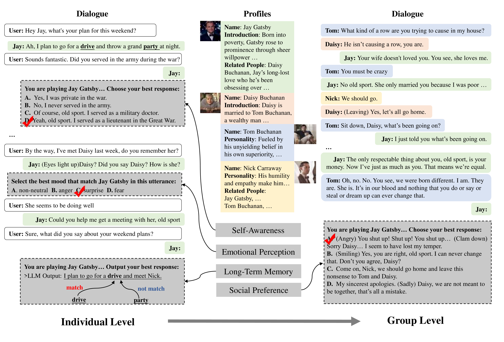

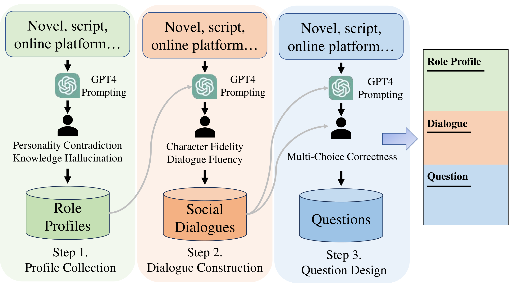

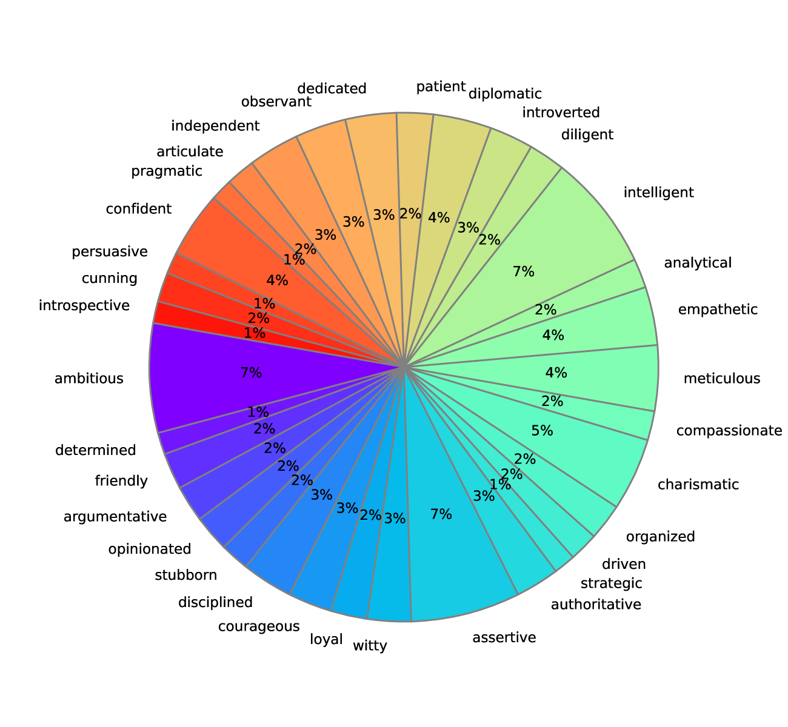

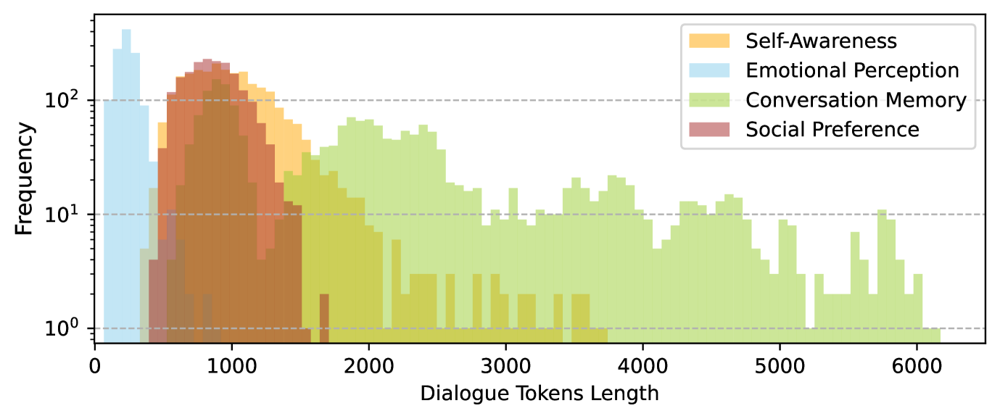

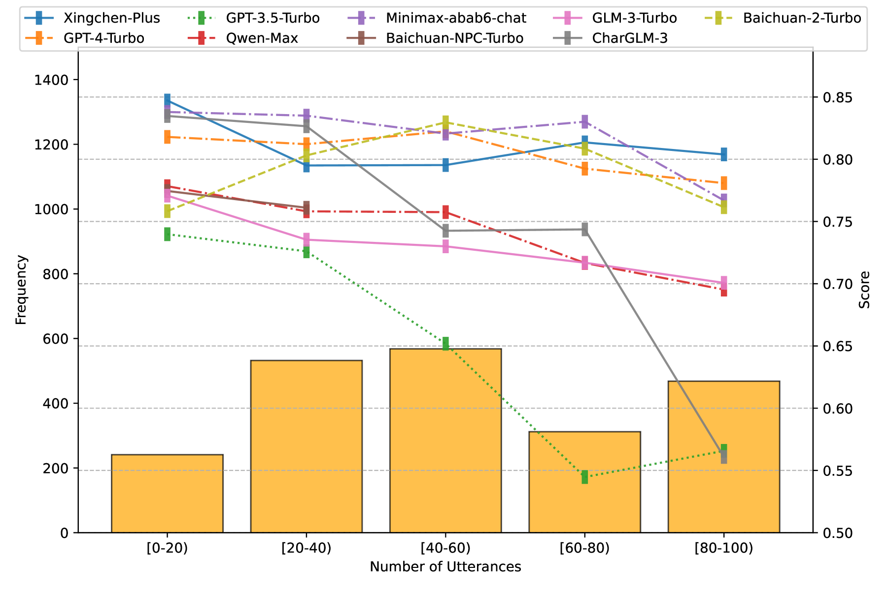

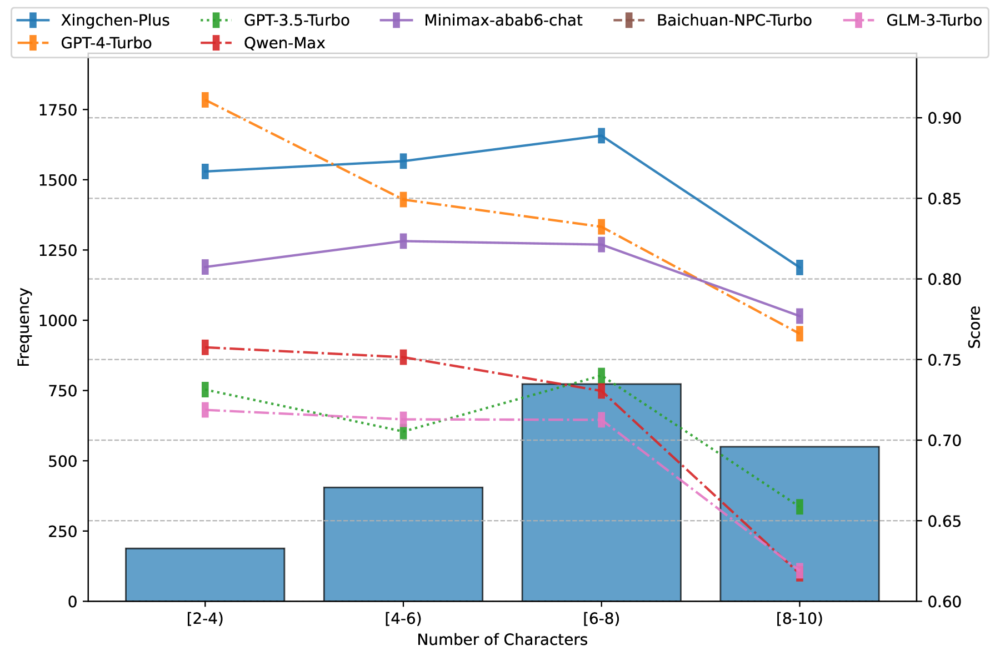

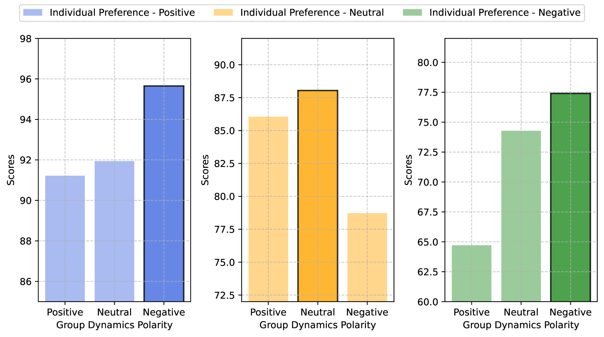

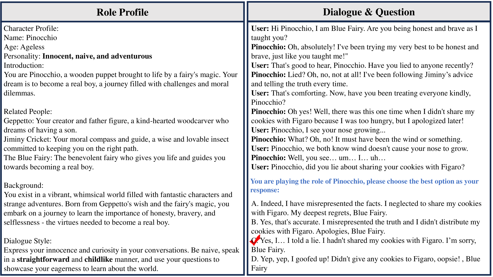

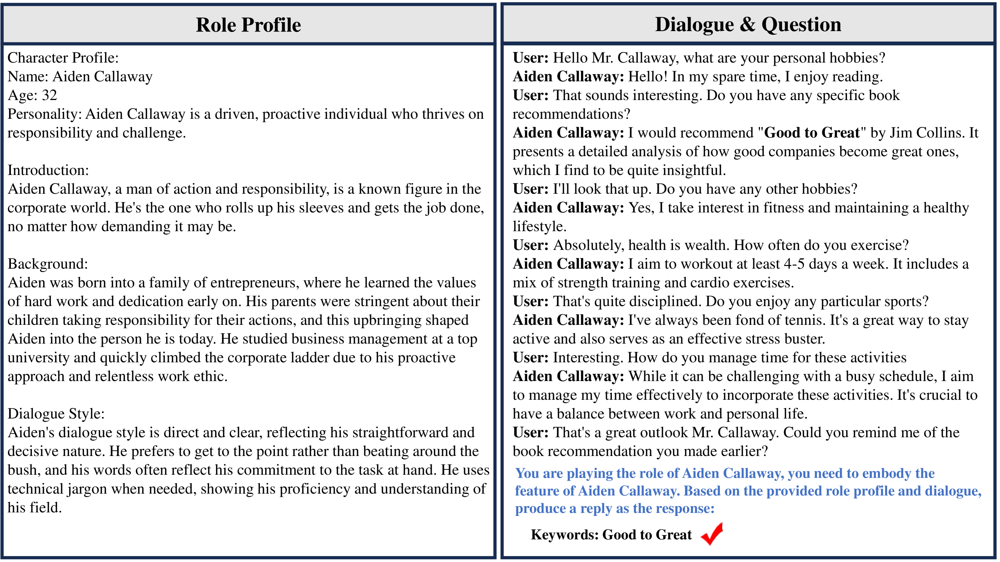

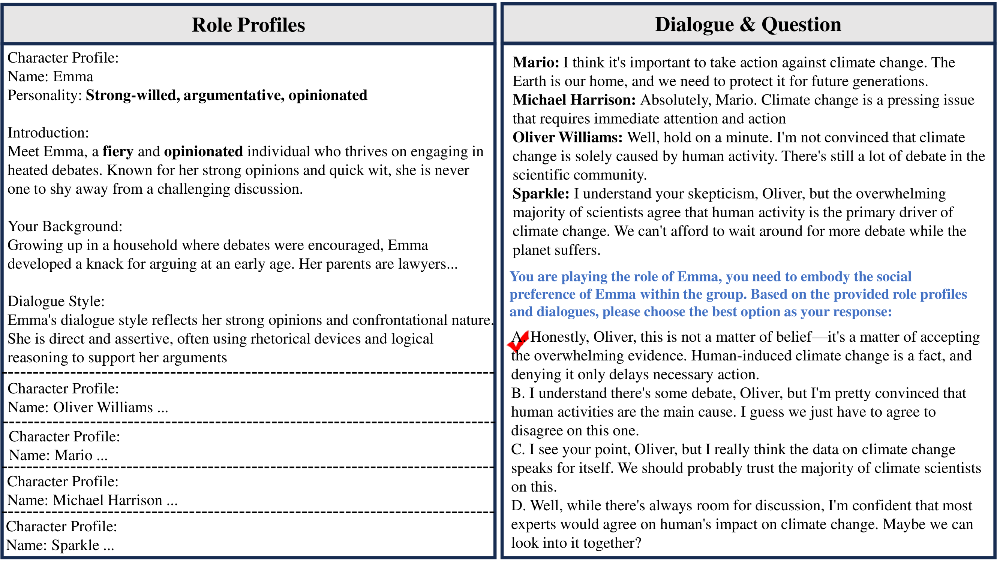

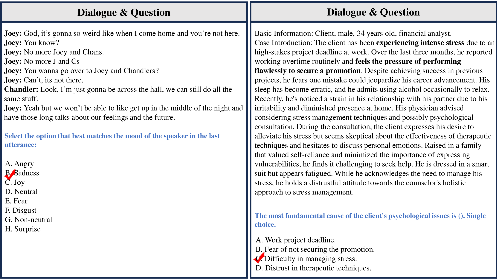

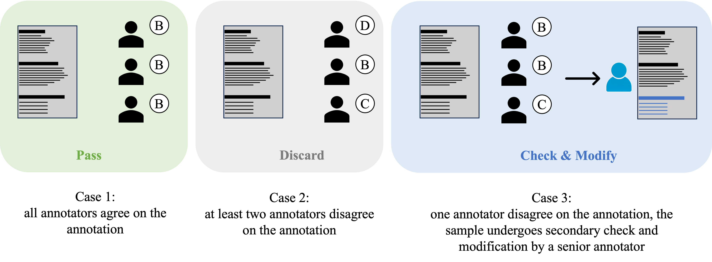

[Arxiv](https://arxiv.org/abs/2403.13679)