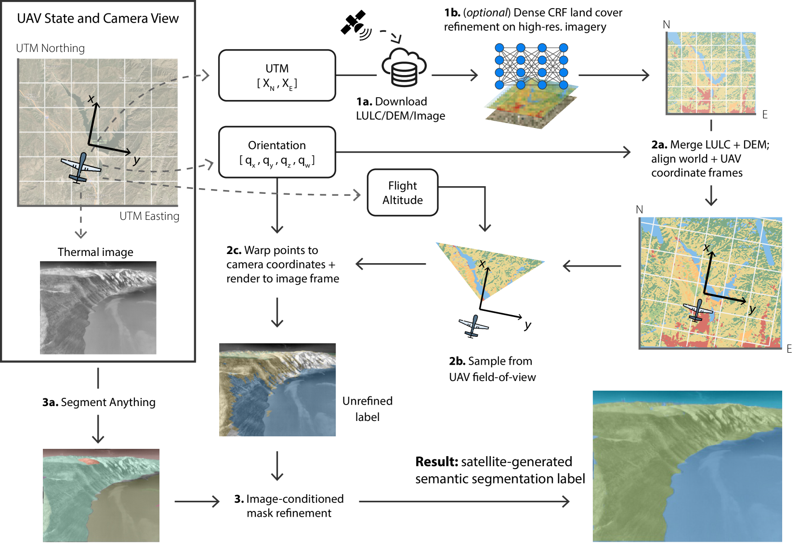
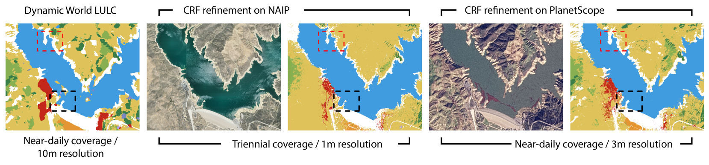
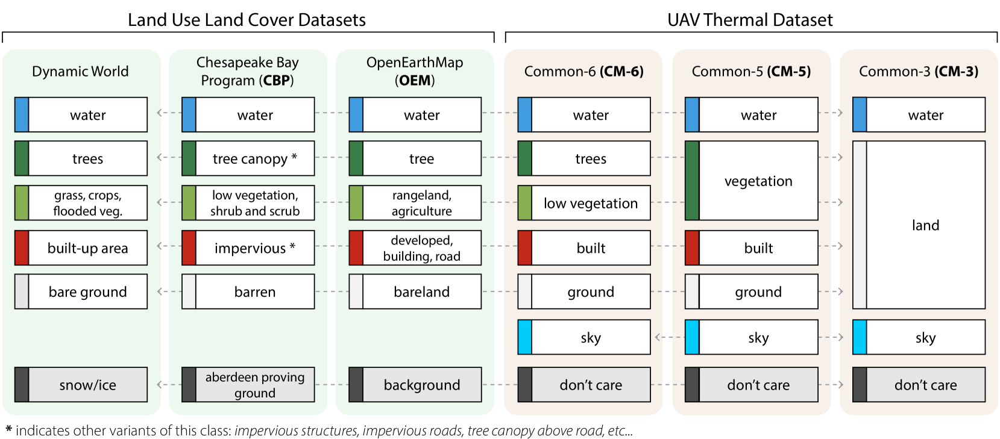
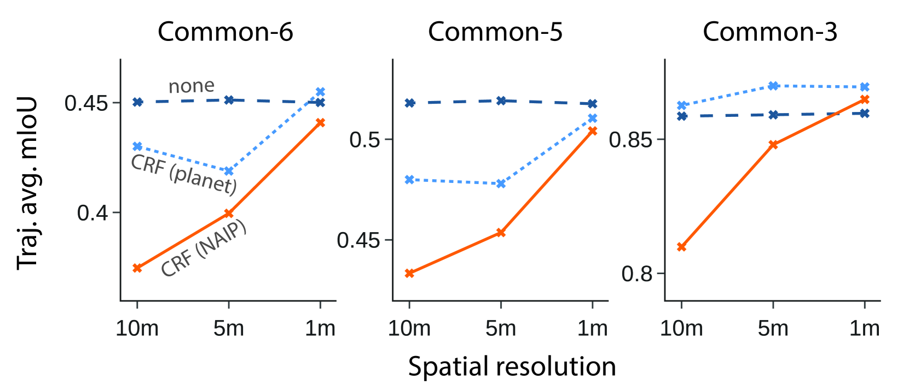
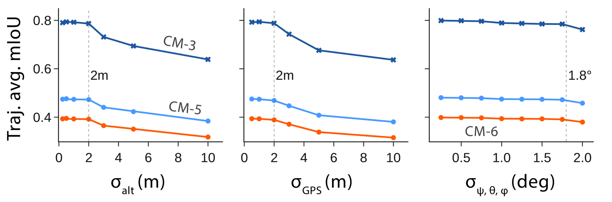

# 利用卫星导航技术为空中田间机器人提供热力语义分割注解，实现“从太空到语义”的创新标注方法。

发布时间：2024年03月20日

`Agent` `无人机` `遥感卫星` `热成像` `语义分割`

> Semantics from Space: Satellite-Guided Thermal Semantic Segmentation Annotation for Aerial Field Robots

# 摘要

> 我们创新性地提出了一种方法，借助卫星数据和无人机自带的定位及姿态数据，能够自动生成来自无人机热成像的语义分割标注，有效解决了因缺乏已标注的热域数据集以及手动标注耗时费力的问题，阻碍了户外机器人热语义感知技术的发展。这种方法不仅能在大规模并行处理下实现现场采集热数据的精准高效标注，还引入了基于热条件优化和视觉基础模型的精细化步骤，以近乎零成本的方式运用低分辨率卫星土地覆盖数据，就能生成极为精确的语义分割标签。此方法取得了与高成本高分辨率方案相近（98.5%）的性能，并在对比当前广泛应用于RGB图像注释生成的基于大型视觉-语言模型的主流零样本语义分割方法时，实现了70%-160%的显著提升。相关代码将发布于GitHub平台：https://github.com/connorlee77/aerial-auto-segment。

> We present a new method to automatically generate semantic segmentation annotations for thermal imagery captured from an aerial vehicle by utilizing satellite-derived data products alongside onboard global positioning and attitude estimates. This new capability overcomes the challenge of developing thermal semantic perception algorithms for field robots due to the lack of annotated thermal field datasets and the time and costs of manual annotation, enabling precise and rapid annotation of thermal data from field collection efforts at a massively-parallelizable scale. By incorporating a thermal-conditioned refinement step with visual foundation models, our approach can produce highly-precise semantic segmentation labels using low-resolution satellite land cover data for little-to-no cost. It achieves 98.5% of the performance from using costly high-resolution options and demonstrates between 70-160% improvement over popular zero-shot semantic segmentation methods based on large vision-language models currently used for generating annotations for RGB imagery. Code will be available at: https://github.com/connorlee77/aerial-auto-segment.

[Arxiv](https://arxiv.org/abs/2403.14056)