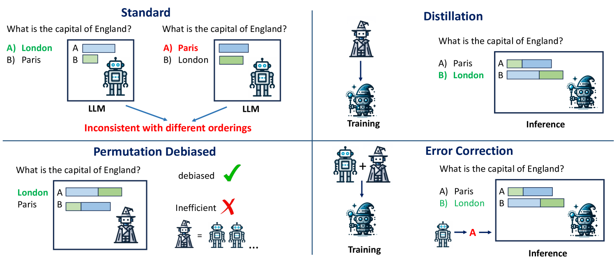
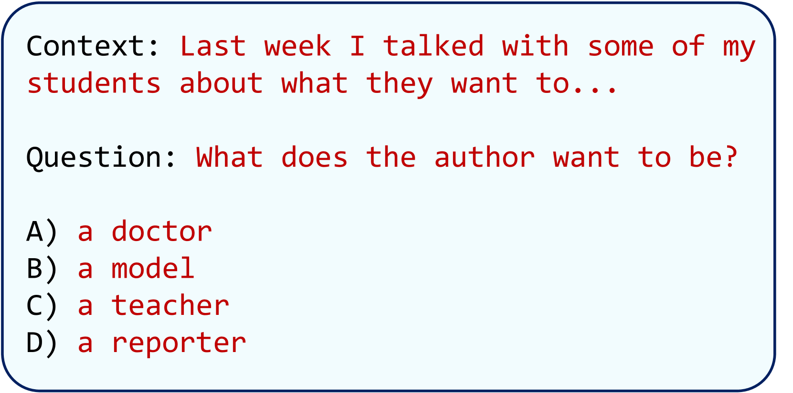
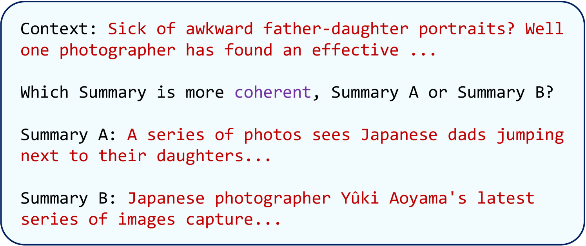
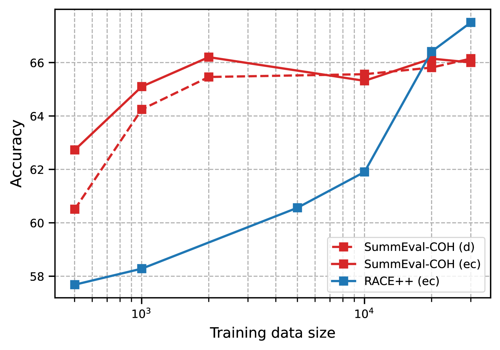

# 通过“教师-学生”训练模式，我们提出了一种通用的排列去偏置方法，旨在为大型语言模型有效减少偏差。这种方法针对大规模语言模型设计，旨在解决其潜在的偏见问题，提升模型的公正性和准确性。

发布时间：2024年03月20日

`LLM应用` `模型压缩`

> Teacher-Student Training for Debiasing: General Permutation Debiasing for Large Language Models

# 摘要

> 尽管 LLMs 在 NLP 任务上展现出了卓越的零样本能力和广泛适用性，但对于某些特定任务，它们有时难以保持关键不变性，如排列敏感性问题——LLMs 对输入选项顺序的变化极为敏感。虽然去偏见技术有助于改善这一状况并提升性能及可靠性，但却通常会带来较高的推理阶段计算开销。本文聚焦于优化推理阶段的效率问题，旨在将耗算力大且经过去偏见处理的教师模型的能力萃取至更为精简的学生模型中。我们探讨了两种不同类型的学生模型：一种完全依赖于知识蒸馏，另一种则针对复杂任务采取错误校正策略，让学生模型通过对教师模型单个偏见决策的修正来实现去偏见输出。此方法通用性强，适用于黑盒与白盒 LLMs。而且，我们还证实了，相较于较大且带偏见的教师模型，我们的紧凑型、仅含编码器架构的学生模型能以显著减少的参数量取得更优的表现。

> Large Language Models (LLMs) have demonstrated impressive zero-shot capabilities and versatility in NLP tasks, however they sometimes fail to maintain crucial invariances for specific tasks. One example is permutation sensitivity, where LLMs' outputs may significantly vary depending on the order of the input options. While debiasing techniques can mitigate these issues, and yield better performance and reliability, they often come with a high computational cost at inference. This paper addresses this inefficiency at inference time. The aim is to distill the capabilities of a computationally intensive, debiased, teacher model into a more compact student model. We explore two variants of student models: one based on pure distillation, and the other on an error-correction approach for more complex tasks, where the student corrects a single biased decision from the teacher to achieve a debiased output. Our approach is general and can be applied to both black-box and white-box LLMs. Furthermore, we demonstrate that our compact, encoder-only student models can outperform their larger, biased teacher counterparts, achieving better results with significantly fewer parameters.

[Arxiv](https://arxiv.org/abs/2403.13590)