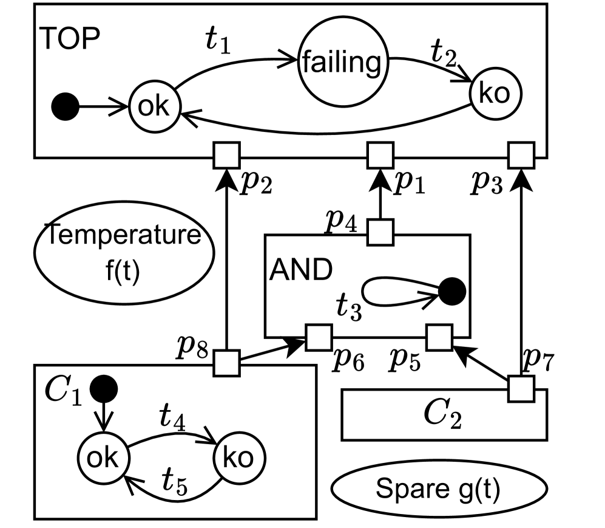
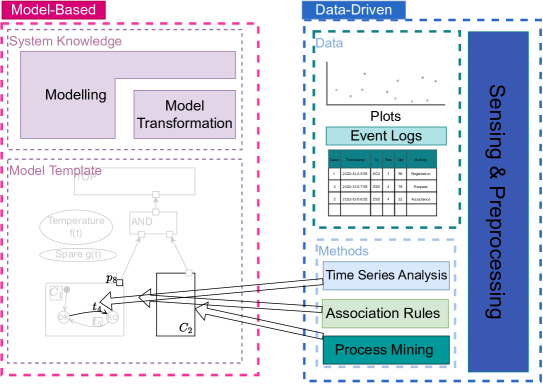

# 本研究致力于将故障树的概念应用于预测性维护场景，探索其扩展应用的可能性。

发布时间：2024年03月20日

`无法分类

根据提供的论文摘要内容，这篇论文主要讨论的是故障树在现代工业系统中的应用以及对故障树进行创新拓展以解决预测性维护问题，未涉及Agent、RAG、LLM应用或LLM理论的相关内容，因此无法将其归类到上述四个分类中。如果需要，可以创建一个新的分类如“可靠性工程”或“工业系统建模”来容纳此类主题的论文。` `预测性维护`

> Towards an extension of Fault Trees in the Predictive Maintenance Scenario

> 故障树因其简洁而深受喜爱，能无缝融入不断演进的工业流程中。为满足现代庞大系统新特性的考量，基于故障树的建模技术也相应地进行了调整。本文提议对故障树进行创新拓展，以解决现代可靠性研究面临的预测性维护难题。文中勾勒出了预测性故障树语言，并列举了若干实际工业场景下的应用案例，以支撑该模型的有效构建与深入分析。

> One of the most appreciated features of Fault Trees (FTs) is their simplicity, making them fit into industrial processes. As such processes evolve in time, considering new aspects of large modern systems, modelling techniques based on FTs have adapted to these needs. This paper proposes an extension of FTs to take into account the problem of Predictive Maintenance, one of the challenges of the modern dependability field of study. The paper sketches the Predictive Fault Tree language and proposes some use cases to support their modelling and analysis in concrete industrial settings.

[Arxiv](https://arxiv.org/abs/2403.13785)