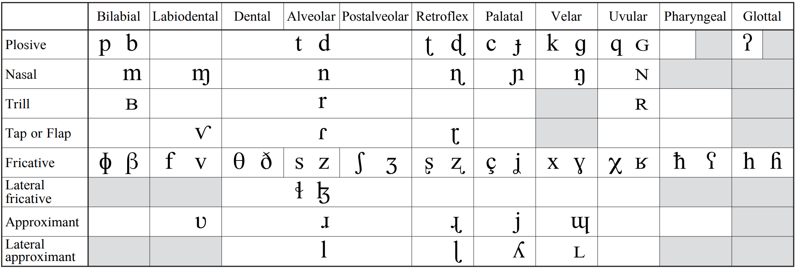
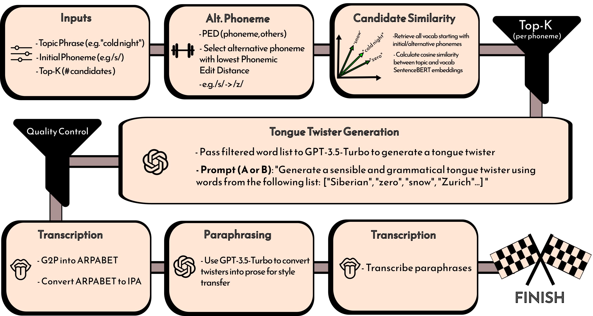

# 通过“训练与约束”方法，我们致力于从主题及释义出发，结合语音学原理，智能生成富有挑战性的绕口令。

发布时间：2024年03月20日

`LLM应用` `语言学` `语音技术`

> Train & Constrain: Phonologically Informed Tongue-Twister Generation from Topics and Paraphrases

# 摘要

> 先前研究集中于双关语和诗歌等领域的语音学和语音驱动的语言生成。本文开辟新径，探讨利用大型语言模型(LLMs)生成绕口令——这种特殊语言形式需基于音素层面的条件控制，确保声音高度重叠，同时兼顾输入话题的语义连贯性和语法正确性。我们创新研发了TwisterLister这一工具链，通过它从LLMs中构建出迄今为止最大的注释绕口令数据集TwistList 2.0，收录了逾17000条由人和LLM共同创作的实例。我们的生成过程巧妙融合了音素限制词汇表与LLM引导策略，创造出新颖而不乏原创性的绕口令。同时，我们展示了基于自动生成数据集训练的小规模模型的自动化及人工评估结果，验证了即使未明确灌输音素知识也能成功生成富含语音学动机的语言类型。更进一步，我们推出了一款可嵌入任意因果语言模型中的音素感知约束解码器(PACD)，并证实其无论是在微调底层语言模型与否的情况下，均能产出优质的绕口令。此外，我们还专门设计并实施了一系列面向基于音素编辑距离(PED)的绕口令生成任务的自动化评价指标，准确把握住了绕口令的独特韵味。

> Previous work in phonologically and phonetically grounded language generation has mainly focused on domains such as puns and poetry. In this article, we present new work on the generation of tongue-twisters - a form of language that is required to be conditioned on a phoneme level to maximize sound overlap, whilst maintaining semantic consistency with an input topic and still being grammatically correct. We present TwisterLister, a pipeline for generating phonologically informed tongue-twisters from Large Language Models (LLMs) that we use to generate TwistList 2.0, the largest annotated dataset of tongue-twisters to date, consisting of 17K+ examples from a combination of human and LLM authors. Our generation pipeline involves the use of a phonologically constrained vocabulary alongside LLM prompting to generate novel, non-derivative tongue-twister examples. We additionally present the results of automatic and human evaluation of smaller models trained on our generated dataset to demonstrate the extent to which phonologically motivated language types can be generated without explicit injection of phonological knowledge. Additionally, we introduce a Phoneme-Aware Constrained Decoding module (PACD) that can be integrated into any causal language model and demonstrate that this method generates good quality tongue-twisters both with and without fine-tuning the underlying language model. We also design and implement a range of automatic metrics for the task of tongue-twister generation that is phonologically motivated and captures the unique essence of tongue-twisters based on Phonemic Edit Distance (PED).

[Arxiv](https://arxiv.org/abs/2403.13901)