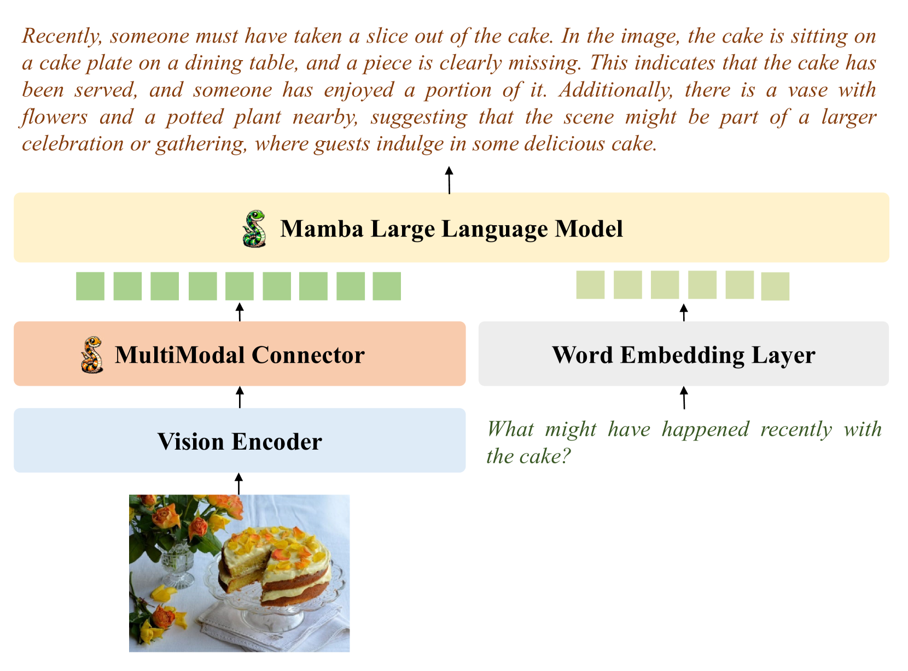
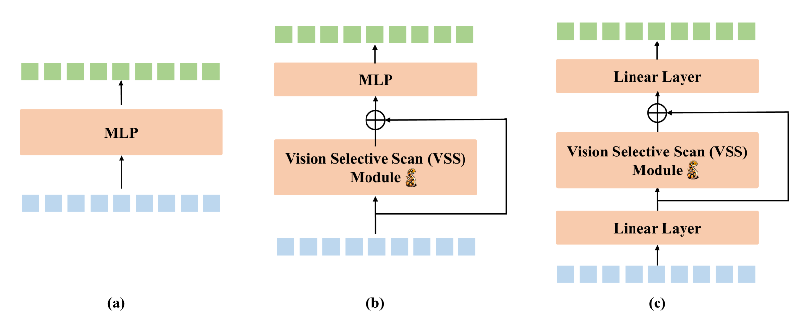
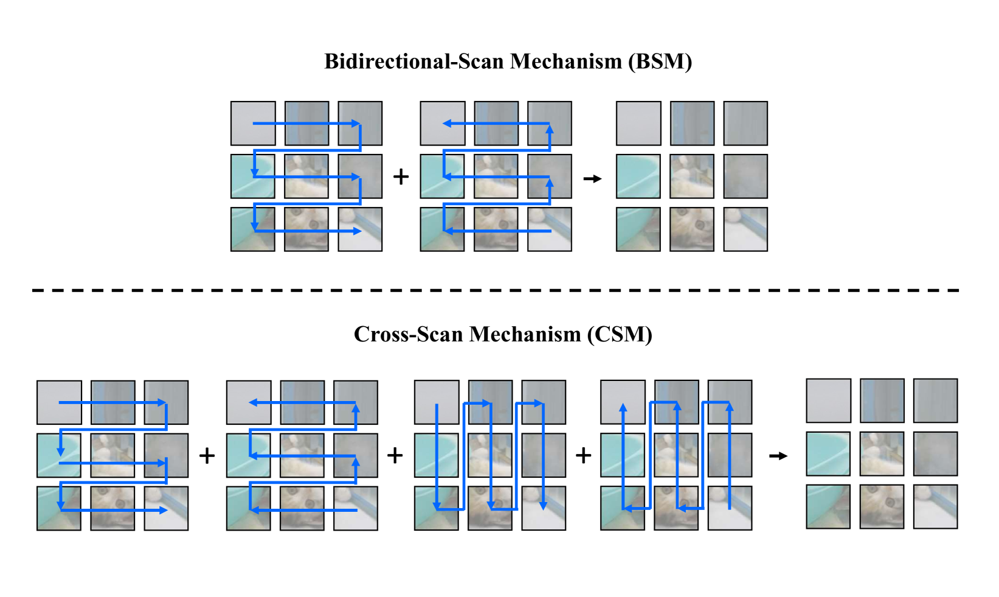
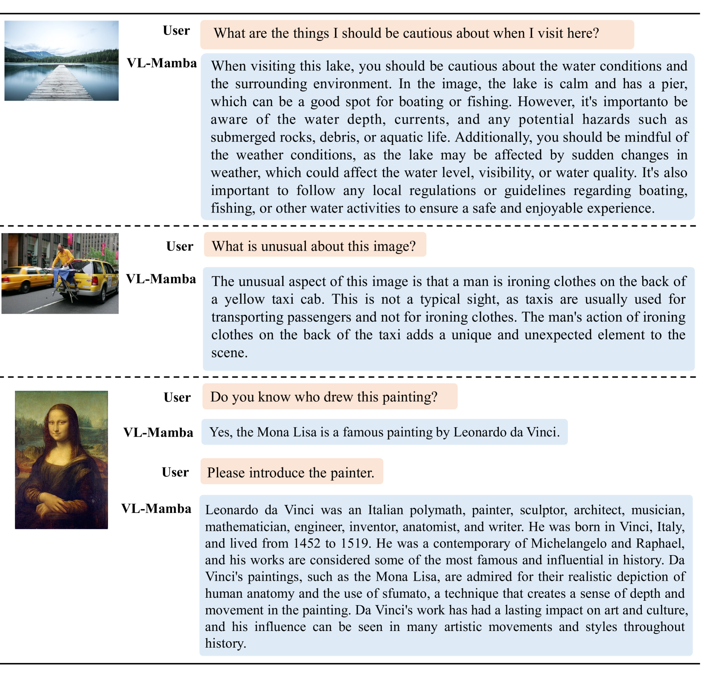

# VL-Mamba：致力于探究状态空间模型如何赋能多模态学习领域，这一研究深入挖掘此类模型在融合多种信息源以提升学习效果的潜力。

发布时间：2024年03月20日

`LLM应用` `多模态学习` `计算机视觉`

> VL-Mamba: Exploring State Space Models for Multimodal Learning

# 摘要

> MLLM凭借广泛的应用场景引发了热烈关注，但其内在的Transformer架构中的注意力机制带来二次复杂度问题，导致高昂的计算成本。为此，我们创新性地提出了基于状态空间模型的VL-Mamba，它适用于长序列且具备快速推理和按序列长度线性扩展的优势。首先，我们将基础的Transformer类语言模型（如LLama或Vicuna）替换为预训练的Mamba语言模型；然后，我们深入探究了如何高效利用二维视觉选择扫描机制实现多模态学习，并结合不同视觉编码器及预训练Mamba语言模型的不同版本。在各类多模态基准测试上取得的竞争性表现验证了VL-Mamba的有效性，充分展现了将状态空间模型应用于多模态学习任务的强大潜力。

> Multimodal large language models (MLLMs) have attracted widespread interest and have rich applications. However, the inherent attention mechanism in its Transformer structure requires quadratic complexity and results in expensive computational overhead. Therefore, in this work, we propose VL-Mamba, a multimodal large language model based on state space models, which have been shown to have great potential for long-sequence modeling with fast inference and linear scaling in sequence length. Specifically, we first replace the transformer-based backbone language model such as LLama or Vicuna with the pre-trained Mamba language model. Then, we empirically explore how to effectively apply the 2D vision selective scan mechanism for multimodal learning and the combinations of different vision encoders and variants of pretrained Mamba language models. The extensive experiments on diverse multimodal benchmarks with competitive performance show the effectiveness of our proposed VL-Mamba and demonstrate the great potential of applying state space models for multimodal learning tasks.

[Arxiv](https://arxiv.org/abs/2403.13600)