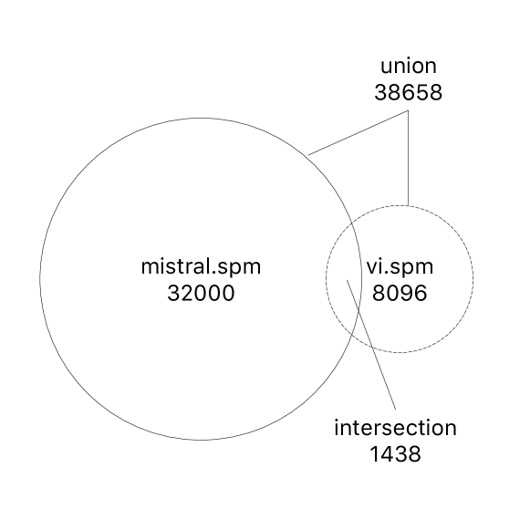
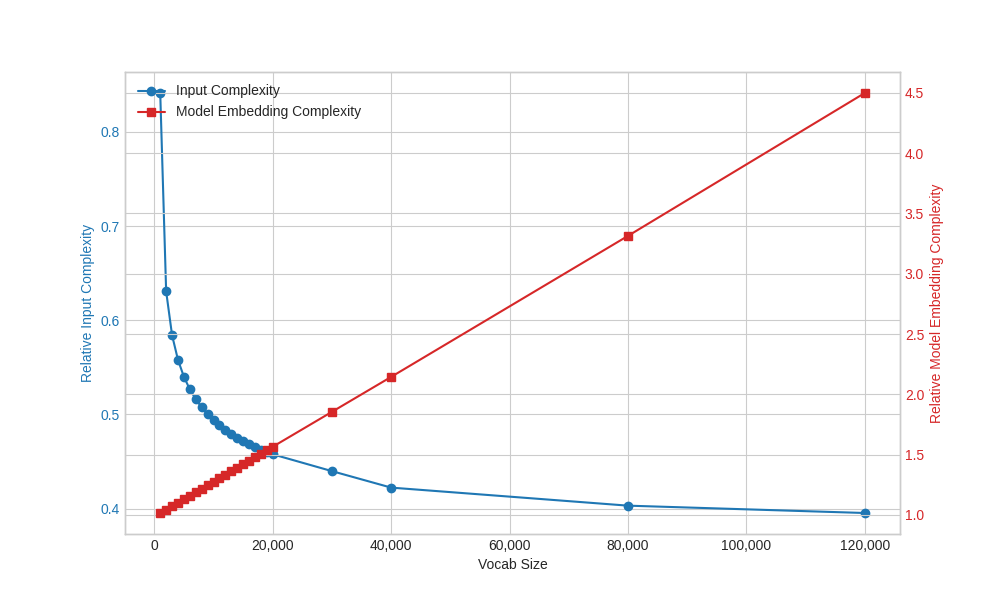
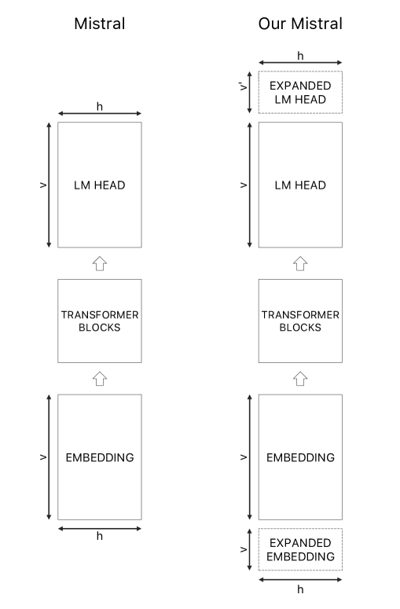
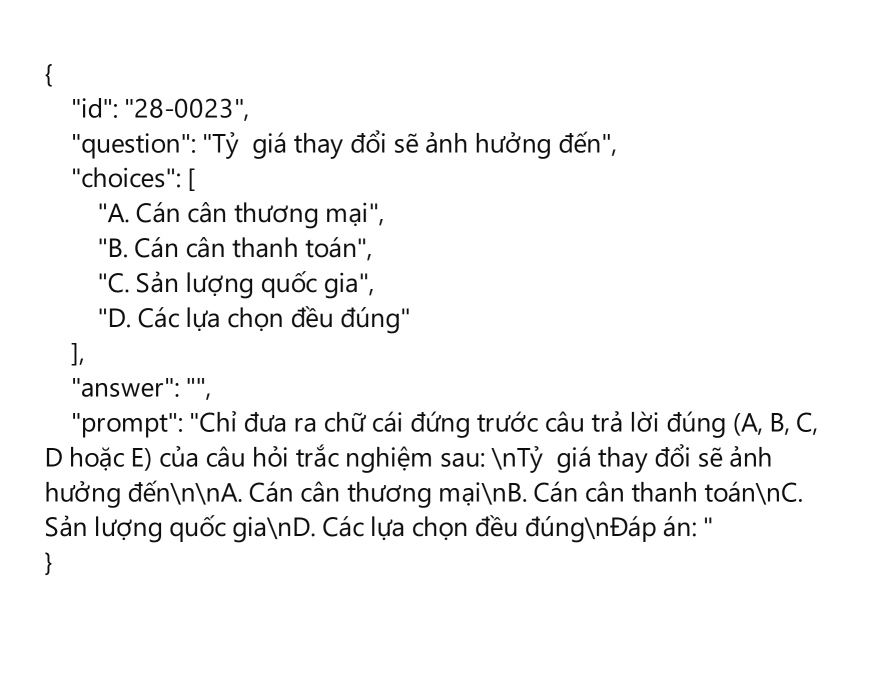

# Vi-Mistral-X项目致力于构建一个经过高级持续预训练技术优化的越南语语言模型，以提升其性能和适用性。进一步精炼后的

发布时间：2024年03月20日

`LLM应用` `越南语`

> Vi-Mistral-X: Building a Vietnamese Language Model with Advanced Continual Pre-training

> 随着LLMs的飞速发展，自然语言处理领域发生了深刻变革，但对特定语言（如越南语）的关注不足造成了显著的研究缺口。为此，本文推出了一款专为越南语打造的创新LLM——vi-mistral-x。该模型采用了基于Mistral架构的独特连续预训练方法，融合了分组查询注意力和滑动窗口注意力机制。vi-Mistral-X标志着越南语理解和生成技术的重大飞跃，通过添加针对越南语优化的额外连续预训练阶段，有效提升了模型对复杂语言特性的理解及生成精准、情境化越南语文本的能力。经过全面的基准测试，vi-mistral-x在文本分类、问答系统和文本生成等多个核心领域均超越现有越南语LLMs，在越南多任务语言理解基准VLMU上的表现更是树立了全新标杆。本文突显了连续预训练在提升特定语言LLMs方面的关键作用，并为多语言模型的研发开辟了新路径。我们期待vi-mistral-x不仅能成为处理越南语的有力武器，更能激发更多针对代表性不足语言构建大型语言模型的前沿进展。

> The advancement of Large Language Models (LLMs) has significantly transformed the field of natural language processing, although the focus on English-centric models has created a noticeable research gap for specific languages, including Vietnamese. To address this issue, this paper presents vi-mistral-x, an innovative Large Language Model designed expressly for the Vietnamese language. It utilizes a unique method of continual pre-training, based on the Mistral architecture, which incorporates grouped-query attention and sliding window attention techniques. This model, vi-Mistral-X, marks a significant step forward in improving the understanding and generation of the Vietnamese language. It introduces an additional phase of continual pre-training, specifically adapted for Vietnamese, enhancing the model's capability in understanding complex language nuances and generating accurate, context-aware Vietnamese text. Through comprehensive testing on various benchmarks, vi-mistral-x has shown to outperform existing Vietnamese LLMs in several key areas, including text classification, question answering, and text generation. Particularly, in the Vietnamese Multitask Language Understanding (VMLU) benchmark, vi-mistral-x sets a new standard, outperforming other available models significantly. This paper highlights the critical role of continual pre-training in advancing language-specific LLMs and opens new avenues for the development of multilingual models. We aim for vi-mistral-x to not just be an important asset for processing the Vietnamese language but also to encourage more advancements in creating large language models for languages that are less represented.

[Arxiv](https://arxiv.org/abs/2403.15470)