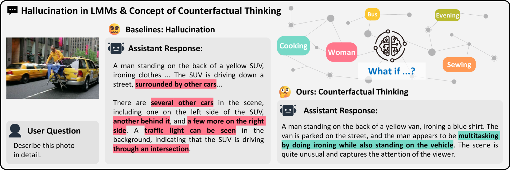
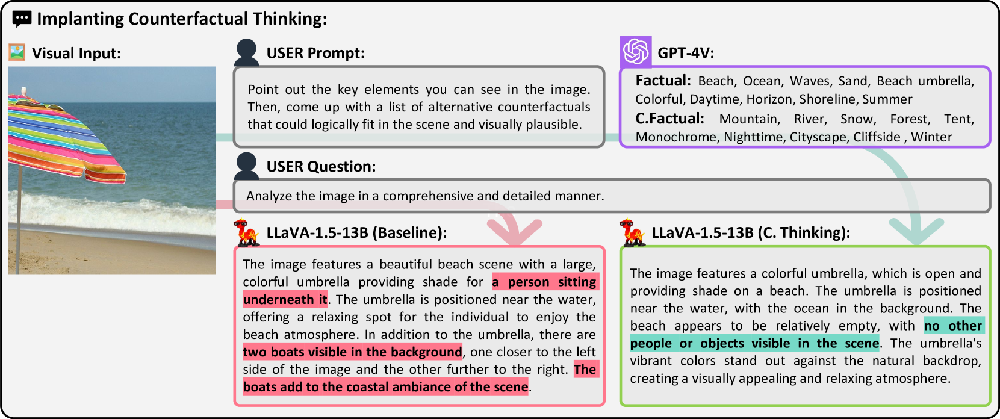
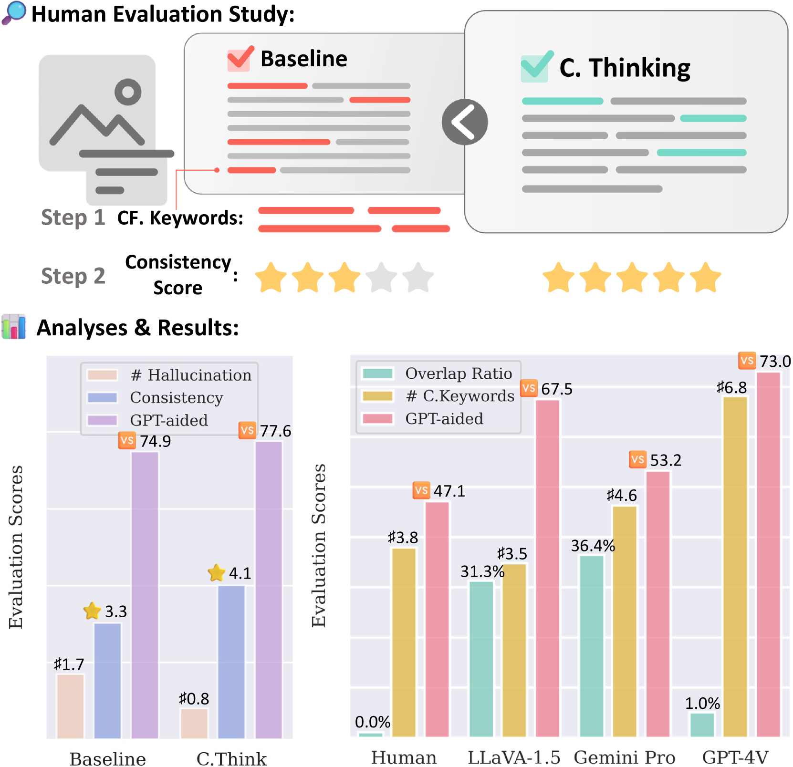
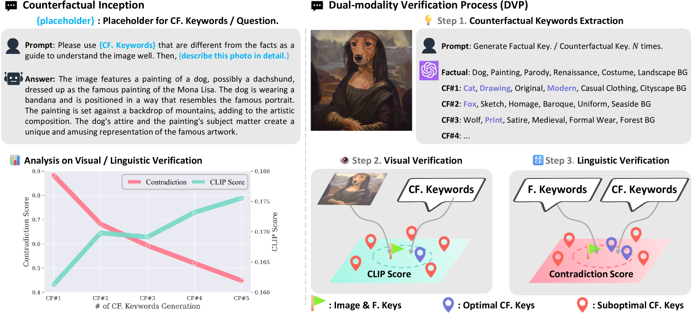
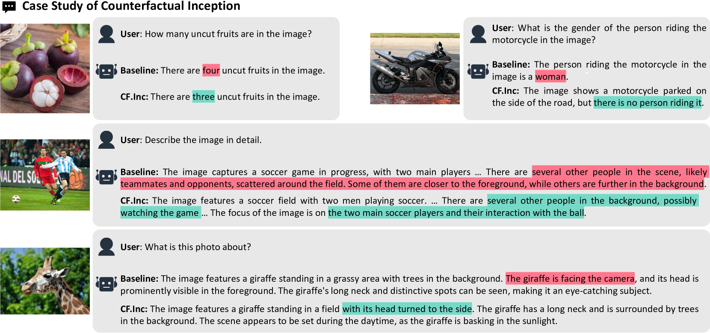

# 试想一下，如果我们采用“反事实启动”策略来缓解大型多模态模型中出现的幻觉效应问题，那将会如何呢？本研究探讨了在大型多模态模型中应用“Counterfactual Inception”技术，以有效减轻其产生的幻觉效应。

发布时间：2024年03月20日

`Agent` `人工智能` `多模态模型`

> What if...?: Counterfactual Inception to Mitigate Hallucination Effects in Large Multimodal Models

> 本文介绍了一项针对大型多模态模型（LMMs）产生错误或无关反应的幻觉效应问题的研究成果，无需额外的训练调整，创新性地引入了“反事实构思”技术，巧妙借助精心挑选且有意错位的反事实关键词来引导LMMs模拟人类的反事实思考过程。这一技术借鉴了人类反事实思维的心理机制，即设想不同的可能性和结果。此外，我们设计了一套严谨的双模态验证流程（DVP），以便在兼顾视觉与语言语境的同时，筛选出能有效激发LMMs反事实思维的理想反事实关键词。广泛的实验覆盖了多种类型的LMMs，包括开源模型和商业私有模型，一致证实了我们的方法在多个数据集上都能显著减轻幻觉效应，从而提升模型的可靠性。

> This paper presents a way of enhancing the reliability of Large Multimodal Models (LMMs) in addressing hallucination effects, where models generate incorrect or unrelated responses. Without additional instruction tuning paradigm, we introduce Counterfactual Inception, a novel method that implants counterfactual thoughts into LMMs using carefully chosen, misaligned counterfactual keywords. This method is grounded in the concept of counterfactual thinking, a cognitive process where humans consider alternative realities and outcomes. By applying this human-like reasoning mechanism to LMMs, we aim to reduce hallucination effects and improve the models' trustworthiness. We also propose Dual-modality Verification Process (DVP), a rigorous framework for selecting optimal counterfactual keywords to trigger counterfactual thinking into LMMs, concurrently considering visual and linguistic context. Our extensive experiments across various LMMs, including both open-source and proprietary models, corroborate that our method significantly mitigates hallucination phenomena across different datasets.

[Arxiv](https://arxiv.org/abs/2403.13513)