# ZigMa：一种名为“蛇形曼巴”的扩散模型，该模型以其灵动曲折的特性而得名。

发布时间：2024年03月20日

`Agent` `数据生成`

> ZigMa: Zigzag Mamba Diffusion Model

# 摘要

> 扩散模型在Transformer架构下长期受限于规模扩展和二次复杂度难题。本研究巧妙利用一种名为Mamba的状态空间模型，探索其在视觉数据生成中的潜力。我们首先揭示了现有基于Mamba的视觉方法大多忽视了在扫描策略中对空间连续性的考量。在此基础上，我们创新提出了一种简洁高效、无需额外参数的Zigzag Mamba方法，不仅超越了基于Mamba的传统方法，在速度和内存使用效率上也优于基于Transformer的同类方法。最后，我们还将Zigzag Mamba融入随机插值框架，在包括FacesHQ（$1024\times 1024$）、UCF101、MultiModal-CelebA-HQ以及MS COCO（$256\times 256$）在内的多种高分辨率视觉数据集中验证模型的可扩展性。相关代码将会在https://taohu.me/zigma/公开发布。

> The diffusion model has long been plagued by scalability and quadratic complexity issues, especially within transformer-based structures. In this study, we aim to leverage the long sequence modeling capability of a State-Space Model called Mamba to extend its applicability to visual data generation. Firstly, we identify a critical oversight in most current Mamba-based vision methods, namely the lack of consideration for spatial continuity in the scan scheme of Mamba. Secondly, building upon this insight, we introduce a simple, plug-and-play, zero-parameter method named Zigzag Mamba, which outperforms Mamba-based baselines and demonstrates improved speed and memory utilization compared to transformer-based baselines. Lastly, we integrate Zigzag Mamba with the Stochastic Interpolant framework to investigate the scalability of the model on large-resolution visual datasets, such as FacesHQ $1024\times 1024$ and UCF101, MultiModal-CelebA-HQ, and MS COCO $256\times 256$. Code will be released at https://taohu.me/zigma/

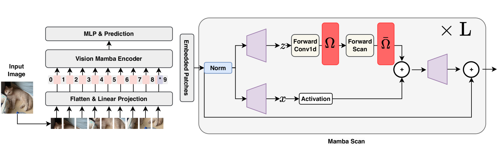

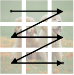

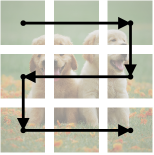

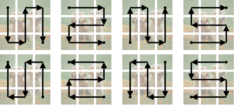

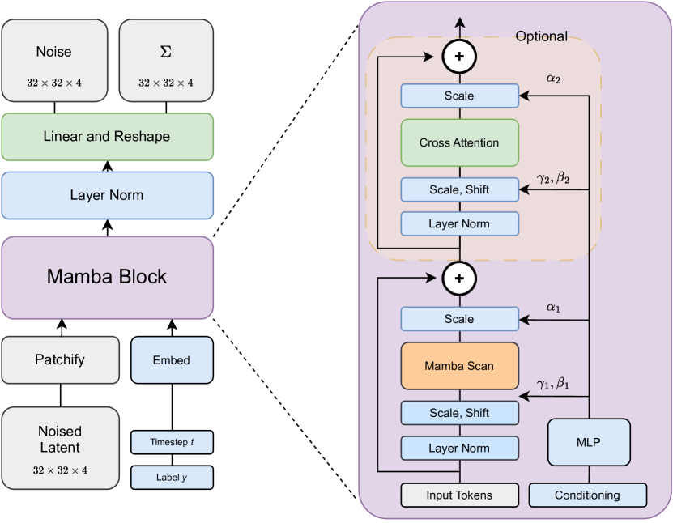

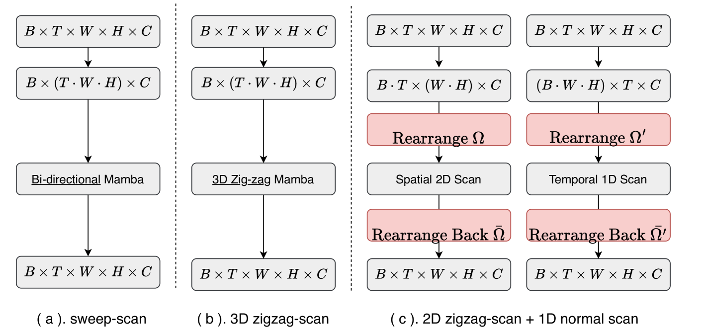

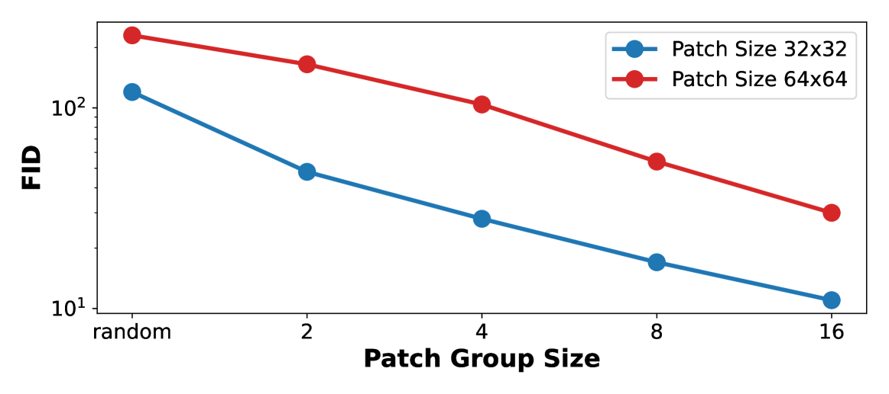

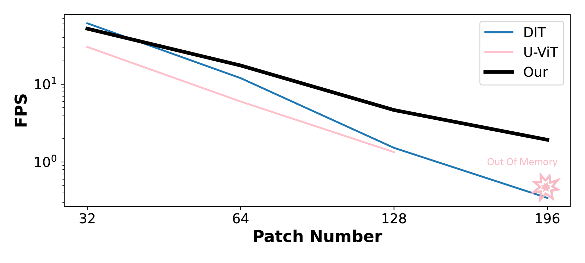

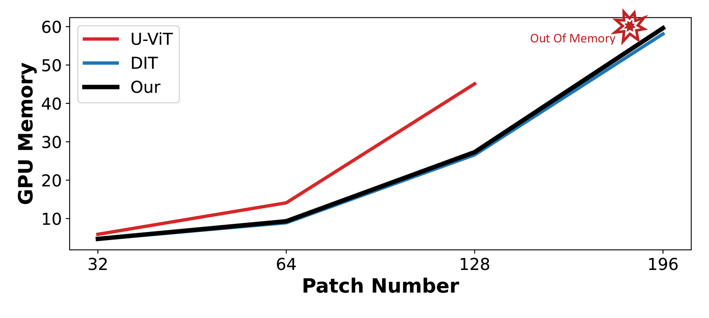

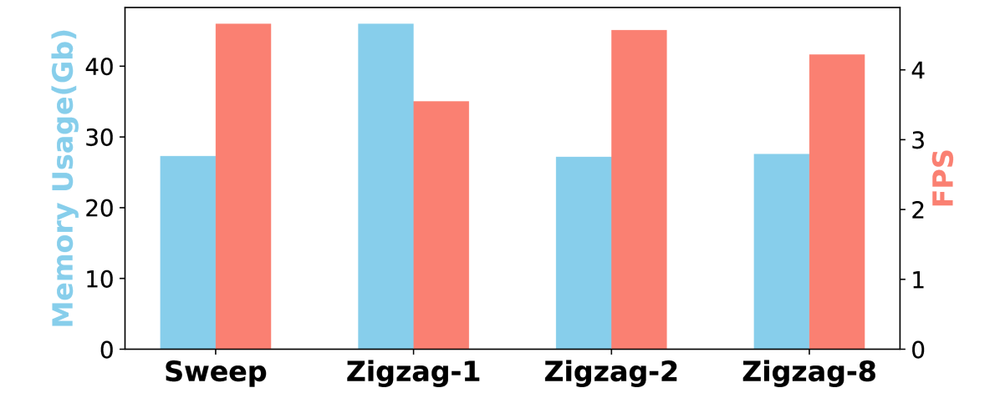

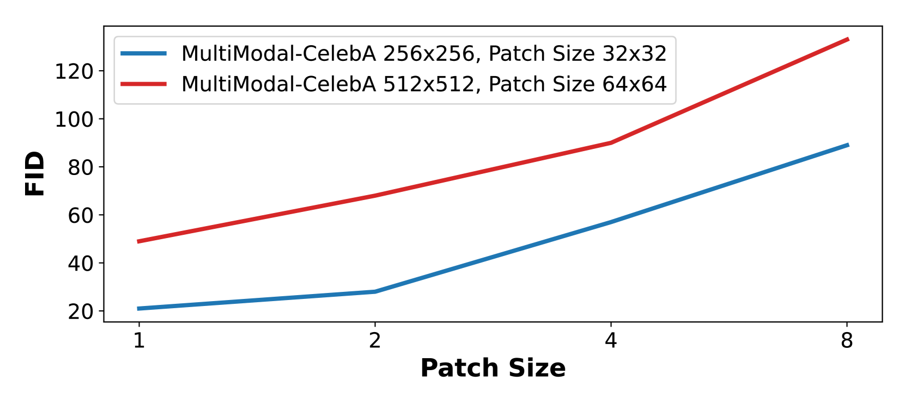

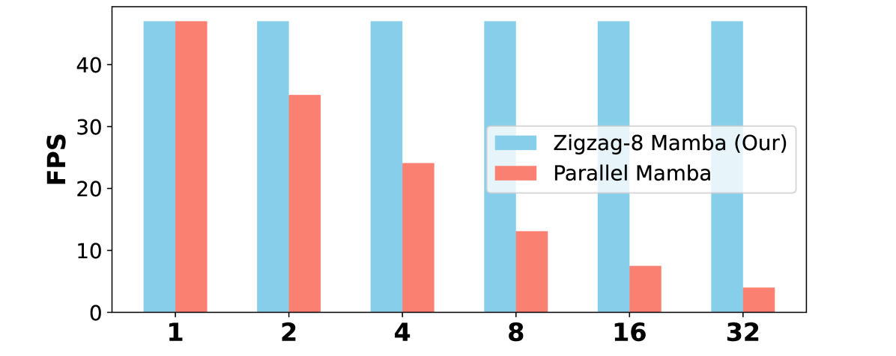

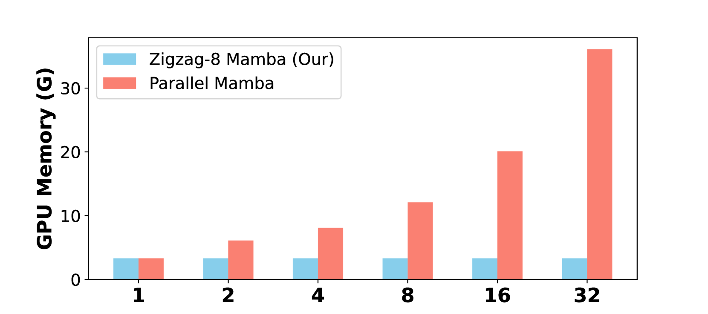

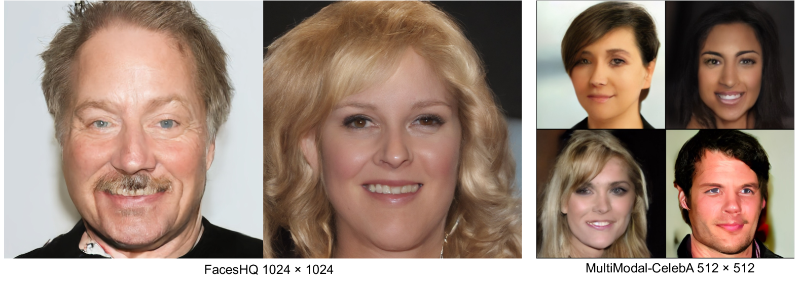

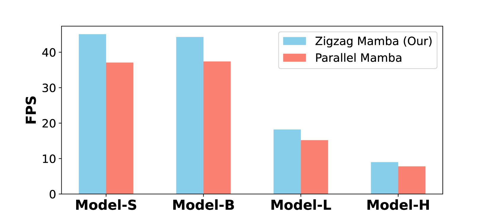

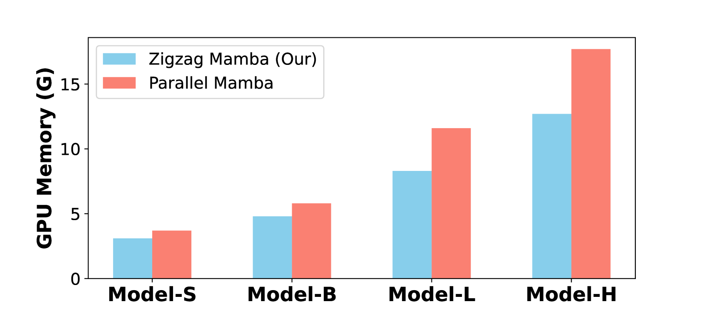

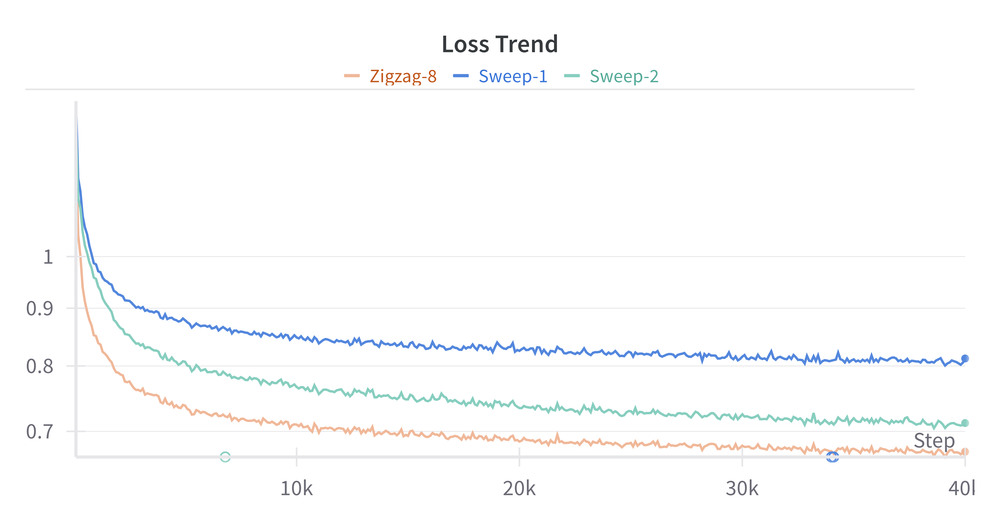

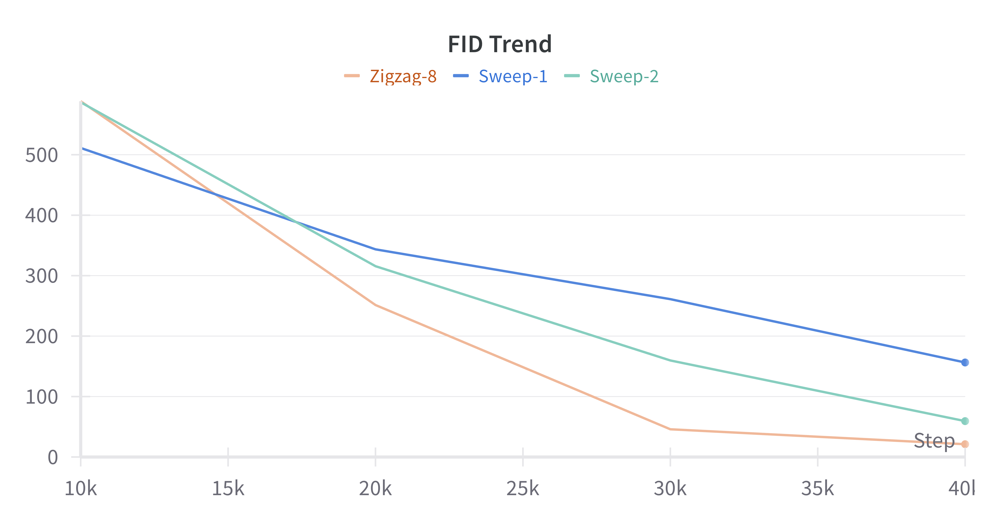

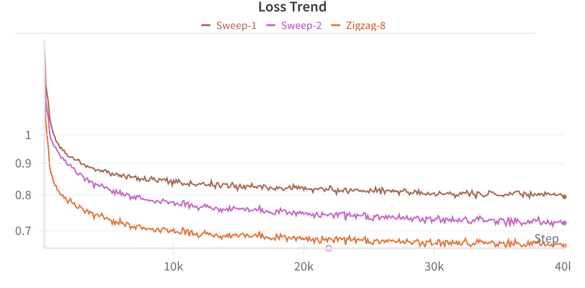

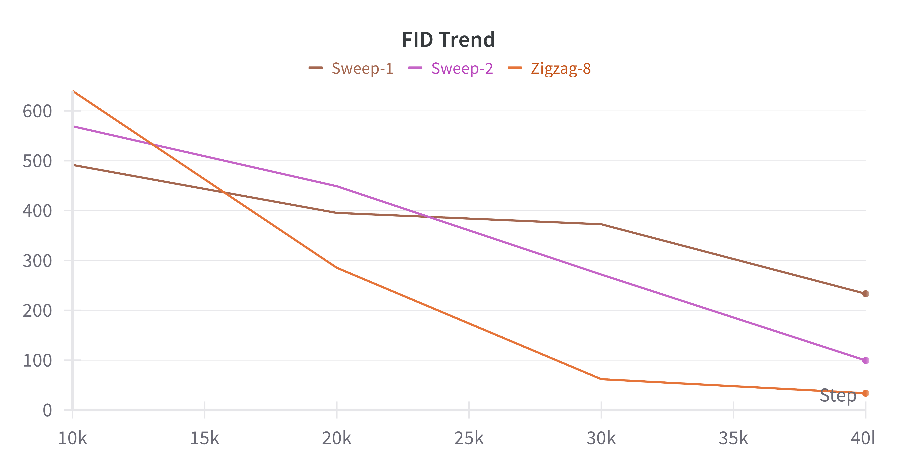

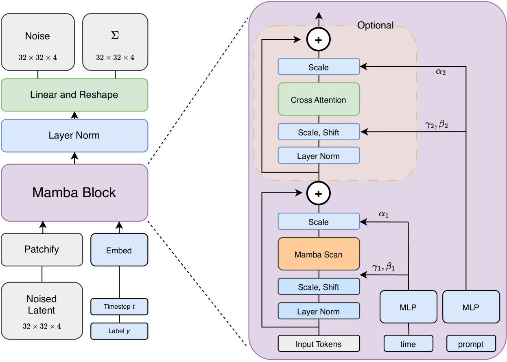

[Arxiv](https://arxiv.org/abs/2403.13802)