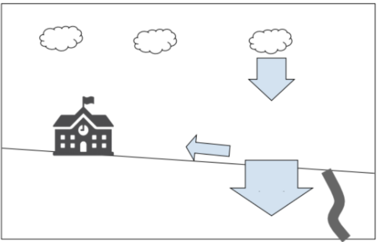
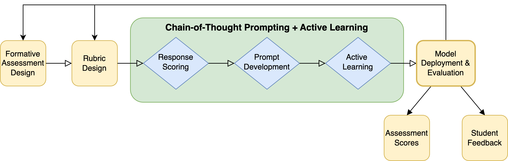

# 我们提出了一种运用LLMs实现的链式思考提示法，专门针对科学学科中学生形成性评价反馈的精准评估。

发布时间：2024年03月21日

`LLM应用`

> A Chain-of-Thought Prompting Approach with LLMs for Evaluating Students' Formative Assessment Responses in Science

> 本文探讨了运用LLMs评判及解析K-12科学课程中的短答案评估，尽管已有方法能够有效评价数学和计算机科学等结构性强的题目，却往往缺乏评分依据的解释。我们的研究聚焦于利用GPT-4配合少量样例学习与主动学习，结合链式思考逻辑，实现对中学地球科学课堂形成性评估的自动化评判与合理解释。通过“人在环中”的策略，我们成功实现了评分并给出有深度的解析。对此方法深入细致的剖析，揭示了在开放式科学评估自动评分过程中，融入人机协同技术的巨大潜力。

> This paper explores the use of large language models (LLMs) to score and explain short-answer assessments in K-12 science. While existing methods can score more structured math and computer science assessments, they often do not provide explanations for the scores. Our study focuses on employing GPT-4 for automated assessment in middle school Earth Science, combining few-shot and active learning with chain-of-thought reasoning. Using a human-in-the-loop approach, we successfully score and provide meaningful explanations for formative assessment responses. A systematic analysis of our method's pros and cons sheds light on the potential for human-in-the-loop techniques to enhance automated grading for open-ended science assessments.

[Arxiv](https://arxiv.org/abs/2403.14565)