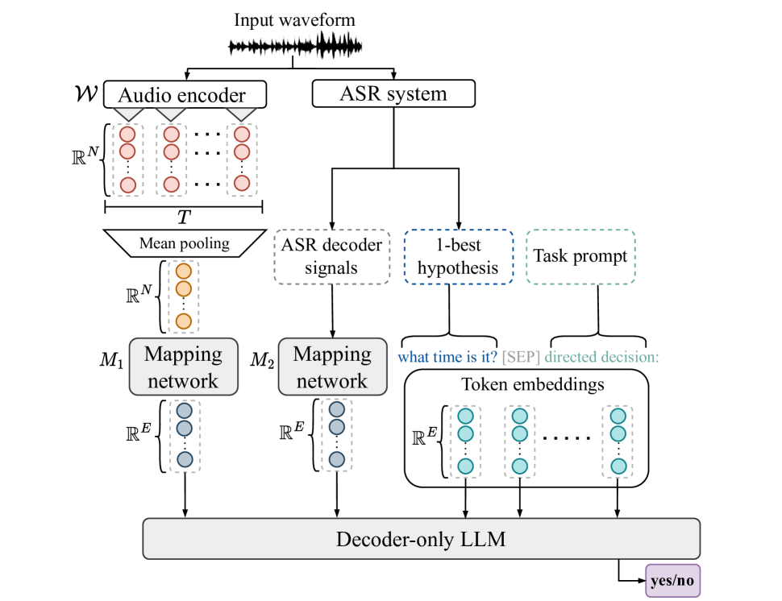
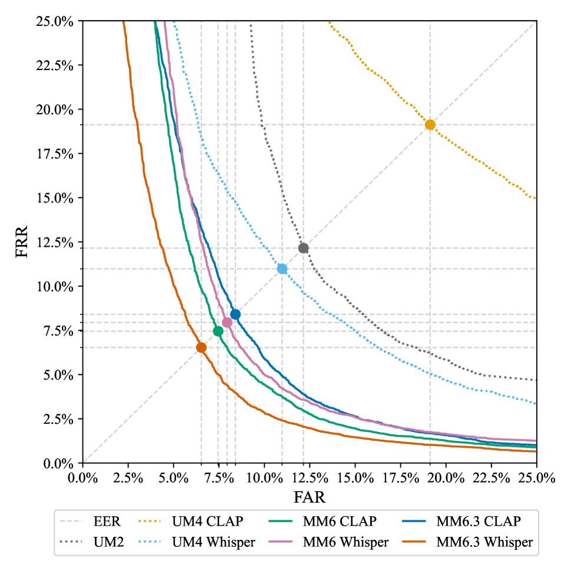

# 我们提出一种创新的多模态方法，结合大型语言模型以实现对设备指向性语音的精准检测。

发布时间：2024年03月21日

`Agent` `语音识别`

> A Multimodal Approach to Device-Directed Speech Detection with Large Language Models

> 为了让用户与虚拟助手的交流更加自然流畅，我们研究是否可以省去每次命令前必须说触发短语的规定。为此，我们从三个方面展开了探索：一是仅依赖音频波形中的声学信息训练分类器；二是将自动语音识别（如最佳候选解码结果）的输出作为大型语言模型（LLM）的输入特征；三是构建一个融合了声学、词汇特征以及ASR解码信号的多模态LLM系统。实验结果显示，相比仅基于文本或音频的模型，运用多模态信息能使相对错误率显著下降，最大降幅可达39%和61%。而通过增大LLM规模及采用低秩适应训练策略，我们在数据集中进一步降低了最多18%的相对EER值。

> Interactions with virtual assistants typically start with a predefined trigger phrase followed by the user command. To make interactions with the assistant more intuitive, we explore whether it is feasible to drop the requirement that users must begin each command with a trigger phrase. We explore this task in three ways: First, we train classifiers using only acoustic information obtained from the audio waveform. Second, we take the decoder outputs of an automatic speech recognition (ASR) system, such as 1-best hypotheses, as input features to a large language model (LLM). Finally, we explore a multimodal system that combines acoustic and lexical features, as well as ASR decoder signals in an LLM. Using multimodal information yields relative equal-error-rate improvements over text-only and audio-only models of up to 39% and 61%. Increasing the size of the LLM and training with low-rank adaption leads to further relative EER reductions of up to 18% on our dataset.

[Arxiv](https://arxiv.org/abs/2403.14438)