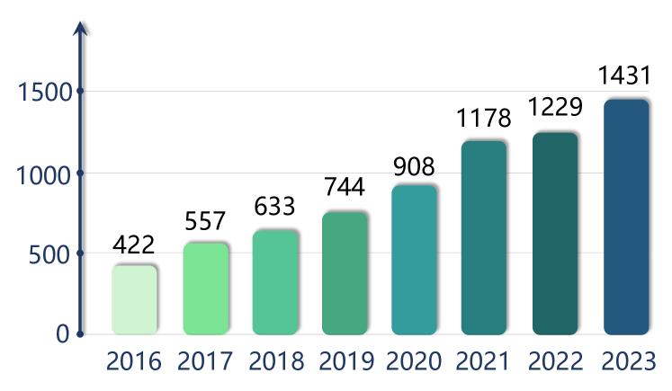
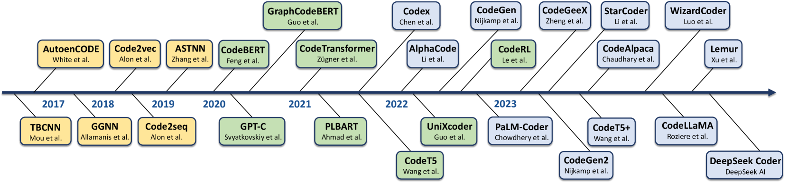
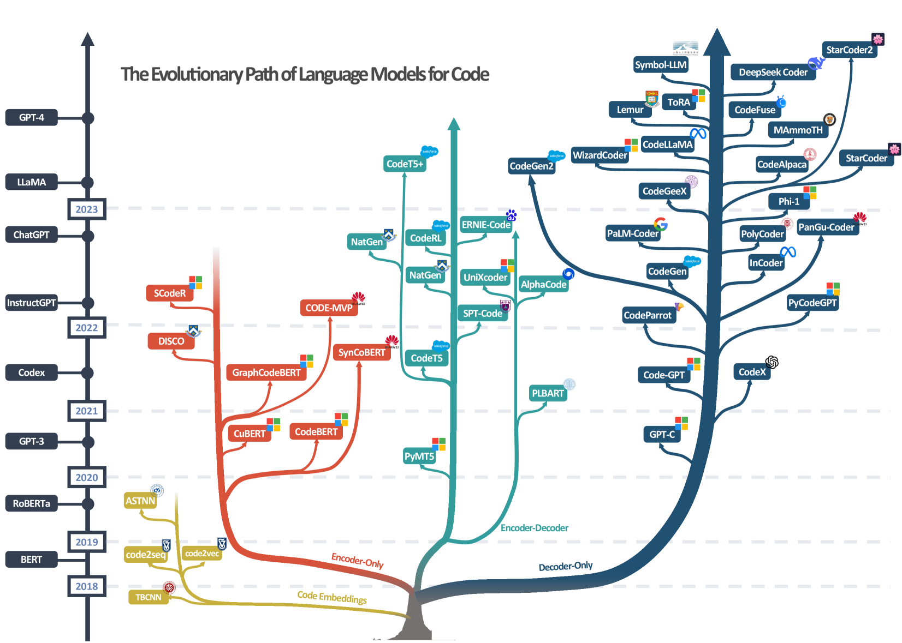
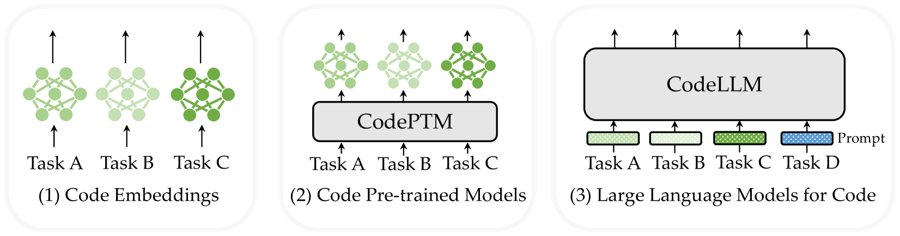
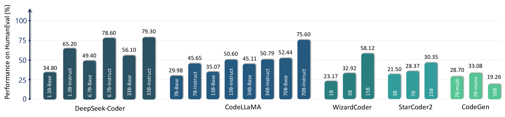
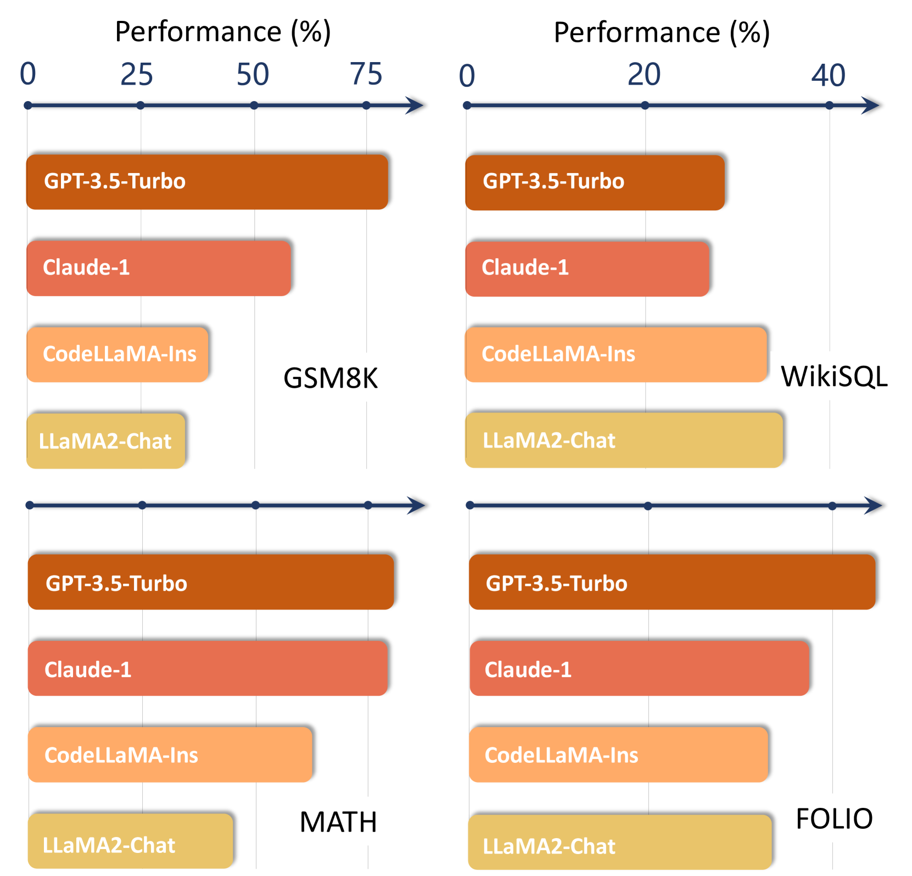

# 本文对神经代码智能进行了一次全面综述，探讨了其核心范式、最新进展以及未来可能超越的范围。

发布时间：2024年03月21日

`Agent` `软件工程`

> A Survey of Neural Code Intelligence: Paradigms, Advances and Beyond

> 神经代码智能运用深度学习的力量理解和优化代码，正孕育着改变全社会的巨大潜能。近年来，这一连结自然语言与编程语言的交叉领域吸引了来自两个研究社群的广泛关注。本研究综述以时间为主线，系统梳理了代码智能的发展历程，涉及50多个典型模型及其变种，超过20类任务类型，以及对超过680篇相关文献的全面概述。我们沿着历史的足迹，追踪了从循环神经网络模拟代码至大型语言模型时代的不同研究阶段范式变迁。同时，我们突出展现了模型、任务和评价标准在各个发展阶段的重要演变过程。在应用场景上，我们看到一个协同演进的过程，从最初针对特定场景的尝试，经历快速扩张阶段对多样化任务的广泛探索，直至当前聚焦于应对日益复杂而多变的实际问题。立足于对发展路径的深入分析，我们进一步探究了代码智能与更广阔的机器智能之间产生的新协同效应，挖掘跨领域的崭新机遇，并展现代码智能在众多领域内产生的深远影响。最后，我们在剖析该领域蕴含的机遇与挑战的同时，也分享了我们对未来最具潜力研究方向的独特见解。目前，与本综述同步进行并持续更新的相关项目及资源已在https://github.com/QiushiSun/NCISurvey公开发布。

> Neural Code Intelligence -- leveraging deep learning to understand, generate, and optimize code -- holds immense potential for transformative impacts on the whole society. Bridging the gap between Natural Language and Programming Language, this domain has drawn significant attention from researchers in both research communities over the past few years. This survey presents a systematic and chronological review of the advancements in code intelligence, encompassing over 50 representative models and their variants, more than 20 categories of tasks, and an extensive coverage of over 680 related works. We follow the historical progression to trace the paradigm shifts across different research phases (e.g., from modeling code with recurrent neural networks to the era of Large Language Models). Concurrently, we highlight the major technical transitions in models, tasks, and evaluations spanning through different stages. For applications, we also observe a co-evolving shift. It spans from initial endeavors to tackling specific scenarios, through exploring a diverse array of tasks during its rapid expansion, to currently focusing on tackling increasingly complex and varied real-world challenges. Building on our examination of the developmental trajectories, we further investigate the emerging synergies between code intelligence and broader machine intelligence, uncovering new cross-domain opportunities and illustrating the substantial influence of code intelligence across various domains. Finally, we delve into both the opportunities and challenges associated with this field, alongside elucidating our insights on the most promising research directions. An ongoing, dynamically updated project and resources associated with this survey have been released at https://github.com/QiushiSun/NCISurvey.

[Arxiv](https://arxiv.org/abs/2403.14734)