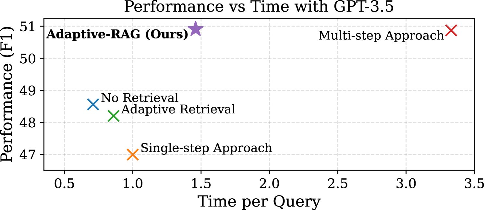
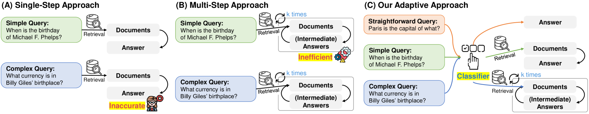
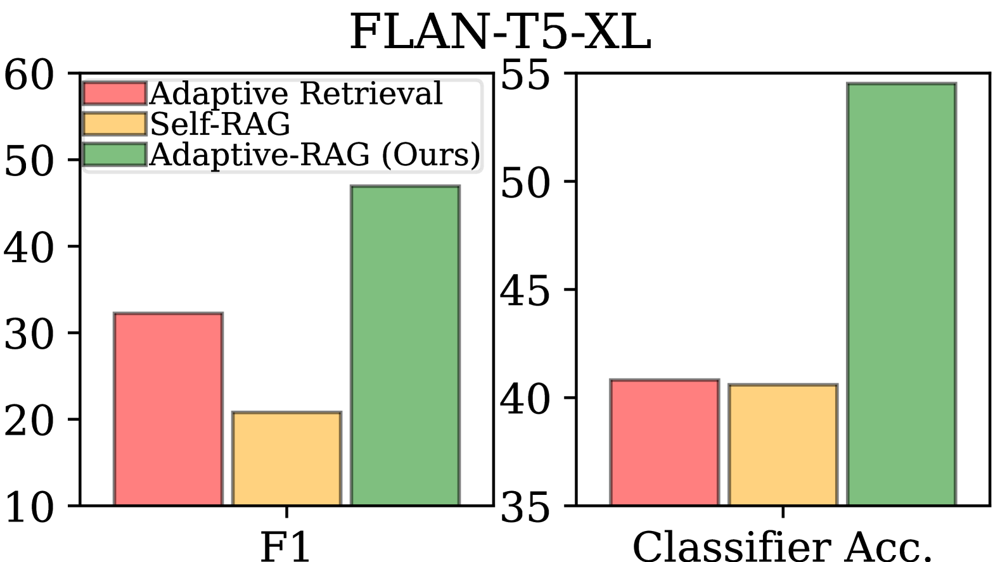
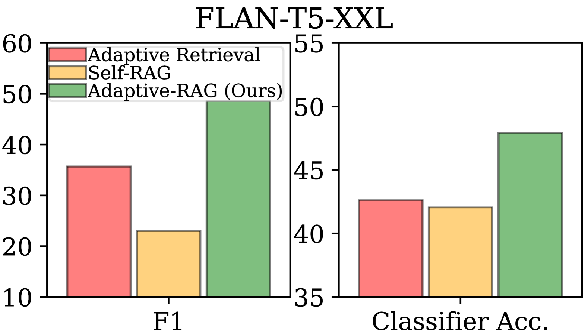
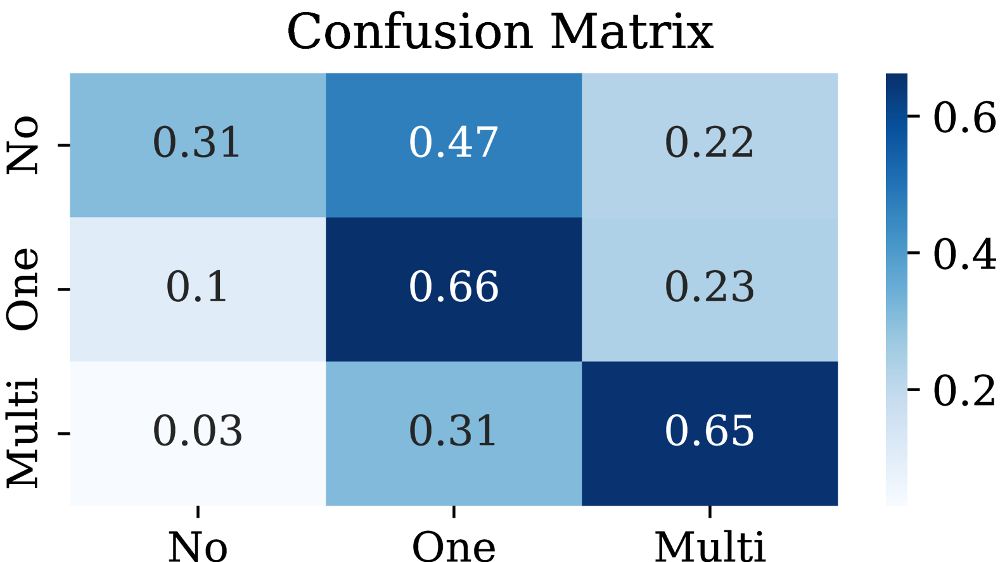

# Adaptive-RAG，一种能够通过识别问题复杂度来自适应调整的检索增强型大型语言模型学习技术。

发布时间：2024年03月21日

`RAG` `问答系统`

> Adaptive-RAG: Learning to Adapt Retrieval-Augmented Large Language Models through Question Complexity

> 近年来， Retrieval-Augmented LLMs因其能将外部数据库中的非参数知识融入LLMs，从而有效提升诸如问答等任务的回答准确性而备受瞩目。然而，现有处理复杂度各异的查询方法尚存不足，或在处理简单查询时消耗过多计算资源，或难以妥善解决复杂的多步骤问题，且用户的查询并非都能明确划分为简单或复杂。为此，我们创新性地设计了一款自适应QA框架，它能根据查询复杂度智能选取适宜的策略，范围涵盖了从最基础到最高级的（增强型检索）LLMs方案。尤为巧妙的是，这一选取过程利用了一个小型LM训练而成的分类器，此分类器借助于实际模型预测结果及数据集中内在归纳偏置生成的自动化标签，准确预测新查询的复杂度级别。这一方案犹如一座桥梁，无缝衔接了迭代式和单步检索增强型LLMs以及无需检索的方法，针对各种查询复杂度提供了均衡而灵活的应对策略。我们已在一系列覆盖多元复杂度的开放领域QA数据集上验证了该模型，实验证明，相较于包括自适应检索在内的同类基准方法，我们的模型显著提升了QA系统的综合效能和精确度。相关代码已开源，地址为：https://github.com/starsuzi/Adaptive-RAG。

> Retrieval-Augmented Large Language Models (LLMs), which incorporate the non-parametric knowledge from external knowledge bases into LLMs, have emerged as a promising approach to enhancing response accuracy in several tasks, such as Question-Answering (QA). However, even though there are various approaches dealing with queries of different complexities, they either handle simple queries with unnecessary computational overhead or fail to adequately address complex multi-step queries; yet, not all user requests fall into only one of the simple or complex categories. In this work, we propose a novel adaptive QA framework, that can dynamically select the most suitable strategy for (retrieval-augmented) LLMs from the simplest to the most sophisticated ones based on the query complexity. Also, this selection process is operationalized with a classifier, which is a smaller LM trained to predict the complexity level of incoming queries with automatically collected labels, obtained from actual predicted outcomes of models and inherent inductive biases in datasets. This approach offers a balanced strategy, seamlessly adapting between the iterative and single-step retrieval-augmented LLMs, as well as the no-retrieval methods, in response to a range of query complexities. We validate our model on a set of open-domain QA datasets, covering multiple query complexities, and show that ours enhances the overall efficiency and accuracy of QA systems, compared to relevant baselines including the adaptive retrieval approaches. Code is available at: https://github.com/starsuzi/Adaptive-RAG.

[Arxiv](https://arxiv.org/abs/2403.14403)