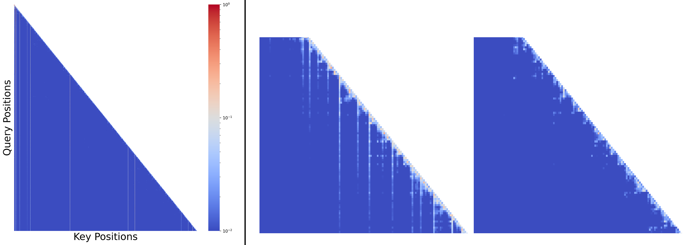
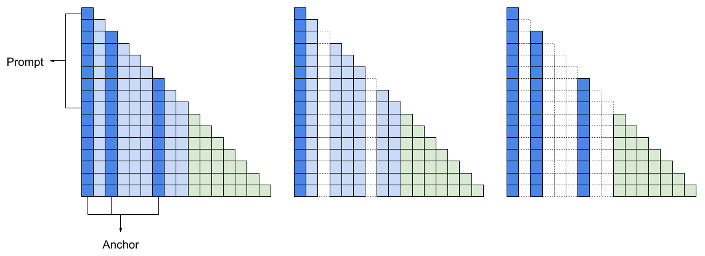
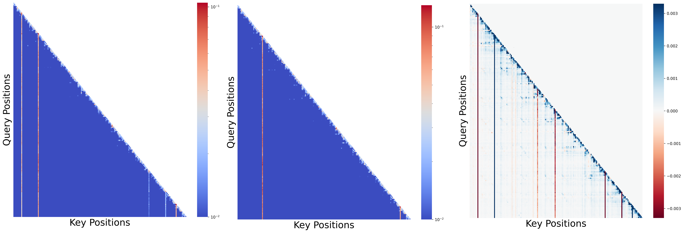
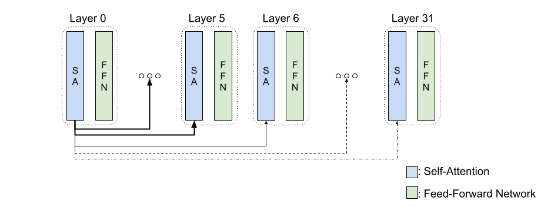
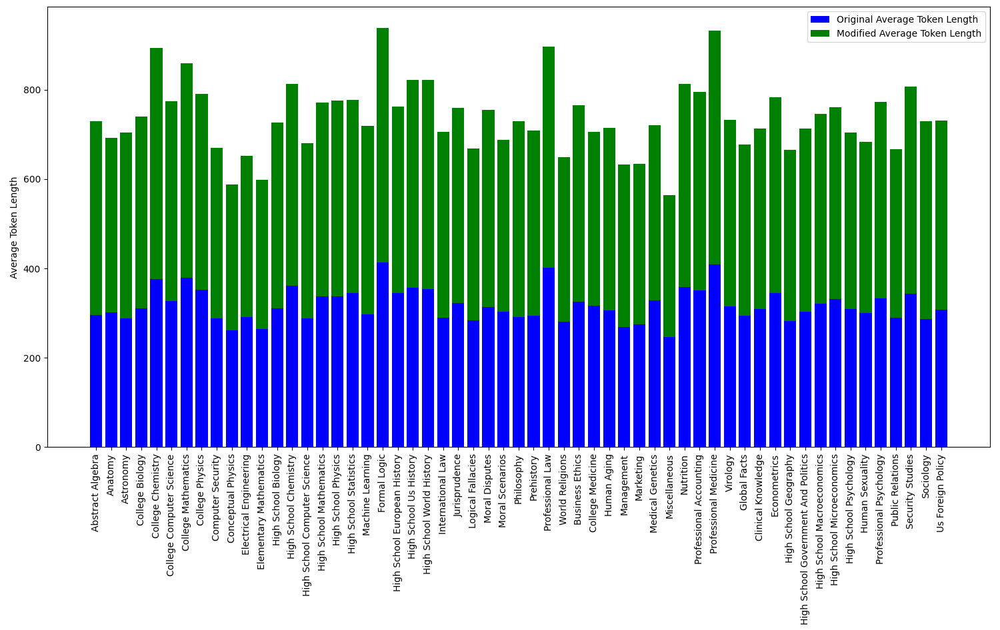
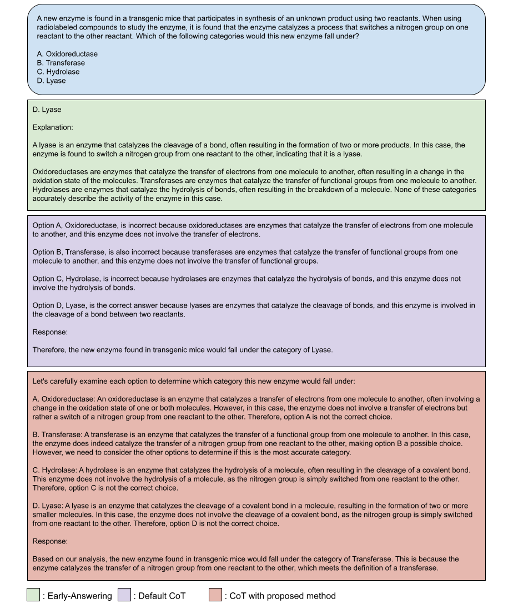
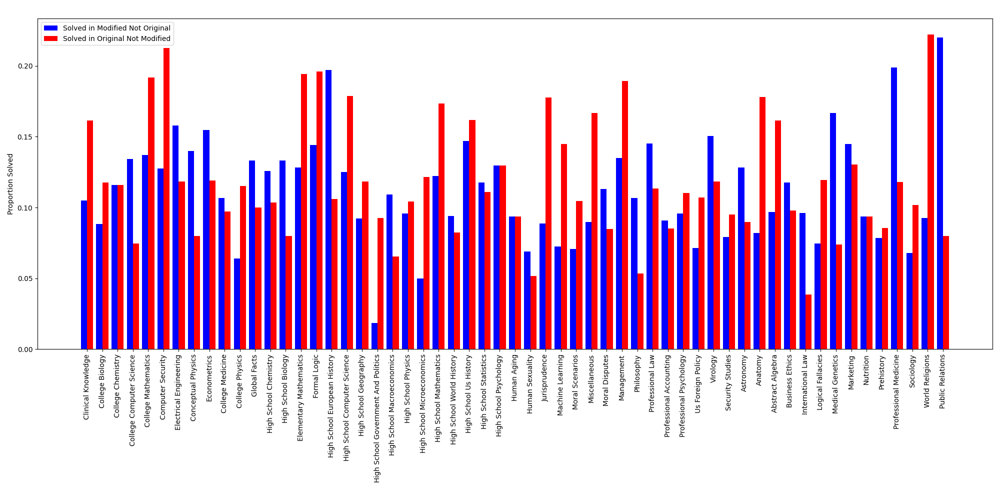
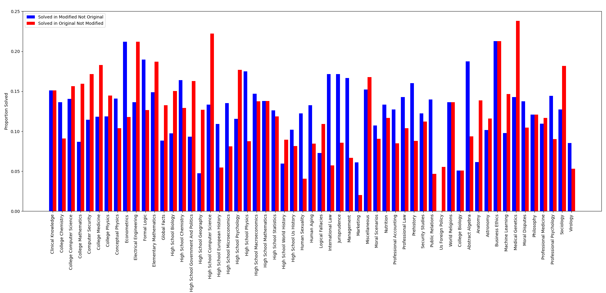

# 聚焦注意力推理：发掘大型语言模型的潜在力量

发布时间：2024年03月21日

`LLM理论` `模型优化`

> Attention-Driven Reasoning: Unlocking the Potential of Large Language Models

# 摘要

> 尽管LLMs已展现出非凡能力，但其推理机理仍未被充分解读。我们创新性地提出了一种无需新增训练数据的方法，通过优化注意力机制来提升LLMs的推理力。针对非语义符号导致的注意力分布不均衡问题，我们设计了一种重校正算法，助模型提炼出更为细腻的知识内核。实验证明，这一方法尤其在处理非STEM类问题时，能显著提高推理效能。我们深入剖析了注意力模式在LLMs推理过程中的关键角色，并提出了强化这些能力的策略，从而引领通往更强大、更全面的语言模型之路。

> Large Language Models (LLMs) have shown remarkable capabilities, but their reasoning abilities and underlying mechanisms remain poorly understood. We present a novel approach to enhance LLMs' reasoning through attention mechanism optimization, without additional training data. We identify inefficiencies in the attention distribution caused by non-semantic tokens and propose an algorithm to re-balance the skewed distribution, enabling the model to abstract more nuanced knowledge. Our experiments demonstrate significantly improved reasoning capabilities, particularly for non-STEM questions. We provide insights into the role of attention patterns in LLMs' reasoning and propose a method to enhance these abilities, paving the way for more powerful and versatile language models.

[Arxiv](https://arxiv.org/abs/2403.14932)