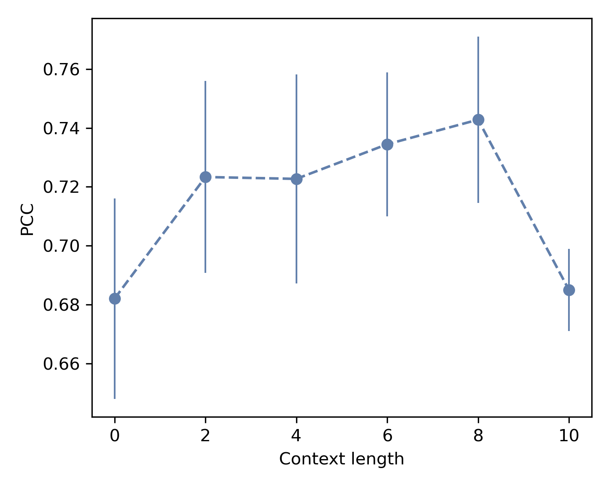
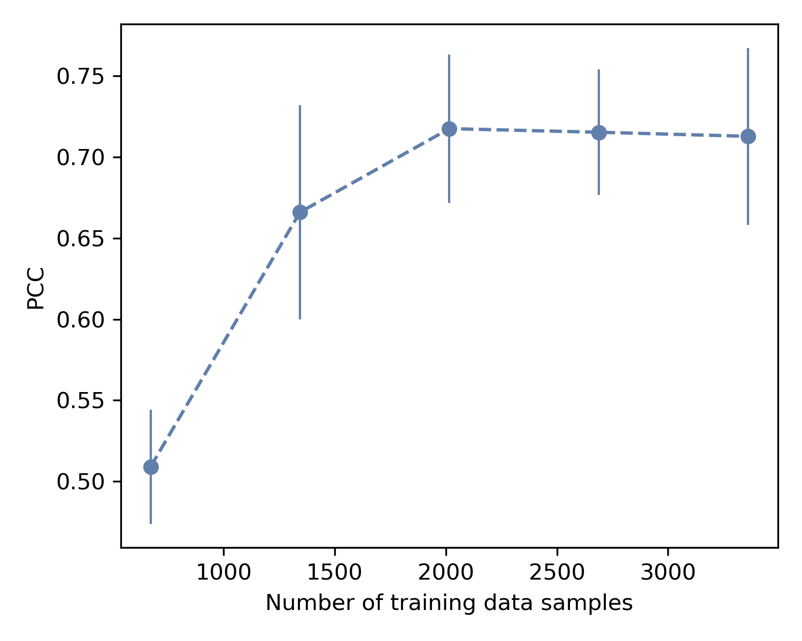
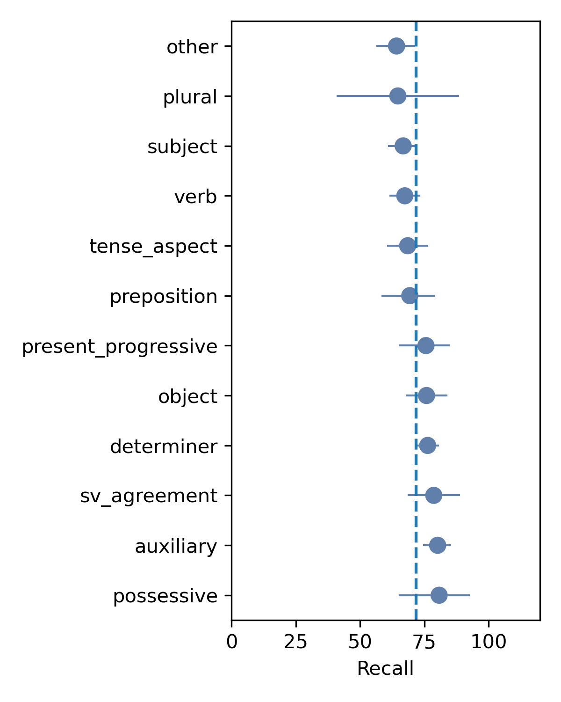
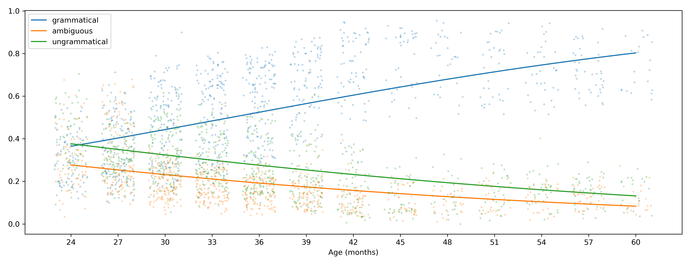

# 本研究致力于实现儿童与照顾者交谈内容的自动语法标注，旨在探索并提升对儿童语言习得过程中语法正确性的自动化识别能力。

发布时间：2024年03月21日

`LLM应用` `儿童语言习得`

> Automatic Annotation of Grammaticality in Child-Caregiver Conversations

# 摘要

> 探讨儿童如何掌握语法是判断不同语言习得理论的关键问题。为了加快速度、提升可重复性和扩大规模，对儿童与其照顾者的对话进行语法规则的语料库研究，我们提出了一种用于对话中情境相关语法规则的编码方案，并对一个大型转录对话库中的逾4000个言语片段进行了自动标注。在此基础上，我们训练并评测了一系列NLP模型，发现经过微调的Transformer模型表现最优，其一致性水平已达到人工标注的标准。作为初步应用及验证手段，我们利用这些训练出的模型对远大于手动标注数据量的语料库进行了标注，并证实儿童的语言规范性确实随年龄增长呈现出稳定的上升趋势。这项工作借助尖端NLP技术助力大规模儿童语言习得研究，丰富了相关领域的文献成果。

> The acquisition of grammar has been a central question to adjudicate between theories of language acquisition. In order to conduct faster, more reproducible, and larger-scale corpus studies on grammaticality in child-caregiver conversations, tools for automatic annotation can offer an effective alternative to tedious manual annotation. We propose a coding scheme for context-dependent grammaticality in child-caregiver conversations and annotate more than 4,000 utterances from a large corpus of transcribed conversations. Based on these annotations, we train and evaluate a range of NLP models. Our results show that fine-tuned Transformer-based models perform best, achieving human inter-annotation agreement levels.As a first application and sanity check of this tool, we use the trained models to annotate a corpus almost two orders of magnitude larger than the manually annotated data and verify that children's grammaticality shows a steady increase with age.This work contributes to the growing literature on applying state-of-the-art NLP methods to help study child language acquisition at scale.

[Arxiv](https://arxiv.org/abs/2403.14208)