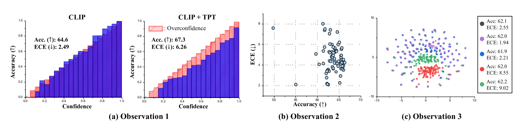
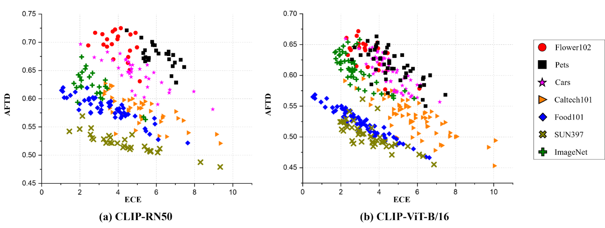
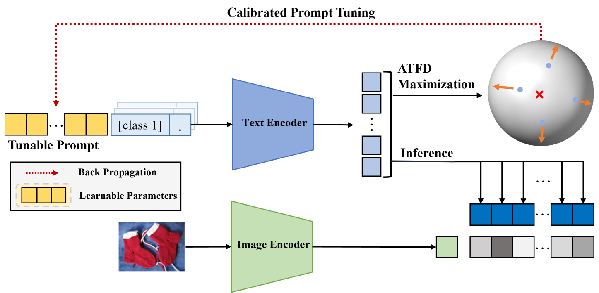
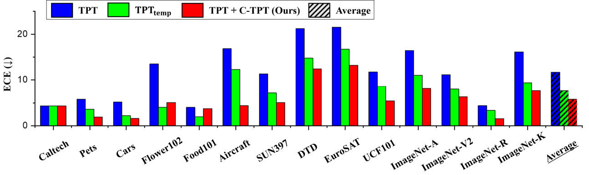
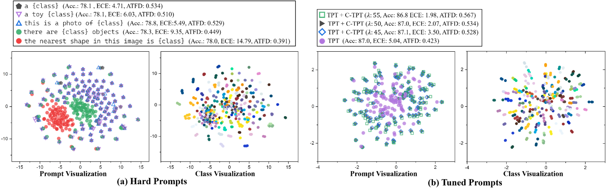
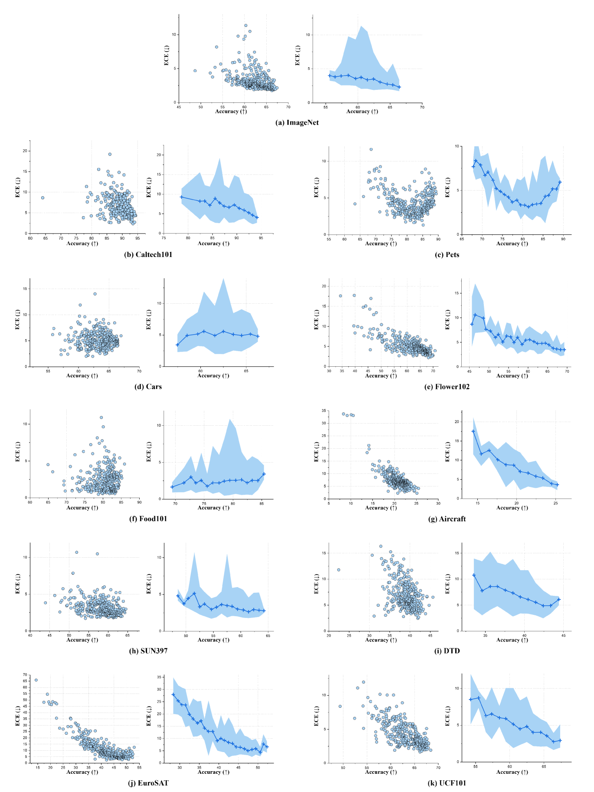
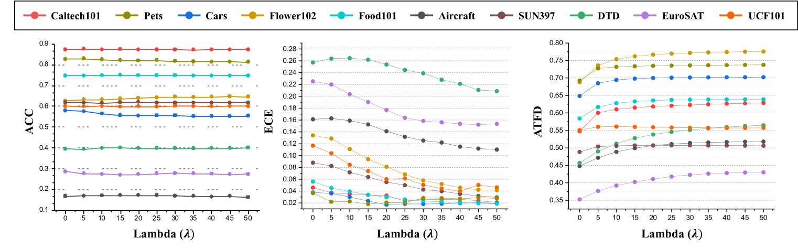
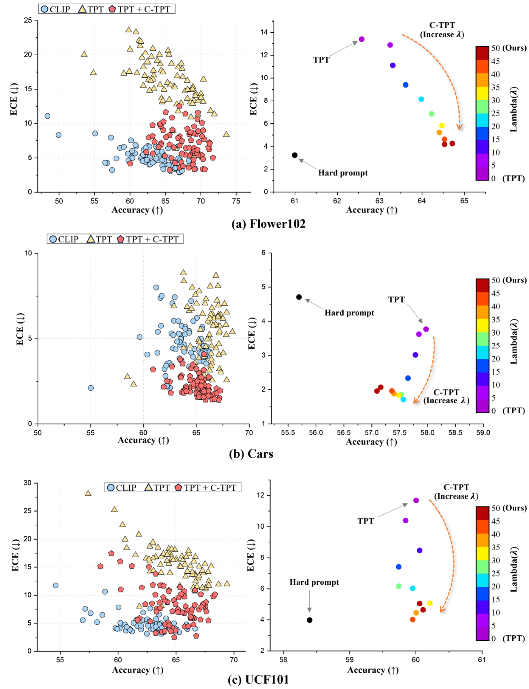
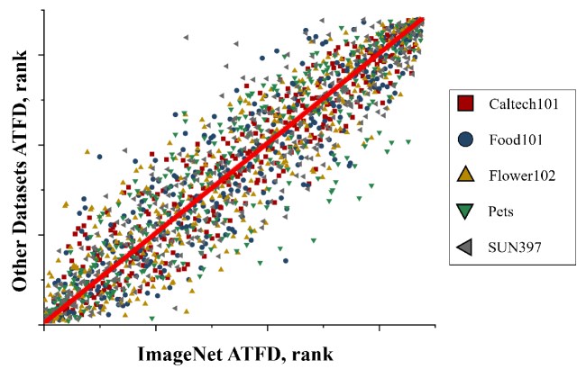

# C-TPT 是一种新颖的方法，它利用文本特征分散技术，在视觉-语言模型的测试阶段进行精确校准的提示调优。

发布时间：2024年03月21日

`LLM应用` `计算机视觉`

> C-TPT: Calibrated Test-Time Prompt Tuning for Vision-Language Models via Text Feature Dispersion

> 测试时适应已成为深度学习中一种无需标注数据即可微调模型的有效手段，尤其体现在近期提出的针对CLIP等大型视觉-语言模型的测试时提示调优技术上。遗憾的是，当前这类提示大多侧重于提升准确率，却忽略了校准这一衡量预测不确定性的重要维度。传统校准方法严重依赖大量标注数据，在测试时场景下显然不适用。因此，本文借助CLIP内在特性，在测试时提示调优阶段探究了校准问题，并通过系列实验发现，选取不同的提示会显著影响CLIP的校准效果，尤其是那些能够增加文本特征分散度的提示，能够带来更佳的校准预测。为此，我们提出了平均文本特征分散度(ATFD)的概念，揭示了它与校准误差间的关联，并创新性地设计了一种名为校准测试时提示调优(C-TPT)的新方法，在保证测试时提示优化的同时增强校准性能。通过在多种CLIP结构和数据集上进行广泛实验，我们证实了C-TPT能够在无需任何标注数据的前提下，有效地提升测试时提示调优的校准水平。

> In deep learning, test-time adaptation has gained attention as a method for model fine-tuning without the need for labeled data. A prime exemplification is the recently proposed test-time prompt tuning for large-scale vision-language models such as CLIP. Unfortunately, these prompts have been mainly developed to improve accuracy, overlooking the importance of calibration-a crucial aspect for quantifying prediction uncertainty. However, traditional calibration methods rely on substantial amounts of labeled data, making them impractical for test-time scenarios. To this end, this paper explores calibration during test-time prompt tuning by leveraging the inherent properties of CLIP. Through a series of observations, we find that the prompt choice significantly affects the calibration in CLIP, where the prompts leading to higher text feature dispersion result in better-calibrated predictions. Introducing the Average Text Feature Dispersion (ATFD), we establish its relationship with calibration error and present a novel method, Calibrated Test-time Prompt Tuning (C-TPT), for optimizing prompts during test-time with enhanced calibration. Through extensive experiments on different CLIP architectures and datasets, we show that C-TPT can effectively improve the calibration of test-time prompt tuning without needing labeled data.

[Arxiv](https://arxiv.org/abs/2403.14119)