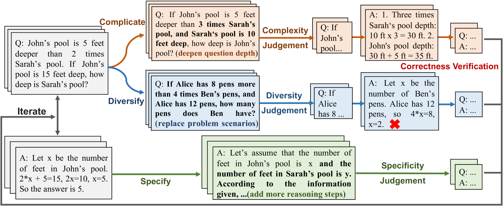
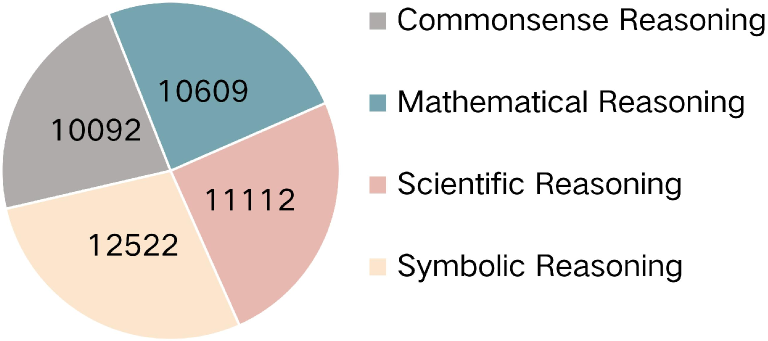
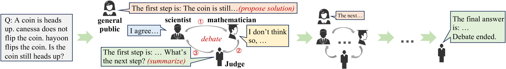

# ChainLM 引入了改良的链式思维提示法，以提升大型语言模型的表现力。这项技术致力于优化大型语言模型在面对复杂任务时的推理能力，通过加强其链式思考过程的引导，实现更高效、精准的自然语言处理。

发布时间：2024年03月21日

`LLM应用` `推理技术`

> ChainLM: Empowering Large Language Models with Improved Chain-of-Thought Prompting

# 摘要

> CoT 提示技术有力提升了 LLM 的推理表现，在复杂推理任务中崭露头角。然而，现有的 CoT 合成技术大多聚焦简单任务，产出的提示往往品质不高且逻辑不连贯。因此，我们针对这一难题进行了实践探索，并创新研发了 CoTGenius 框架，专门用于自动生成高品质的 CoT 提示。CoTGenius 结合了“复杂化”、“多样化”和“具体化”三大进化策略，辅以“进化成功评判”和“正确性验证”双重筛选机制。我们运用 CoTGenius 大规模构建了 CoT 数据集，并在此基础上微调了 Llama 2-Chat 的 70 亿和 130 亿参数模型，形成了全新的 ChainLM 模型。为解决推理过程中步步积累的误差问题，我们创新提出了“逐步辩论法”，让多个辩手对每一步推理展开讨论，共同寻找正确答案。大量实验结果显示，相比已有的模型，ChainLM 在解决一系列复杂的推理问题上展现出了显著增强的能力。另外，我们也深度剖析了 CoTGenius 内部各类数据类别对模型性能的具体影响。目前，我们已在 Github 平台（https://github.com/RUCAIBox/ChainLM）公开了相关数据集和代码资源。

> Chain-of-Thought (CoT) prompting can enhance the reasoning capabilities of large language models (LLMs), establishing itself as a primary approach to solving complex reasoning tasks. Existing CoT synthesis approaches usually focus on simpler reasoning tasks and thus result in low-quality and inconsistent CoT prompts. In response to this challenge, we present an empirical investigation of CoT prompting and introduce CoTGenius, a novel framework designed for the automatic generation of superior CoT prompts. CoTGenius is developed based on three major evolution strategies, i.e., complicate, diversify, and specify-alongside two filtering mechanisms: evolutionary success judgement and correctness verification. We further employ CoTGenius to create an extensive CoT dataset, and subsequently fine-tune the Llama 2-Chat 7B and 13B models on this dataset. We call the resulting model ChainLM. To deal with the cumulative error issue in reasoning steps, we propose a step-level debating method, wherein multiple debaters discuss each reasoning step to arrive at the correct answer. Extensive experiments demonstrate that our ChainLM models exhibit enhanced proficiency in addressing a spectrum of complex reasoning problems compared to existing models. In addition, we conduct an in-depth analysis of the impact of data categories within CoTGenius on the model performance. We release our dataset and code at https://github.com/RUCAIBox/ChainLM.

[Arxiv](https://arxiv.org/abs/2403.14312)