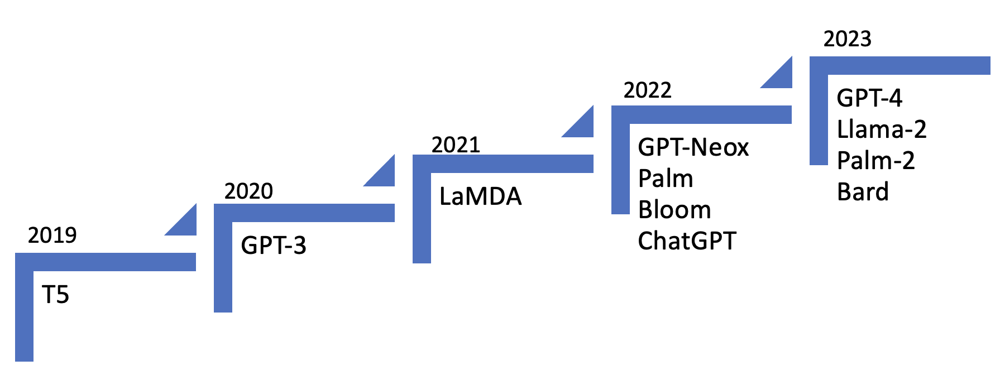
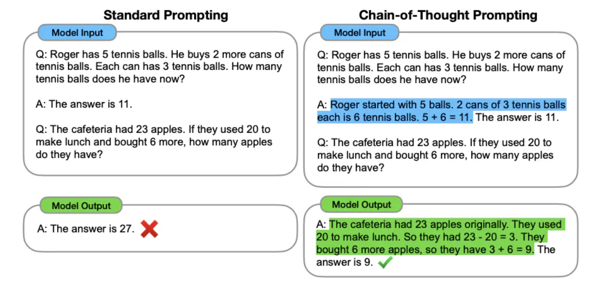
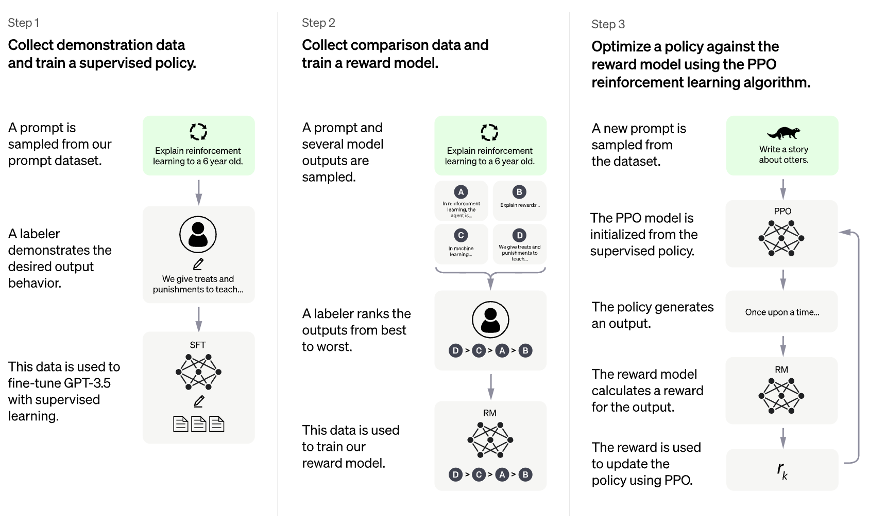
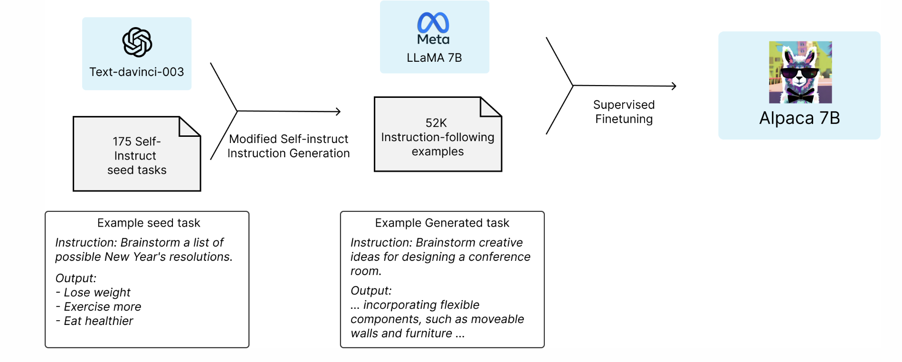

# ChatGPT 的替代方案探究：大型语言模型综览

发布时间：2024年03月21日

`LLM理论` `人工智能`

> ChatGPT Alternative Solutions: Large Language Models Survey

> 近年来，LLMs的壮丽风采不仅在自然语言处理天地中熠熠生辉，更是在广阔的应用领域洒下了它的光辉。这种LLMs实力的精彩展现引发了相关领域的研究热潮，涵盖了神经网络结构优化、上下文长度扩展、模型校准、训练数据集改进、性能基准设定、效率升级等诸多方面。学界与业界的紧密合作使得LLMs研究领域持续攀登新高，其中ChatGPT——一款以LLMs为核心的强大AI聊天机器人，便是这一进程中的重要标志，赢得了全社会的广泛关注。不断演进的LLMs技术正在深刻改变AI全行业的风貌，有望引领我们创造和运用AI算法的方式实现变革。面对如此迅猛的技术演变步伐，本篇综述将带你一览LLMs世界中最新的研究成果。我们将深入探讨背景知识、重大突破以及主流方法，并为你带来最新鲜的文献回顾。通过对比分析多种LLM模型，本论文不仅提供了一份详尽的整体概览，还规划出一条揭示现存挑战并预见未来可能的研究走向的路径。这份调查报告生动展示了当下生成式AI的发展现状，照亮了更多有待探索、优化和创新的机遇之路。

> In recent times, the grandeur of Large Language Models (LLMs) has not only shone in the realm of natural language processing but has also cast its brilliance across a vast array of applications. This remarkable display of LLM capabilities has ignited a surge in research contributions within this domain, spanning a diverse spectrum of topics. These contributions encompass advancements in neural network architecture, context length enhancements, model alignment, training datasets, benchmarking, efficiency improvements, and more. Recent years have witnessed a dynamic synergy between academia and industry, propelling the field of LLM research to new heights. A notable milestone in this journey is the introduction of ChatGPT, a powerful AI chatbot grounded in LLMs, which has garnered widespread societal attention. The evolving technology of LLMs has begun to reshape the landscape of the entire AI community, promising a revolutionary shift in the way we create and employ AI algorithms. Given this swift-paced technical evolution, our survey embarks on a journey to encapsulate the recent strides made in the world of LLMs. Through an exploration of the background, key discoveries, and prevailing methodologies, we offer an up-to-the-minute review of the literature. By examining multiple LLM models, our paper not only presents a comprehensive overview but also charts a course that identifies existing challenges and points toward potential future research trajectories. This survey furnishes a well-rounded perspective on the current state of generative AI, shedding light on opportunities for further exploration, enhancement, and innovation.

[Arxiv](https://arxiv.org/abs/2403.14469)