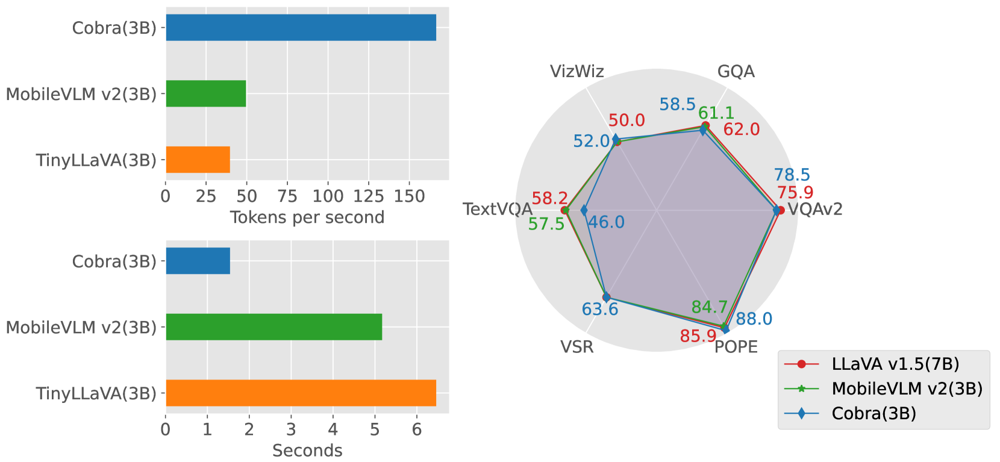
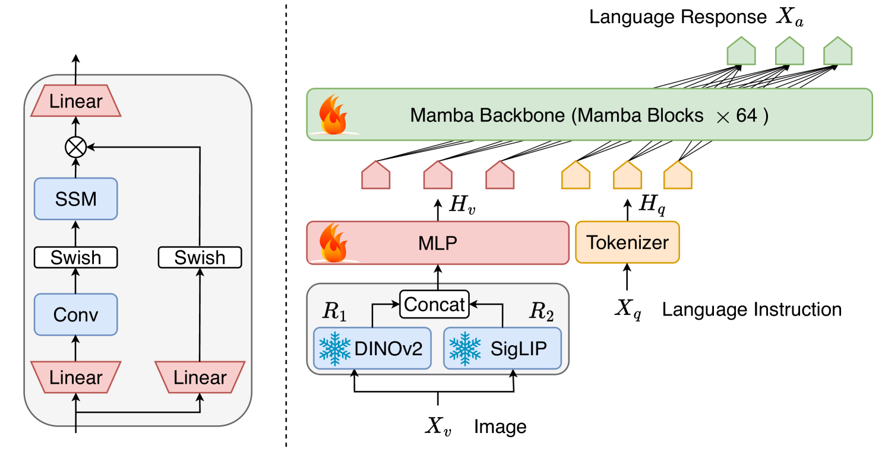
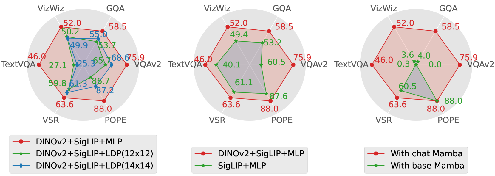
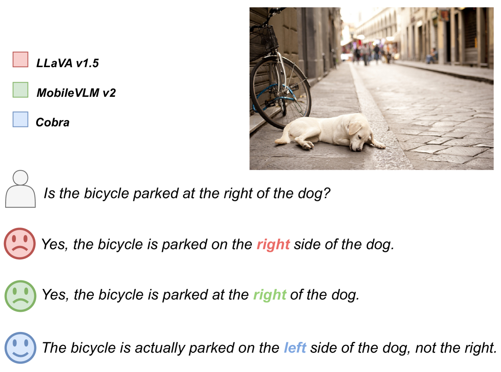
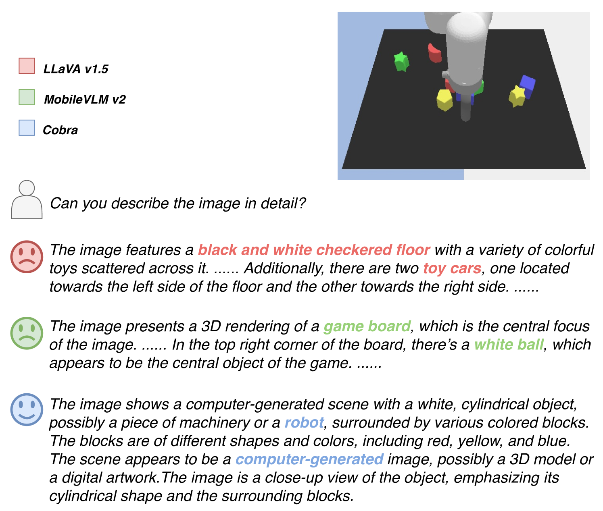

# Cobra 是对 Mamba 的扩展，旨在构建一个适用于多模态场景的大型语言模型，并致力于提高其推理效率。

发布时间：2024年03月21日

`LLM应用` `多模态` `计算机视觉`

> Cobra: Extending Mamba to Multi-Modal Large Language Model for Efficient Inference

# 摘要

> 近年来，MLLM 在多个领域大放异彩，但作为下游任务基石的现行模型大多基于计算效率较低的二次复杂度Transformer网络。因此，我们创新提出了一种线性复杂度的MLLM——Cobra，它巧妙地将高效Mamba语言模型融入视觉模态，并精心设计了多种模态融合方案以打造强力多模态Mamba。实验证明，Cobra不仅在计算效率上与当下前沿如LLaVA-Phi、TinyLLaVA及MobileVLM v2等方法旗鼓相当，而且得益于其线性序列建模，运行速度更胜一筹。更有意思的是，在封闭集挑战预测基准测试中，Cobra展现了出色的抗视觉幻象和空间关系判断能力。尤为值得一提的是，尽管Cobra的参数量仅为LLaVA的大约43%，其性能仍可与之媲美。我们将全面开源Cobra的所有代码，期待这一新方法能够推动未来对MLLM复杂性难题的研究进展，项目主页参见：https://sites.google.com/view/cobravlm。

> In recent years, the application of multimodal large language models (MLLM) in various fields has achieved remarkable success. However, as the foundation model for many downstream tasks, current MLLMs are composed of the well-known Transformer network, which has a less efficient quadratic computation complexity. To improve the efficiency of such basic models, we propose Cobra, a linear computational complexity MLLM. Specifically, Cobra integrates the efficient Mamba language model into the visual modality. Moreover, we explore and study various modal fusion schemes to create an effective multi-modal Mamba. Extensive experiments demonstrate that (1) Cobra achieves extremely competitive performance with current computationally efficient state-of-the-art methods, \textit{e.g.}, LLaVA-Phi, TinyLLaVA, and MobileVLM v2, and has faster speed due to Cobra's linear sequential modeling. (2) Interestingly, the results of closed-set challenging prediction benchmarks show that Cobra performs well in overcoming visual illusions and spatial relationship judgments. (3) Notably, Cobra even achieves comparable performance to LLaVA with about 43% of the number of parameters. We will make all codes of Cobra open-source and hope that the proposed method can facilitate future research on complexity problems in MLLM. Our project page is available at: https://sites.google.com/view/cobravlm.

[Arxiv](https://arxiv.org/abs/2403.14520)