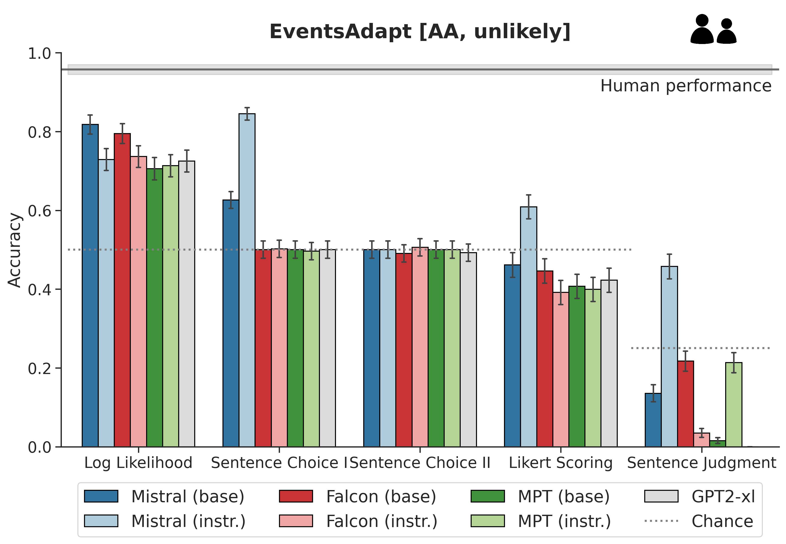
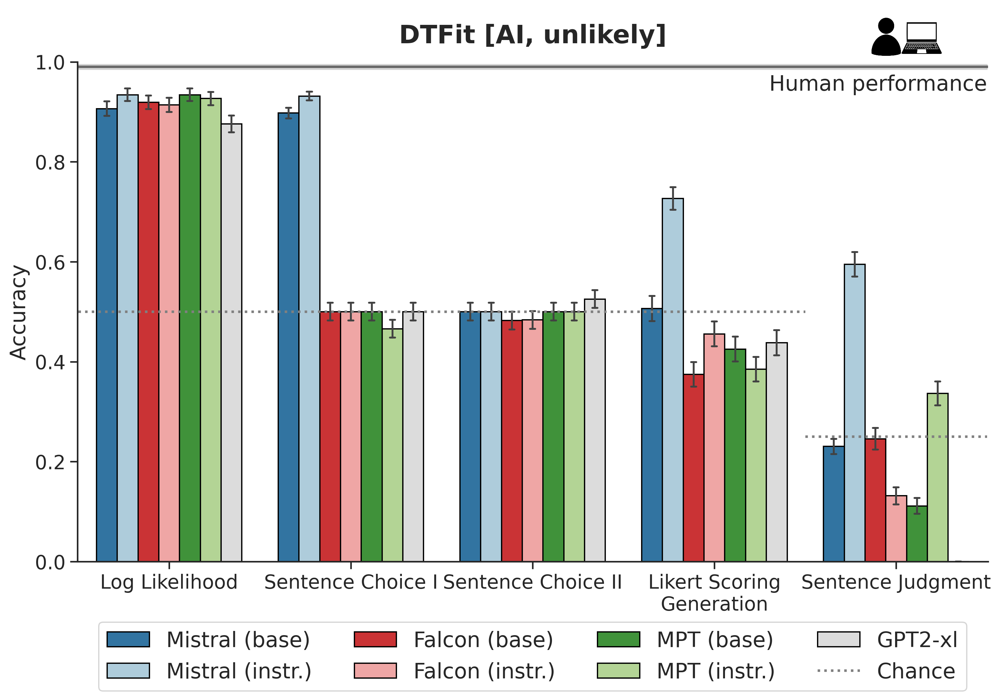
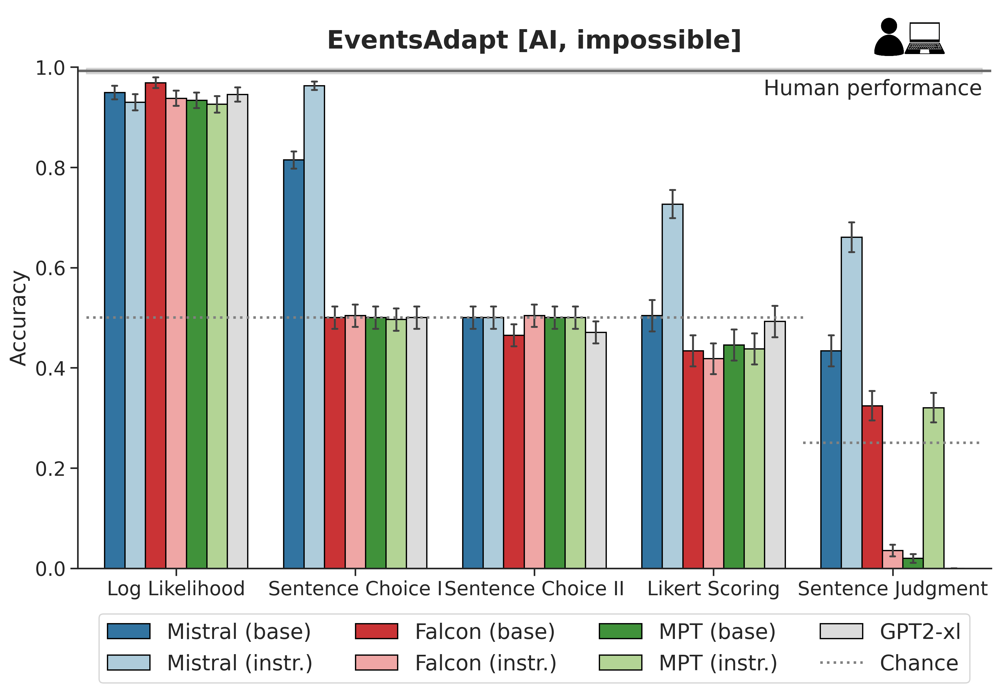
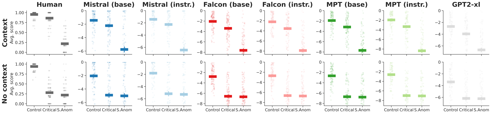
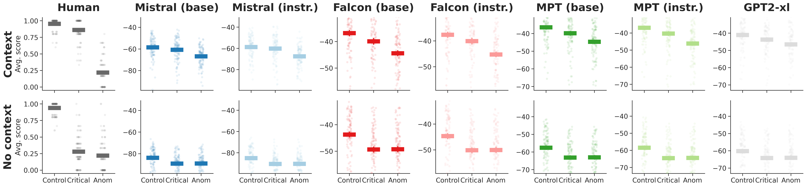
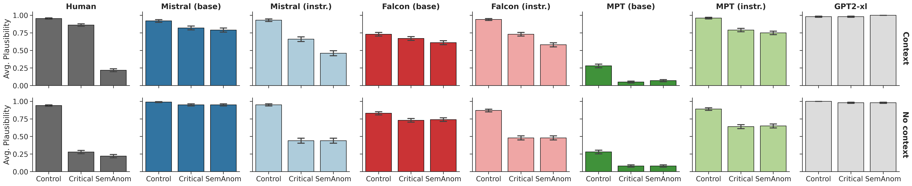

# 本研究对比了未经特殊调优的基础大型语言模型与经过指令调优后的模型，在评估语句可信度上的差异。

发布时间：2024年03月21日

`LLM理论` `人机交互`

> Comparing Plausibility Estimates in Base and Instruction-Tuned Large Language Models

> 经过指令微调的LLMs可以响应以提示形式构造的具体查询，极大地方便了人机互动。然而，依赖提示的方法可能无法充分挖掘LLMs在预训练阶段积累的大量隐性知识。本研究深入探讨并对比分析了LLMs语义合理性的评估方式。我们在一个英语句子合理性任务上，分别运用显式提示法和通过直接读取模型分配给字符串的概率进行隐式估算的方式，比较了未经调整的基础LLM与经过指令微调后的LLM的表现。实验1结果显示，无论模型架构或合理性数据集如何变化，(i) 对数似然性($\textit{LL}$)分数始终是衡量句子合理性的最可靠指标，而零样本提示法往往得出的结果不稳定且质量较低；(ii) 基于$\textit{LL}$的表现仍落后于人类；(iii) 经过指令微调的模型在$\textit{LL}$基础上的表现不如基础模型。在实验2中，我们揭示了模型间的$\textit{LL}$分数会按照预期受到上下文因素的影响，显示出在三个上下文敏感合理度指标上高水平的表现，并与人类明确做出的合理性判断直接相符。总体来看，在LLMs中，$\textit{LL}$估计相较于直接提示法，依然是更为可靠地衡量合理性的手段。

> Instruction-tuned LLMs can respond to explicit queries formulated as prompts, which greatly facilitates interaction with human users. However, prompt-based approaches might not always be able to tap into the wealth of implicit knowledge acquired by LLMs during pre-training. This paper presents a comprehensive study of ways to evaluate semantic plausibility in LLMs. We compare base and instruction-tuned LLM performance on an English sentence plausibility task via (a) explicit prompting and (b) implicit estimation via direct readout of the probabilities models assign to strings. Experiment 1 shows that, across model architectures and plausibility datasets, (i) log likelihood ($\textit{LL}$) scores are the most reliable indicator of sentence plausibility, with zero-shot prompting yielding inconsistent and typically poor results; (ii) $\textit{LL}$-based performance is still inferior to human performance; (iii) instruction-tuned models have worse $\textit{LL}$-based performance than base models. In Experiment 2, we show that $\textit{LL}$ scores across models are modulated by context in the expected way, showing high performance on three metrics of context-sensitive plausibility and providing a direct match to explicit human plausibility judgments. Overall, $\textit{LL}$ estimates remain a more reliable measure of plausibility in LLMs than direct prompting.

[Arxiv](https://arxiv.org/abs/2403.14859)